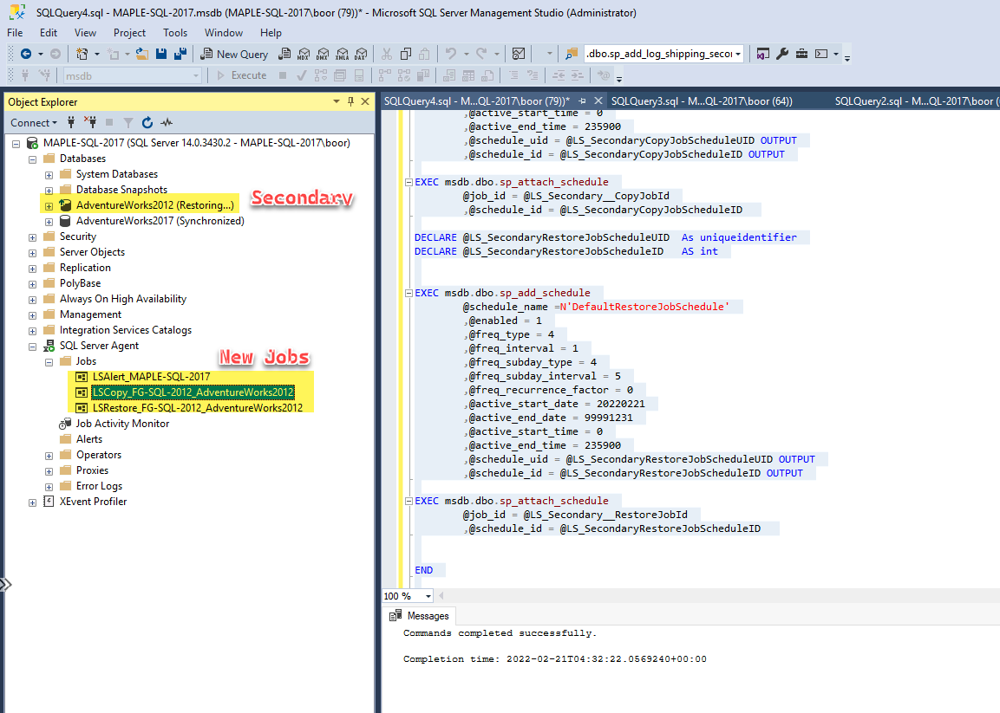
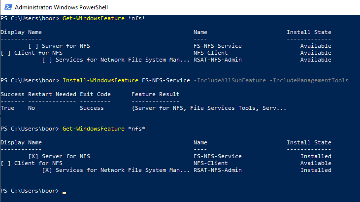
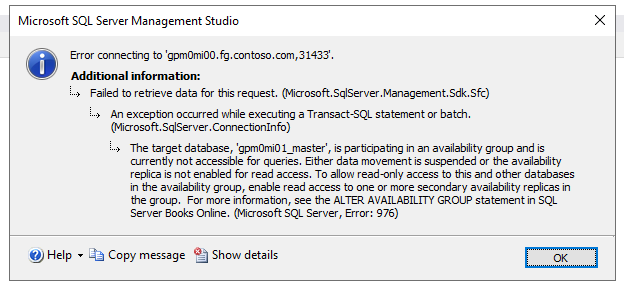

# SQL Server to Arc SQL MI - Migration environment

> `#TODO logo diagram`

A terraform-built demo environment for migrating various SQL Servers to Arc SQL MI.

**Architecture**

> `#TODO DIAGRAM | Domain, DNS`

**Validated Scenarios**

> `#TODO Validated scenarios`

## Table of Contents <!-- omit in toc -->
- [Infrastructure Deployment](#infrastructure-deployment)
  - [Dev Container](#dev-container)
  - [Terraform apply](#terraform-apply)
- [Post Deployment Steps](#post-deployment-windows-vms)
  - [Create Root Domain fg.contoso.com](#create-root-domain-with-dc1)
  - [Join new Domain Controller DC2 to Root Domain](#join-new-dc2-to-root-domain)
  - [Create Child Domain maple.fg.contoso.com](#create-child-domain)
  - [Add DNS Forwarding and Delegation](#add-dns-forwarding-and-delegation)
  - [Turn off local Windows Firewalls](#turn-off-local-firewall)
  - [Domain join SQL Servers & Client](#domain-join-remaining-machines)
  - [Install SQL 2022 on FG-SQL-2022-vm](#install-sql-2022)
  - [Create Windows Logins in SQL](#create-windows-logins-in-sql)
- [Arc SQL MI Setup with AD](#arc-sql-mi-setup)
  - [Data Controller deployment](#data-controller-deployment)
  - [Active Directory pre-reqs](#active-directory-pre-reqs)
  - [Keytab creation](#keytab-creation)
  - [SQL MI Deployment](#sql-mi-deployment)
  - [Create Windows Logins](#create-windows-logins)
- [MIAA - DAG migration setup](#miaa-migration-setup)
  - [DAG from SQL 2019](#dag-from-SQL-2019-to-MIAA)
  - [DAG from SQL 2017](#dag-from-SQL-2017-to-MIAA)
  - [DAG from SQL 2016](#dag-from-SQL-2016-to-MIAA)
  - [DAG from SQL 2022](#dag-from-SQL-2022-to-MIAA)
  - [DAG from Azure SQL MI](#dag-from-Azure-SQL-MI-to-MIAA)
- [MIAA - Log shipping migration setup](#miaa-log-shipping-migration-setup)
  - [Log shipping from SQL 2012-2016 to 2019, DAG over to MIAA](#log-shipping-from-SQL-2012-to-2016-to-MIAA)
  - [Log shipping from SQL 2012 to MIAA](#log-shipping-from-SQL-2012-to-MIAA)

## Infrastructure Deployment

### Dev Container
The folder `.devcontainer` has necessary tools (terraform, azure-cli, kubectl etc) to get started on this demo with [Remote Containers](https://code.visualstudio.com/docs/remote/containers).

## Terraform apply

The following script deploys the environment with Terraform:
```bash
# ---------------------
# ENVIRONMENT VARIABLES
# For Terraform
# ---------------------
# Secrets
export TF_VAR_SPN_CLIENT_ID=$spnClientId
export TF_VAR_SPN_CLIENT_SECRET=$spnClientSecret
export TF_VAR_SPN_TENANT_ID=$spnTenantId
export TF_VAR_SPN_SUBSCRIPTION_ID=$subscriptionId
export TF_VAR_VM_USER_PASSWORD=$localPassword # RDP password for VMs

# Module specific
export TF_VAR_resource_group_name='raki-sql-to-miaa-migration-test-rg'

# ---------------------
# DEPLOY TERRAFORM
# ---------------------
cd terraform
terraform init
terraform plan 
terraform apply -auto-approve

# ---------------------
# DESTROY ENVIRONMENT
# ---------------------
terraform destory
```
And we see:


> Note that `FG-SQL-2022-vm` is not an Azure Marketplace SQL image, it's a Windows Server 2022 machine where we will install SQL 2022 CTP.

## Post Deployment Windows VMs

The following steps weren't automated via Terraform because of return on invetment (and because automating stuff inside Windows is tedious via PowerShell DSC etc.) - so we run these scripts manually:

---

### Create Root Domain with DC1

We run the following on: `FG-DC-1` to create `fg.contoso.com`

```powershell
# Configure the Domain Controller
$domainName = 'fg.contoso.com'
$domainAdminPassword = "acntorPRESTO!"
$secureDomainAdminPassword = $domainAdminPassword | ConvertTo-SecureString -AsPlainText -Force

Install-WindowsFeature -Name AD-Domain-Services -IncludeManagementTools

# Create Active Directory Forest - FG
Install-ADDSForest `
    -DomainName "$domainName" `
    -CreateDnsDelegation:$false `
    -DatabasePath "C:\Windows\NTDS" `
    -DomainMode "7" `
    -DomainNetbiosName $domainName.Split('.')[0].ToUpper() `
    -ForestMode "7" `
    -InstallDns:$true `
    -LogPath "C:\Windows\NTDS" `
    -NoRebootOnCompletion:$false `
    -SysvolPath "C:\Windows\SYSVOL" `
    -Force:$true `
    -SafeModeAdministratorPassword $secureDomainAdminPassword
```

After the reboot, we can login via Bastion as our Domain Admin `boor@fg.contoso.com` or `FG\boor`.

---

### Join new DC2 to Root Domain

We run the following on: `FG-DC-2` to join `fg.contoso.com`:

```powershell
# Join to Domain
$user = "FG\boor"
$domainAdminPassword = "acntorPRESTO!"
$domainName = 'fg.contoso.com'
$pass = $domainAdminPassword | ConvertTo-SecureString -AsPlainText -Force
$Credential = New-Object -TypeName System.Management.Automation.PSCredential -ArgumentList $user, $pass
add-computer –domainname $domainName -Credential $Credential

# Install Windows Features
Install-WindowsFeature -Name AD-Domain-Services -IncludeManagementTools -Verbose

# Import Module
Import-Module ADDSDeployment -Verbose

Install-ADDSDomainController `
    -CreateDnsDelegation:$false `
    -DatabasePath "C:\Windows\NTDS" `
    -DomainName $domainName `
    -InstallDns:$true `
    -LogPath "C:\Windows\NTDS" `
    -NoGlobalCatalog:$false `
    -SiteName "Default-First-Site-Name" `
    -SysvolPath "C:\Windows\SYSVOL" `
    -NoRebootOnCompletion:$false `
    -Force:$true `
    -SafeModeAdministratorPassword $pass `
    -Credential $Credential

# Reboot, and login with Domain Admin

# Test install after reboot
Test-ADDSDomainControllerInstallation -Debug -Credential $Credential -DomainName $domainName -SafeModeAdministratorPassword $pass

# Get DC information
Get-ADDomainController -Discover
Get-ADDomainController -Verbose

# Get PDC
Get-ADDomainController -Discover -Domain $domainName -Service "PrimaryDC","TimeService"

```
And we see:


DNS:


And we can check the domain and Forest information:
``` Powershell
# To find the Domain Functional Level, use this command:
Get-ADDomain | fl Name,DomainMode

# To find the Forest Functional Level, use this command:
Get-ADForest | fl Name,ForestMode
```


---

### Create Child Domain

We run the following on: `MAPLE-DC-1` to create `maple.fg.contoso.com`:

```Powershell
# Install Windows Features
Install-WindowsFeature -Name AD-Domain-Services -IncludeManagementTools -Verbose

# Set Creds
$user = "boor@fg.contoso.com" # Different format than before since machine isn't domain joined
$domainAdminPassword = "acntorPRESTO!"
$domainName = 'fg.contoso.com'
$pass = $domainAdminPassword | ConvertTo-SecureString -AsPlainText -Force
$Credential = New-Object -TypeName System.Management.Automation.PSCredential -ArgumentList $user, $pass

# Create Child Domain
Install-ADDSDomain `
    -Credential $Credential `
    -NewDomainName "maple" `
    -ParentDomainName $domainName `
    -InstallDNS `
    -DatabasePath "C:\Windows\NTDS" `
    -SysvolPath "C:\Windows\SYSVOL" `
    -LogPath "C:\Windows\NTDS" `
    -SafeModeAdministratorPassword $pass `
    -NoRebootOnCompletion:$false `
    -Force:$true

# Reboot, and login with Domain Admin for Child Domain boor@maple.fg.contoso.com
whoami

# Test install after reboot
Test-ADDSDomainControllerInstallation -Debug -Credential $Credential -DomainName $domainName -SafeModeAdministratorPassword $pass

# Get DC information
Get-ADDomainController -Discover
Get-ADDomainController -Verbose

# Get PDC
Get-ADDomainController -Discover -Domain $domainName -Service "PrimaryDC","TimeService"
```

We see after logging in with `boor@maple.fg.contoso.com`:


And note we can also login with `boor@fg.contoso.com` into the `maple` machine - which is desirable:

Finally we see the new Child Domain and domain controller get added as well:


The Child Domain is visible in the Root Domain Controller as well:


---

### Add DNS Forwarding and Delegation

On both `FG-DC-1` and `MAPLE-DC-1`, we need to configure DNS Delegation and Conditional Forwarding so any domain queries end up in the correct domain's DNS server:

* Run on `FG-DC-1` for `maple.fg.contoso.com` goes to the `MAPLE-DC-1` DNS Server

  ```PowerShell
  Add-DnsServerZoneDelegation -Name "fg.contoso.com" -ChildZoneName "maple" -NameServer "maple-dc-1-vm.maple.fg.contoso.com" -IPAddress 192.168.1.4 -PassThru -Verbose
  ```
* Run on `MAPLE-DC-1` for `fg.contoso.com` goes to the `FG-DC-1` DNS Server

  ```PowerShell
  Add-DnsServerConditionalForwarderZone -Name "fg.contoso.com" -MasterServers "192.168.0.4" # FG-DC-1-vm
  ```

> Run `ipconfig /flushdns` each machine testing this update.

`ping FG-DC-1-vm.fg.contoso.com`:

We see on `FG-DC-1`:


And we see on `MAPLE-DC-1`:

`ping MAPLE-DC-1-vm.maple.fg.contoso.com`


---
### Turn off local Firewall

We need to turn off Windows Firewall for later steps where `5022` is required for the AG listener. In PROD environments this can be dealt with seperately but for this use case, I found the following to work in avoiding various network related heartaches:

```PowerShell
Set-NetFirewallProfile -Profile Domain,Public,Private -Enabled False
```

We do this on all of our SQL machines:
* `FG-SQL-2012-sql-vm`
* `FG-SQL-2014-sql-vm`
* `FG-SQL-2016-sql-vm`
* `FG-SQL-2022-vm`
* `MAPLE-SQL-2017-sql-vm`
* `MAPLE-SQL-2019-sql-vm`

---

### Domain Join remaining machines

On each of the following `FG` machines, run the following PowerShell script as local admin:
* `FG-CLIENT-vm`
* `FG-SQL-2012-sql-vm`
* `FG-SQL-2014-sql-vm`
* `FG-SQL-2016-sql-vm`
* `FG-SQL-2022-vm`

``` Powershell
# Join to FG Domain
$user = "FG\boor"
$domainAdminPassword = "acntorPRESTO!"
$domainName = 'fg.contoso.com'
$pass = $domainAdminPassword | ConvertTo-SecureString -AsPlainText -Force
$Credential = New-Object -TypeName System.Management.Automation.PSCredential -ArgumentList $user, $pass
add-computer –domainname $domainName -Credential $Credential -restart –force
```

We see:


And similarly for the `MAPLE` machines:
* `MAPLE-SQL-2017-sql-vm`
* `MAPLE-SQL-2019-sql-vm`

``` Powershell
# Join to MAPLE Domain
$user = "MAPLE\boor"
$domainAdminPassword = "acntorPRESTO!"
$domainName = 'maple.fg.contoso.com'
$pass = $domainAdminPassword | ConvertTo-SecureString -AsPlainText -Force
$Credential = New-Object -TypeName System.Management.Automation.PSCredential -ArgumentList $user, $pass
add-computer –domainname $domainName -Credential $Credential -restart –force
```


---

### Install SQL 2022

We install SQL Server 2022 [CTP - Community Technology Preview](https://searchsqlserver.techtarget.com/definition/Community-Technology-Preview-CTP) on our VM. This installation had to be done manually via `setup.exe` as we don't have an Azure VM ISO with the necessary automation available at the time of writing (February 2022).

Once the installation is done, we see:


And validate our SQL engine version:


```text
Microsoft SQL Server 2022 (CTP1.3) - 16.0.300.4 (X64)   Feb  9 2022 10:50:31   Copyright (C) 2021 Microsoft Corporation  Enterprise Edition (64-bit) on Windows Server 2022 Datacenter 10.0 <X64> (Build 20348: ) (Hypervisor) 
```

---

### Create Windows logins in SQL

Now, we must RDP in as the **local** user `boor` and not the domain user (`FG\boor` or `MAPLE\boor`) - so that we can sign into our **6** SQL Servers and create Windows AD logins.

> This is because the SQL Marketplace images created local user logins by default.

For example:


Launch SSMS and sign in:


Perform on:
* `FG-SQL-2012-sql-vm`
* `FG-SQL-2014-sql-vm`
* `FG-SQL-2016-sql-vm`
* `FG-SQL-2022-vm`
* `MAPLE-SQL-2017-sql-vm`
* `MAPLE-SQL-2019-sql-vm`

``` SQL
USE [master]
GO
-- Create login for FG
CREATE LOGIN [FG\boor] FROM WINDOWS WITH DEFAULT_DATABASE=[master]
GO
ALTER SERVER ROLE [sysadmin] ADD MEMBER [FG\boor]
GO
-- Create login for MAPLE
CREATE LOGIN [MAPLE\boor] FROM WINDOWS WITH DEFAULT_DATABASE=[master]
GO
ALTER SERVER ROLE [sysadmin] ADD MEMBER [MAPLE\boor]
GO
```

We create the windows logins on all 4 SQL servers:


From `FG-SQL-2014`, and `MAPLE-SQL-2019`, login to all 4 instances as Windows AD login:


---

## Arc SQL MI Setup

### Data Controller deployment

We deploy in _Indirect_ mode since it's a bit faster but this will work identically in _Direct_.

We run this directly in our `.devcontainer` which has the pre-reqs installed:

```bash
cd kubernetes

# Deployment variables
export adminUsername='admin'
export resourceGroup=$TF_VAR_resource_group_name
export AZDATA_USERNAME='admin'
export AZDATA_PASSWORD='acntorPRESTO!'
export arcDcName='arc-dc'
export azureLocation='eastus'
export clusterName='aks-cni'
export AZDATA_LOGSUI_USERNAME=$AZDATA_USERNAME
export AZDATA_METRICSUI_USERNAME=$AZDATA_USERNAME
export AZDATA_LOGSUI_PASSWORD=$AZDATA_PASSWORD
export AZDATA_METRICSUI_PASSWORD=$AZDATA_PASSWORD

# Login as service principal
az login --service-principal --username $spnClientId --password $spnClientSecret --tenant $spnTenantId
az account set --subscription $subscriptionId

# Adding Azure Arc CLI extensions
az config set extension.use_dynamic_install=yes_without_prompt

# Getting AKS cluster credentials kubeconfig file
az aks get-credentials --resource-group $resourceGroup --name $clusterName --admin

kubectl get nodes

# Monitor pods in arc namespace in another window
watch kubectl get pods -n arc

#########################################
# Create data controller in indirect mode
#########################################
# Create with the AKS profile
az arcdata dc create --profile-name azure-arc-aks-premium-storage \
                     --k8s-namespace arc \
                     --name $arcDcName \
                     --subscription $subscriptionId \
                     --resource-group $resourceGroup \
                     --location $azureLocation \
                     --connectivity-mode indirect \
                     --use-k8s

# Monitor Data Controller
watch kubectl get datacontroller -n arc

# Spot for ActiveDirectoryConnector CRD
kubectl get ActiveDirectoryConnector -n arc
```

---

### Active Directory pre-reqs

Perform the pre-reqs below in `FG-DC-1` and repeat #3 on `MAPLE-DC-1`:

```PowerShell
Import-Module ActiveDirectory
#######################################
# 1. Create an AD Account for our sqlmi
#######################################
# Create OU - not an Arc requirement but nice to show since everyone uses it
# Arc SQL MI Users can be in any OU
New-ADOrganizationalUnit -Name "ArcSQLMI" -Path "DC=FG,DC=CONTOSO,DC=COM"

$pass = "acntorPRESTO!" | ConvertTo-SecureString -AsPlainText -Force
New-ADUser -Name "sql-ad-yes-1-account" `
           -UserPrincipalName "sql-ad-yes-1-account@fg.contoso.com" `
           -Path "OU=ArcSQLMI,DC=FG,DC=CONTOSO,DC=COM" `
           -AccountPassword $pass `
           -Enabled $true `
           -ChangePasswordAtLogon $false `
           -PasswordNeverExpires $true

# "-PasswordNeverExpires "Since we don't want to deal with Keytab rotations for this demo, in PROD we don't need this

################
# 2. Create SPNs
################
setspn -S MSSQLSvc/sql-ad-yes-1.fg.contoso.com sql-ad-yes-1-account
setspn -S MSSQLSvc/sql-ad-yes-1.fg.contoso.com:31433 sql-ad-yes-1-account

# Verify SPNs got created
$search = New-Object DirectoryServices.DirectorySearcher([ADSI]"")
$search.filter = "(servicePrincipalName=*)"

## You can use this to filter for OU's:
## $results = $search.Findall() | ?{ $_.path -like '*OU=whatever,DC=whatever,DC=whatever*' }
$results = $search.Findall()

foreach( $result in $results ) {
    $userEntry = $result.GetDirectoryEntry()
    Write-host "Object Name    =    "    $userEntry.name -backgroundcolor "yellow" -foregroundcolor "black"
    Write-host "DN    =    "    $userEntry.distinguishedName
    Write-host "Object Cat.    =    " $userEntry.objectCategory
    Write-host "servicePrincipalNames"

    $i=1
    foreach( $SPN in $userEntry.servicePrincipalName ) {
        Write-host "SPN ${i} =$SPN"
        $i+=1
    }
    Write-host ""
}

##########################################################################################
#                                      RUN ON FG-DC-1
##########################################################################################
# 3A. Reverse Lookup Zone - Pointer - FG
#############################################
# Add a reverse lookup zone - FG Subnet
Add-DnsServerPrimaryZone -NetworkId "192.168.0.0/24" -ReplicationScope Domain

# Get reverse zone name
$Zones = @(Get-DnsServerZone)
ForEach ($Zone in $Zones) {
    if ((-not $($Zone.IsAutoCreated)) -and ($Zone.IsReverseLookupZone) -and ($Zone.ZoneName.Split(".")[0] -eq "0")) {
       $Reverse = $Zone.ZoneName
    }
}

# Add a PTR record to the Reverse Lookup Zone for the Domain Controller. This is needed for when the SQL MI Pod looks up the DC in reverse.
Add-DNSServerResourceRecordPTR -ZoneName $Reverse -Name 4 -PTRDomainName FG-DC-1-vm.fg.contoso.com # 4 is because of the IP address of the DC
Add-DNSServerResourceRecordPTR -ZoneName $Reverse -Name 5 -PTRDomainName FG-DC-2-vm.fg.contoso.com # 5 is because of the IP address of the DC

#############################################
# 3B. Reverse Lookup Zone - Pointer - MAPLE
#############################################
# Add a reverse lookup zone - MAPLE Subnet
Add-DnsServerPrimaryZone -NetworkId "192.168.1.0/24" -ReplicationScope Domain

# Get reverse zone name
$Zones = @(Get-DnsServerZone)
ForEach ($Zone in $Zones) {
    if ((-not $($Zone.IsAutoCreated)) -and ($Zone.IsReverseLookupZone) -and ($Zone.ZoneName.Split(".")[0] -eq "1")) {
       $Reverse = $Zone.ZoneName
    }
}

# Add a PTR record to the Reverse Lookup Zone for the Domain Controller. 
Add-DNSServerResourceRecordPTR -ZoneName $Reverse -Name 4 -PTRDomainName MAPLE-DC-1-vm.maple.fg.contoso.com

##########################################################################################
#                          RUN 3 AND 4 ABOVE ON MAPLE-DC-1 AS WELL
##########################################################################################

```

---

### Keytab Creation

```bash
cd active-directory
##################################
# Keytab generation Job deployment
##################################
# Create secret with AD Password
kubectl create secret generic keytab-password --from-literal=password=acntorPRESTO! -n arc

# Kubernetes Service Account for Job to create secrets
kubectl apply -f service-account.yaml

# Kubernetes Job Deployment
kubectl apply -f deploy-job.yaml

# View keytab secret
kubectl get secret sql-ad-yes-1-keytab-secret -n arc -o go-template='{{range $k,$v := .data}}{{printf "%s: " $k}}{{if not $v}}{{$v}}{{else}}{{$v | base64decode}}{{end}}{{"\n"}}{{end}}'
```

---

### SQL MI Deployment

```bash
cd ../sql-mi
######################################
# Active Directory + SQL MI deployment
######################################
# Deploy Active Directory Connector
kubectl apply -f ActiveDirectoryConnector.yaml

# Deploy MI
kubectl apply -f sql-ad-yes-1.yaml
```

And we create a DNS record in `FG-DC-1` with the Load Balancer's IP:
```Powershell
Add-DnsServerResourceRecordA -Name sql-ad-yes-1 -ZoneName fg.contoso.com -IPv4Address 20.121.224.105 # AKS LB
```

### Create Windows Logins

Use SSMS from any of our Windows VMs to login to `sql-ad-yes-1.fg.contoso.com,31433`:

```SQL
USE [master]
GO
-- Create login for FG
CREATE LOGIN [FG\boor] FROM WINDOWS WITH DEFAULT_DATABASE=[master]
GO
ALTER SERVER ROLE [sysadmin] ADD MEMBER [FG\boor]
GO
```

And we see the windows login get created:


And we note that Windows login works:


Let's take a look at the [`krb5.conf`](https://web.mit.edu/kerberos/krb5-1.12/doc/admin/conf_files/krb5_conf.html) file that was created in the SQL MI Pod:

```bash
kubectl exec sql-ad-yes-1-0 -n arc -c arc-sqlmi -- cat /var/run/etc/krb5.conf
```

We see the following, which basically makes the Kerberos library lookup the KDC realm:
```
[libdefaults]
    default_realm = FG.CONTOSO.COM
    dns_lookup_realm = true
    dns_lookup_kdc = true
```

Now we run the following for `MAPLE`:

```sql
USE [master]
GO
-- Create login for MAPLE
CREATE LOGIN [MAPLE\boor] FROM WINDOWS WITH DEFAULT_DATABASE=[master]
GO
ALTER SERVER ROLE [sysadmin] ADD MEMBER [MAPLE\boor]
GO
```

In `security.log`:
```bash
# Tail the Kerberos logs to see what happens when you create the users
# security.log
kubectl exec sql-ad-yes-1-0 -n arc -c arc-sqlmi -- tail /var/opt/mssql/log/security.log --follow

# Successful for FG\boor
02/16/2022 13:51:16.571453412 Debug [security.kerberos] <0000001361/0x00000330> Processing SSPI operation 0x0000000D
02/16/2022 13:51:16.673826368 Debug [security.kerberos] <0000001361/0x00000330> SSPI operation 0x0000000D returned status: [Status: 0x0 Success errno = 0x0(0) Success]
02/16/2022 13:51:16.674009670 Debug [security.kerberos.libos] <0000000872/0x00000214> LookupAccountName() return value: 0x00000001

# Successful for MAPLE\boor
02/16/2022 14:41:38.820451426 Debug [security.kerberos] <0000001361/0x00000330> Processing SSPI operation 0x0000000D
02/16/2022 14:41:38.834570701 Debug [security.kerberos] <0000001361/0x00000330> SSPI operation 0x0000000D returned status: [Status: 0x0 Success errno = 0x0(0) Success]
02/16/2022 14:41:38.834778403 Debug [security.kerberos.libos] <0000000981/0x000002cc> LookupAccountName() return value: 0x00000001
```

And we see the user get created:


We can now sign in with `MAPLE\boor` - which proves our Child domain also works:


---

# MIAA Migration Setup

Here we will showcase the various migration scenarios that are possible with Arc SQL MI.

First, let's download and restore AdventureWorks in all of our SQL Server Instances:

**Download**
```PowerShell
# Run on all if PowerShell complains about SSL
[Net.ServicePointManager]::SecurityProtocol = "tls12, tls11, tls"

# FG-SQL-2012
wget "https://github.com/Microsoft/sql-server-samples/releases/download/adventureworks/AdventureWorksLT2012.bak" -outfile "C:\Program Files\Microsoft SQL Server\MSSQL11.MSSQLSERVER\MSSQL\Backup\AdventureWorksLT2012.bak"

# FG-SQL-2014
wget "https://github.com/Microsoft/sql-server-samples/releases/download/adventureworks/AdventureWorksLT2014.bak" -outfile "C:\Program Files\Microsoft SQL Server\MSSQL12.MSSQLSERVER\MSSQL\Backup\AdventureWorksLT2014.bak"

# FG-SQL-2016
wget "https://github.com/Microsoft/sql-server-samples/releases/download/adventureworks/AdventureWorksLT2016.bak" -outfile "C:\Program Files\Microsoft SQL Server\MSSQL13.MSSQLSERVER\MSSQL\Backup\AdventureWorksLT2016.bak"

# MAPLE-SQL-2017
wget "https://github.com/Microsoft/sql-server-samples/releases/download/adventureworks/AdventureWorksLT2017.bak" -outfile "C:\Program Files\Microsoft SQL Server\MSSQL14.MSSQLSERVER\MSSQL\Backup\AdventureWorksLT2017.bak"

# MAPLE-SQL-2019
wget "https://github.com/Microsoft/sql-server-samples/releases/download/adventureworks/AdventureWorksLT2019.bak" -outfile "C:\Program Files\Microsoft SQL Server\MSSQL15.MSSQLSERVER\MSSQL\Backup\AdventureWorksLT2019.bak"

# FG-SQL-2022-vm
wget "https://github.com/Microsoft/sql-server-samples/releases/download/adventureworks/AdventureWorksLT2019.bak" -outfile "C:\Program Files\Microsoft SQL Server\MSSQL16.MSSQLSERVER\MSSQL\Backup\AdventureWorksLT2019.bak"
```

**Restore**
```SQL

-- FG-SQL-2012
USE [master]
RESTORE DATABASE [AdventureWorks2012] 
FROM  DISK = N'C:\Program Files\Microsoft SQL Server\MSSQL11.MSSQLSERVER\MSSQL\Backup\AdventureWorksLT2012.bak' 
WITH MOVE 'AdventureWorksLT2008_Data' TO 'C:\Program Files\Microsoft SQL Server\MSSQL11.MSSQLSERVER\MSSQL\DATA\AdventureWorksLT2012_Data.mdf',
MOVE 'AdventureWorksLT2008_Log' TO 'C:\Program Files\Microsoft SQL Server\MSSQL11.MSSQLSERVER\MSSQL\DATA\AdventureWorksLT2012_log.ldf',
FILE = 1,  NOUNLOAD,  STATS = 5
GO

-- FG-SQL-2014
USE [master]
RESTORE DATABASE [AdventureWorks2014] 
FROM  DISK = N'C:\Program Files\Microsoft SQL Server\MSSQL12.MSSQLSERVER\MSSQL\Backup\AdventureWorksLT2014.bak' 
WITH MOVE 'AdventureWorksLT2008_Data' TO 'C:\Program Files\Microsoft SQL Server\MSSQL12.MSSQLSERVER\MSSQL\DATA\AdventureWorksLT2014_Data.mdf',
MOVE 'AdventureWorksLT2008_Log' TO 'C:\Program Files\Microsoft SQL Server\MSSQL12.MSSQLSERVER\MSSQL\DATA\AdventureWorksLT2014_log.ldf',
FILE = 1,  NOUNLOAD,  STATS = 5
GO

-- FG-SQL-2016
USE [master]
RESTORE DATABASE [AdventureWorks2016] 
FROM  DISK = N'C:\Program Files\Microsoft SQL Server\MSSQL13.MSSQLSERVER\MSSQL\Backup\AdventureWorksLT2016.bak' 
WITH MOVE 'AdventureWorksLT2012_Data' TO 'C:\Program Files\Microsoft SQL Server\MSSQL13.MSSQLSERVER\MSSQL\DATA\AdventureWorksLT2016_Data.mdf',
MOVE 'AdventureWorksLT2012_Log' TO 'C:\Program Files\Microsoft SQL Server\MSSQL13.MSSQLSERVER\MSSQL\DATA\AdventureWorksLT2016_log.ldf',
FILE = 1,  NOUNLOAD,  STATS = 5
GO

-- MAPLE-SQL-2017
USE [master]
RESTORE DATABASE [AdventureWorks2017] 
FROM  DISK = N'C:\Program Files\Microsoft SQL Server\MSSQL14.MSSQLSERVER\MSSQL\Backup\AdventureWorksLT2017.bak' 
WITH MOVE 'AdventureWorksLT2012_Data' TO 'C:\Program Files\Microsoft SQL Server\MSSQL14.MSSQLSERVER\MSSQL\DATA\AdventureWorksLT2017_Data.mdf',
MOVE 'AdventureWorksLT2012_Log' TO 'C:\Program Files\Microsoft SQL Server\MSSQL14.MSSQLSERVER\MSSQL\DATA\AdventureWorksLT2017_log.ldf',
FILE = 1,  NOUNLOAD,  STATS = 5
GO

-- MAPLE-SQL-2019
USE [master]
RESTORE DATABASE [AdventureWorks2019] 
FROM  DISK = N'C:\Program Files\Microsoft SQL Server\MSSQL15.MSSQLSERVER\MSSQL\Backup\AdventureWorksLT2019.bak' 
WITH MOVE 'AdventureWorksLT2012_Data' TO 'C:\Program Files\Microsoft SQL Server\MSSQL15.MSSQLSERVER\MSSQL\DATA\AdventureWorksLT2016_Data.mdf',
MOVE 'AdventureWorksLT2012_Log' TO 'C:\Program Files\Microsoft SQL Server\MSSQL15.MSSQLSERVER\MSSQL\DATA\AdventureWorksLT2016_log.ldf',
FILE = 1,  NOUNLOAD,  STATS = 5
GO

-- FG-SQL-2022-vm
USE [master]
RESTORE DATABASE [AdventureWorks2022] 
FROM  DISK = N'C:\Program Files\Microsoft SQL Server\MSSQL16.MSSQLSERVER\MSSQL\Backup\AdventureWorksLT2019.bak' 
WITH MOVE 'AdventureWorksLT2012_Data' TO 'C:\Program Files\Microsoft SQL Server\MSSQL16.MSSQLSERVER\MSSQL\DATA\AdventureWorksLT2022_Data.mdf',
MOVE 'AdventureWorksLT2012_Log' TO 'C:\Program Files\Microsoft SQL Server\MSSQL16.MSSQLSERVER\MSSQL\DATA\AdventureWorksLT2022_log.ldf',
FILE = 1,  NOUNLOAD,  STATS = 5
GO

```

We see:


---

## DAG from SQL 2019 to MIAA

1. Get the Mirroring endpoint cert out of our MIAA Pod:

```bash
cd distributed-ag

# Pull out .PEM from Pod
instance='sql-ad-yes-1'
az sql mi-arc get-mirroring-cert \
             --cert-file "$instance.pem" \
             --name $instance \
             --k8s-namespace arc \
             --use-k8s
# result write to file sql-ad-yes-1.pem: -----BEGIN CERTIFICATE-----
# MIIDTTCCAjWgAwIBAgIIAvXErfDIUg4wDQYJKoZIhvcNAQELBQAwKDEmMCQGA1UEAxMdQ2x1c3Rl
# ...
# ELusPb3xiiGRKs7ufrf1YusZXRK4xfHrNcN5ctNAskQB5Z7RG+bphXBG1qeIrKX0fE9j
# -----END CERTIFICATE-----

# Convert to .CER for SQL Server 2019
openssl x509 -inform PEM -in $instance.pem -outform DER -out $instance.cer
```

> Now we can use any creative method to get the .cer file into our MAPLE-SQL-2019 Azure VM from this dev container 😊 (I used a SAS URL.)

We also note the mirroring endpoint for MIAA is `sql-ad-yes-1.fg.contoso.com:5022` - since we added a DNS entry in Windows earlier and this listens on Port 5022.

---

2. On the following SQL instances, first we enable AlwaysOn AGs:
* `MAPLE-SQL-2017`
* `MAPLE-SQL-2019`
* `FG-SQL-2022-vm` <- the `vm` part is necessary since it's in our SQL Instance name from the manual install

> Prior to SQL Server 2017, e.g. SQL Server 2016 SP3 and earlier, the instance had to reside on a Windows Server Failover Cluster (WSFC) node to enable the Always On availability group feature - from [here](https://docs.microsoft.com/en-us/sql/database-engine/availability-groups/windows/enable-and-disable-always-on-availability-groups-sql-server?view=sql-server-ver15#Prerequisites). We don't have this setup as it's fairly tedious to automate.

```PowerShell
Enable-SqlAlwaysOn -ServerInstance "MAPLE-SQL-2019" -Force
```

Then, create Master Key and locally signed certificate for the AG Mirroring Endpoint:

```sql
-- Create Master Key for cert based operations
CREATE MASTER KEY ENCRYPTION BY PASSWORD = 'acntorPRESTO!'

-- Create certificte for this AG mirroring endpoint
-- Backup public key to local C:\ Drive
CREATE CERTIFICATE server_ag_cert WITH SUBJECT = 'Local AG Certificate';
BACKUP CERTIFICATE server_ag_cert to file = N'C:\Program Files\Microsoft SQL Server\MSSQL15.MSSQLSERVER\MSSQL\Backup\MAPLE-SQL-2019.cer';

```
> Copy the file into this VS Code devcontainer using some creative method

We see:


Then, we create the AG mirroring endpoint on Port `5022` and onboard the DB:

```sql
-- Create AG mirroring endpoint with this cert as the authentication mechanism
CREATE ENDPOINT [Hadr_endpoint]
    STATE = STARTED 
    AS TCP (LISTENER_IP = ALL, LISTENER_PORT = 5022)
    FOR DATA_MIRRORING (
        ROLE = ALL,
        AUTHENTICATION = CERTIFICATE server_ag_cert,
        ENCRYPTION = REQUIRED ALGORITHM AES
    );

-- View database mirroring endpoints on SQL Server
SELECT
 name, type_desc, state_desc, role_desc,
 connection_auth_desc, is_encryption_enabled, encryption_algorithm_desc
FROM 
 sys.database_mirroring_endpoints

-- Create AG with static IP address - can also use DNS
CREATE AVAILABILITY GROUP [SQL2019-AG1]
WITH (DB_FAILOVER = ON, CLUSTER_TYPE = NONE)
FOR 
REPLICA ON N'MAPLE-SQL-2019' WITH (ENDPOINT_URL = 'TCP://192.168.3.4:5022',
    FAILOVER_MODE = MANUAL,  
    AVAILABILITY_MODE = SYNCHRONOUS_COMMIT,   
    PRIMARY_ROLE(ALLOW_CONNECTIONS = ALL),SECONDARY_ROLE(ALLOW_CONNECTIONS = ALL),
    BACKUP_PRIORITY = 50,   
    SEEDING_MODE = AUTOMATIC);

-- Change Database in Full Recovery mode to add to AG
ALTER DATABASE AdventureWorks2019 SET RECOVERY FULL
GO
BACKUP DATABASE AdventureWorks2019 TO DISK = N'NUL'
GO

-- Add Database into created AG
ALTER AVAILABILITY GROUP [SQL2019-AG1] ADD DATABASE AdventureWorks2019;  
GO  

-- Create login
CREATE LOGIN miaa_login WITH PASSWORD = 'acntorPRESTO!';

-- Create user for login
CREATE USER miaa_user FOR LOGIN miaa_login;

-- Allow authorization via the cert we pulled from MIAA
CREATE CERTIFICATE miaa_certificate   
    AUTHORIZATION miaa_user
    FROM FILE = N'C:\Program Files\Microsoft SQL Server\MSSQL15.MSSQLSERVER\MSSQL\Backup\sql-ad-yes-1.cer';

-- Allow MIAA to connect to the Mirroring endpoint 
GRANT CONNECT ON ENDPOINT::[Hadr_endpoint] TO [miaa_login]

-- Create DAG
CREATE AVAILABILITY GROUP [DAG2019]  
   WITH (DISTRIBUTED)   
   AVAILABILITY GROUP ON  
      'SQL2019-AG1' WITH    
      (   
        LISTENER_URL = 'TCP://192.168.3.4:5022',    
        AVAILABILITY_MODE = ASYNCHRONOUS_COMMIT,   
        FAILOVER_MODE = MANUAL,   
        SEEDING_MODE = AUTOMATIC
      ), 
      'sql-ad-yes-1' WITH    
      (   
         LISTENER_URL = 'TCP://sql-ad-yes-1.fg.contoso.com:5022',   
         AVAILABILITY_MODE = ASYNCHRONOUS_COMMIT,   
         FAILOVER_MODE = MANUAL,   
         SEEDING_MODE = AUTOMATIC   
      );    
GO
```

We see:


Now, we create the DAG on the MIAA side.

---

3. On MIAA, create the DAG:

```bash
# Convert SQL 2019 cert to PEM
openssl x509 -inform der -in MAPLE-SQL-2019.cer -outform pem -out MAPLE-SQL-2019.pem

# Tail logs in Controller to see DAG getting created
watch kubectl logs control-sfrlt -n arc -c controller

# Tail error logs in SQL MI pod to see what happens when DAG is created
watch kubectl exec sql-ad-yes-1-0 -n arc -c arc-sqlmi -- tail /var/opt/mssql/log/errorlog

# Variables
dag_cr_name='dag2019' # CRD name
dag_sql_name='DAG2019' # Same name as T-SQL DAG above
local_instance='sql-ad-yes-1' # MIAA instance
remote_instance='SQL2019-AG1' # SQL 2019 AG name
sql_ag_endpoint='TCP://192.168.3.4:5022' # Endpoint for SQL 2019 AG listener

# Check MAPLE 2019 AG endpoint is reachable
kubectl exec sql-ad-yes-1-0 -n arc -c arc-sqlmi -- curl -v telnet://192.168.3.4:5022
# * TCP_NODELAY set
# * Connected to MAPLE-SQL-2019.maple.fg.contoso.com (192.168.3.4) port 5022 (#0)

# Create DAG on MIAA
az sql mi-arc dag create \
              --name=$dag_cr_name \
              --dag-name=$dag_sql_name \
              --local-instance-name=$local_instance \
              --remote-instance-name=$remote_instance \
              --role secondary \
              --remote-mirroring-url=$sql_ag_endpoint \
              --remote-mirroring-cert-file="MAPLE-SQL-2019.pem" \
              --k8s-namespace=arc \
              --use-k8s

# In the Controller logs
# GRANT CONNECT ON ENDPOINT::hadr_endpoint TO [DAG_SQL2019-AG1_Login]
# ; 
# 2022-02-19 01:14:24.7450 | INFO  | DistributedAgStateMachine:sql-ad-yes-1::CreatingDagTransition : Done with add certificate to mirroring endpoint 
# 2022-02-19 01:14:24.7546 | INFO  | DistributedAgStateMachine:sql-ad-yes-1::AddDistributedAgForRemote : connection : sql-ad-yes-1,sql-ad-yes-1-p-svc  query = 
# ALTER AVAILABILITY GROUP [DAG2019]
#    JOIN
#    AVAILABILITY GROUP ON 
#       'sql-ad-yes-1' WITH 
#       (
#          LISTENER_URL = 'tcp://localhost:5022',
#          AVAILABILITY_MODE = ASYNCHRONOUS_COMMIT,
#          FAILOVER_MODE = MANUAL,
#          SEEDING_MODE = AUTOMATIC 
#       ),
#       'SQL2019-AG1' WITH 
#       (   
#          LISTENER_URL = 'TCP://192.168.3.4:5022', 
#          AVAILABILITY_MODE = ASYNCHRONOUS_COMMIT,   
#          FAILOVER_MODE = MANUAL,
#          SEEDING_MODE = AUTOMATIC
#       );
  
# 2022-02-19 01:14:24.8282 | INFO  | Succeeded: 
# ALTER AVAILABILITY GROUP [DAG2019]
#    JOIN
#    AVAILABILITY GROUP ON 
#       'sql-ad-yes-1' WITH 
#       (
#          LISTENER_URL = 'tcp://localhost:5022',
#          AVAILABILITY_MODE = ASYNCHRONOUS_COMMIT,
#          FAILOVER_MODE = MANUAL,
#          SEEDING_MODE = AUTOMATIC 
#       ),
#       'SQL2019-AG1' WITH 
#       (   
#          LISTENER_URL = 'TCP://192.168.3.4:5022', 
#          AVAILABILITY_MODE = ASYNCHRONOUS_COMMIT,   
#          FAILOVER_MODE = MANUAL,
#          SEEDING_MODE = AUTOMATIC
#       );

# And in MIAA /var/opt/mssql/log/errorlog we see these informational messages:

# 2022-02-21 01:09:53.48 spid62s     Version of database AdventureWorks2019 at startup is 869.t
# 2022-02-21 01:09:53.60 spid62s     Parallel redo is started for database 'AdventureWorks2019' with worker pool size [2].C
# 2022-02-21 01:09:53.71 spid62s     [HadrRecoveryCallbacks] Recovery should not complete on downlevel database AdventureWorks2019 because downlevel version (869) is not allowed.
# 2022-02-21 01:09:53.74 spid61s     Always On Availability Groups connection with primary database established for secondary database 'AdventureWorks2019' on the availability replica 'SQL2019-AG1' with Replica ID: {c42a9c69-7527-ac60-52ff-01b8eb4ab7cc}. This is an informational message only. No user action is required.
# 2022-02-21 01:09:53.75 spid61s     The recovery LSN (49:272:1) was identified for the database with ID 6. This is an informational message only. No user action is required.

# And we see
kubectl get dag -n arc

# NAME      STATUS      RESULTS   AGE
# dag2019   Succeeded             13s

# Let's check if the database files are present for AdventureWorks
# MDF
kubectl exec sql-ad-yes-1-0 -n arc -c arc-sqlmi -- ls -lA /var/opt/mssql/data
# total 152516
# -rw-rw---- 1 1000700001 1000700001 23003136 Feb 19 01:14 AdventureWorksLT2016_Data.mdf
# ...

# LDF
kubectl exec sql-ad-yes-1-0 -n arc -c arc-sqlmi -- ls -lA /var/opt/mssql/data-log
# total 2064
# -rw-rw---- 1 1000700001 1000700001 2097152 Feb 19 01:14 AdventureWorksLT2016_log.ldf
```

And we can get the health of the DAG on the SQL MI side via:

```sql
-- Shows sync status of distributed AG
SELECT 
 ag.[name] AS [DAG Name], 
 ag.is_distributed, 
 ar.replica_server_name AS [Underlying AG],
 ars.role_desc AS [Role], 
 ars.synchronization_health_desc AS [Sync Status],
 ar.endpoint_url as [Endpoint URL],
 ar.availability_mode_desc AS [Sync mode],
 ar.failover_mode_desc AS [Failover mode],
 ar.seeding_mode_desc AS [Seeding mode],
 ar.primary_role_allow_connections_desc AS [Primary allow connections],
 ar.secondary_role_allow_connections_desc AS [Secondary allow connections]
FROM
 sys.availability_groups AS ag
 INNER JOIN sys.availability_replicas AS ar
 ON ag.group_id = ar.group_id
 INNER JOIN sys.dm_hadr_availability_replica_states AS ars
 ON ar.replica_id = ars.replica_id
WHERE
 ag.is_distributed = 1
```

And this is the finished state:


To clean up the DAG on SQL 2019:
```sql
-- Run on SQL 2019
-- DAG
DROP AVAILABILITY GROUP [DAG2019]
DROP CERTIFICATE [miaa_certificate]
DROP USER [miaa_user]
DROP LOGIN [miaa_login]

-- AG
DROP AVAILABILITY GROUP [SQL2019-AG1]
DROP ENDPOINT [Hadr_endpoint]
DROP CERTIFICATE [server_ag_cert]
```
To clean up the DAG on SQL MIAA:

```bash
az sql mi-arc dag delete \
            --name=dag2019 \
            --k8s-namespace=arc \
            --use-k8s
```

---

## DAG from SQL 2017 to MIAA

> The steps for a SQL 2017 are identical to 2019 above

We setup a DAG to a new SQL MIAA, `sql-ad-no-1` (this MIAA we don't bother with Active Directory setup since we showcased this with `sql-ad-yes-1` earlier).

**Validation**

```PowerShell
# And we see
kubectl get dag -n arc

# NAME      STATUS      RESULTS   AGE
# dag2017   Succeeded             5m39s
# dag2019   Succeeded             2d

# /var/opt/mssql/log/errorlog:

# 2022-02-21 01:09:53.48 spid62s     Version of database AdventureWorks2017 at startup is 869.t
# 2022-02-21 01:09:53.60 spid62s     Parallel redo is started for database 'AdventureWorks2017' with worker pool size [2].C
# 2022-02-21 01:09:53.71 spid62s     [HadrRecoveryCallbacks] Recovery should not complete on downlevel database AdventureWorks2017 because downlevel version (869) is not allowed.
# 2022-02-21 01:09:53.74 spid61s     Always On Availability Groups connection with primary database established for secondary database 'AdventureWorks2017' on the availability replica 'SQL2017-AG1' with Replica ID: {c42a9c69-7527-ac60-52ff-01b8eb4ab7cc}. This is an informational message only. No user action is required.
# 2022-02-21 01:09:53.75 spid61s     The recovery LSN (49:272:1) was identified for the database with ID 6. This is an informational message only. No user action is required.


# Let's check if the database files are present for AdventureWorks
# MDF
kubectl exec sql-ad-no-1-0 -n arc -c arc-sqlmi -- ls -lA /var/opt/mssql/data
# -rw-rw---- 1 1000700001 1000700001 23003136 Feb 21 01:09 AdventureWorksLT2017_Data.mdf
# ...

# LDF
kubectl exec sql-ad-no-1-0 -n arc -c arc-sqlmi -- ls -lA /var/opt/mssql/data-log
# -rw-rw---- 1 1000700001 1000700001 2097152 Feb 21 01:09 AdventureWorksLT2017_log.ldf
```

DAGs are healthy:


---

## DAG from SQL 2016 to MIAA

> In this demonstration, we will not be able to setup DAGs from SQL 2016 for 2 reasons, **1** is blocking until a feature support is rolled back from 2017 as a patch.

There are 2 reasons why setting up DAGs from SQL 2016 to MIAA is hard - even though DAG support was [introduced in SQL 2016](https://docs.microsoft.com/en-us/sql/database-engine/availability-groups/windows/distributed-availability-groups?view=sql-server-ver15).

### 1. Windows Filepath
Currently, there is a blocking feature in setting up Distributed AGs in SQL 2016, basically, the DAG with a seed expects MIAA on Linux to have the same MDF, LDF filepath as the Windows in SQL 2016 machine `C:\` drive, which is impossible - this limitation is documented [here](https://docs.microsoft.com/en-us/sql/database-engine/availability-groups/windows/automatic-seeding-secondary-replicas?view=sql-server-ver15#-disk-layout) and is fixed from 2017:

> In SQL Server 2016 and before, the folder where the database is created by automatic seeding **must already exist and be the same as the path on the primary replica**.

> SQL Server 2017 supports availability group replicas on instances of SQL Server with different default paths.

So if we were to follow the above 2019 steps in an Always-On enabled 2016 cluster - we'd see this blocking error which doesn't have any workarounds:
```text
2022-02-10 19:30:52.91 spid41s Error: 5133, Severity: 16, State: 1.
2022-02-10 19:30:52.91 spid41s Directory lookup for the file "C:\Program Files\Microsoft SQL Server\MSSQL13.MSSQLSERVER\MSSQL\DATA\test_db1.mdf" failed with the operating system error 2(The system cannot find the file specified.).
2022-02-10 19:30:52.92 spid41s Error: 3156, Severity: 16, State: 3.
2022-02-10 19:30:52.92 spid41s File 'test_db1' cannot be restored to 'C:\Program Files\Microsoft SQL Server\MSSQL13.MSSQLSERVER\MSSQL\DATA\test_db1.mdf'. Use WITH MOVE to identify a valid location for the file.
2022-02-10 19:30:52.98 spid41s Error: 5133, Severity: 16, State: 1.
2022-02-10 19:30:52.98 spid41s Directory lookup for the file "C:\Program Files\Microsoft SQL Server\MSSQL13.MSSQLSERVER\MSSQL\DATA\test_db1_log.ldf" failed with the operating system error 2(The system cannot find the file specified.).
2022-02-10 19:30:52.99 spid41s Error: 3156, Severity: 16, State: 3.
2022-02-10 19:30:52.99 spid41s File 'test_db1_log' cannot be restored to 'C:\Program Files\Microsoft SQL Server\MSSQL13.MSSQLSERVER\MSSQL\DATA\test_db1_log.ldf'. Use WITH MOVE to identify a valid location for the file.
```

### 2. WSFC requirement

> Prior to SQL Server 2017, and Windows Server 2016, the instance had to reside on a Windows Server Failover Cluster (WSFC) node to enable the Always On availability group feature - from [here](https://docs.microsoft.com/en-us/sql/database-engine/availability-groups/windows/enable-and-disable-always-on-availability-groups-sql-server?view=sql-server-ver15#Prerequisites)

So because of the fact that DAGs won't work with 2016 anyway, and the fact that it's notoriously hard to setup WSFC in Azure with Terraform, we bucket SQL 2016 with the remainder of the migration patterns for 2012 and 2014 via log-shipping.

---

## DAG from SQL 2022 to MIAA

It seems Distributed AGs do not work on MIAA January release as of yet due to database backward compatibility between SQL 2022 CTP 1.3 and MIAA at the time of writing:

| Engine | `SELECT @@VERSION` |
| --- | --- |
| SQL 2022 CTP 1.3 | Microsoft SQL Server 2022 (CTP1.3) - 16.0.300.4 (X64)   Feb  9 2022 10:50:31   Copyright (C) 2021 Microsoft Corporation  Enterprise Edition (64-bit) on Windows Server 2022 Datacenter 10.0 <X64> (Build 20348: ) (Hypervisor)   |
| MIAA January 2022 | Microsoft Azure SQL Managed Instance - Azure Arc - 15.0.2255.118 (X64)   Jan 25 2022 18:51:31   Copyright (C) 2019 Microsoft Corporation  General Purpose (64-bit) on Linux (Ubuntu 20.04.3 LTS) <X64> | 


> The steps follwed for SQL 2022 are identical to 2019 [above](#dag-from-SQL-2019-to-MIAA).

We had setup a DAG to a new SQL MIAA, `sql-ad-no-2`.

**Observation after DAG setup**

```PowerShell
# Once we submit the DAG to the CRD, the Controller performs the following TSQL:

# In the Controller logs
CONNECT ON ENDPOINT::hadr_endpoint TO [DAG_SQL2022-AG1_Login];
2022-02-21 01:50:12.1709 | INFO  | DistributedAgStateMachine:sql-ad-no-2::CreatingDagTransition : Done with add certificate to mirroring endpoint 
2022-02-21 01:50:12.1772 | INFO  | DistributedAgStateMachine:sql-ad-no-2::AddDistributedAgForRemote : connection : sql-ad-no-2,sql-ad-no-2-p-svc  query = 
ALTER AVAILABILITY GROUP [DAG2022]
   JOIN
   AVAILABILITY GROUP ON 
      'sql-ad-no-2' WITH 
      (
         LISTENER_URL = 'tcp://localhost:5022',
         AVAILABILITY_MODE = ASYNCHRONOUS_COMMIT,
         FAILOVER_MODE = MANUAL,
         SEEDING_MODE = AUTOMATIC 
      ),
      'SQL2022-AG1' WITH 
      (   
         LISTENER_URL = 'TCP://192.168.2.30:5022', 
         AVAILABILITY_MODE = ASYNCHRONOUS_COMMIT,   
         FAILOVER_MODE = MANUAL,
         SEEDING_MODE = AUTOMATIC
      );
  
2022-02-21 01:50:12.2890 | INFO  | Succeeded: 
ALTER AVAILABILITY GROUP [DAG2022]
   JOIN
   AVAILABILITY GROUP ON 
      'sql-ad-no-2' WITH 
      (
         LISTENER_URL = 'tcp://localhost:5022',
         AVAILABILITY_MODE = ASYNCHRONOUS_COMMIT,
         FAILOVER_MODE = MANUAL,
         SEEDING_MODE = AUTOMATIC 
      ),
      'SQL2022-AG1' WITH 
      (   
         LISTENER_URL = 'TCP://192.168.2.30:5022', 
         AVAILABILITY_MODE = ASYNCHRONOUS_COMMIT,   
         FAILOVER_MODE = MANUAL,
         SEEDING_MODE = AUTOMATIC
      );

# And although we see the DAG provisioniing TSQL "suceeded" by the Controller:
kubectl get dag -n arc

# NAME      STATUS      RESULTS   AGE
NAME      STATUS      RESULTS   AGE
dag2017   Succeeded             42m
dag2019   Succeeded             2d
dag2022   Succeeded <-          118s

# In the MIAA /var/opt/mssql/log/errorlog - we see the errors when the Database begins to seed from 2022 -> MIAA:

2022-02-21 01:50:14.45 spid90s     The database was backed up on a server running database version 947. That version is incompatible with this server, which supports version 936. Either restore the database on a server that supports the backup, or use a backup that is compatible with this server.u
2022-02-21 01:50:14.45 spid90s     Error: 3013, Severity: 16, State: 1.f
2022-02-21 01:50:14.45 spid90s     RESTORE DATABASE is terminating abnormally.a
2022-02-21 01:50:14.45 spid90s     Automatic seeding of availability database 'AdventureWorks2022' in availability group 'DAG2022' failed with a transient error. The operation will be retried.g
2022-02-21 01:50:14.45 spid90s     Always On: DebugTraceVarArgs AR 'Seeding is cancelled for [$]. Reason = 215 [Seeding]'
2022-02-21 01:50:14.45 spid90s     Always On: DebugTraceVarArgs AR '[HADR] [Secondary] operation on replicas [A94F9BA7-911E-9971-44D2-2078B49468D2]->[5C3A49E6-9E5A-C69A-3C34-C9C7CF688382], database [AdventureWorks2022], remote endpoint [TCP://192.168.2.30:5022], source operation [765CBC06-DBC3-4791-AF56-9A816BD06E74]: Transitioning from [SEEDING] to [FAILED].'y
2022-02-21 01:50:14.45 spid90s     Error: 208, Severity: 16, State: 1.1
2022-02-21 01:50:14.45 spid90s     Invalid object name 'sys.dm_hadr_automatic_seeding'.
2022-02-21 01:50:14.45 spid90s     Always On: DebugTraceVarArgs AR '[HADR] [Secondary] operation on replicas [A94F9BA7-911E-9971-44D2-2078B49468D2]->[5C3A49E6-9E5A-C69A-3C34-C9C7CF688382], database [AdventureWorks2022], remote endpoint [TCP://192.168.2.30:5022], source operation [765CBC06-DBC3-4791-AF56-9A816BD06E74]: Failed to log 'FAILED' seeding'

# And as the errors above indicate, the seeding fails, and the database files are not seeded for AdventureWorks to MIAA:
# MDF
kubectl exec sql-ad-no-1-0 -n arc -c arc-sqlmi -- ls -lA /var/opt/mssql/data
# -rw-rw---- 1 1000700001 1000700001 23003136 Feb 21 01:09 AdventureWorksLT2017_Data.mdf
# ...

# LDF
kubectl exec sql-ad-no-1-0 -n arc -c arc-sqlmi -- ls -lA /var/opt/mssql/data-log
# -rw-rw---- 1 1000700001 1000700001 2097152 Feb 21 01:09 AdventureWorksLT2017_log.ldf
```

DAGs are unhealthy as expected - since the Database didn't seed:


This will most likely be fixed as SQL 2022 is close to GA.

---

## DAG from Azure SQL MI to MIAA

> TBD on feature support

---

# MIAA Log shipping migration setup

## Log shipping from SQL 2012 to 2016 to MIAA

> **Plan**: 2012 → 2017 → onboard to AG → get auto-seeded to MIAA

**Create a Share available to both `FG-SQL-2012` and `MAPLE-SQL-2017`**

We do this on `MAPLE-DC-1`'s local `C:\` drive but this could be anywhere that's network reachable.

> We will use `MAPLE-DC-1` as the mediary server for all Log Shipping.

```PowerShell
# New SMB share location - create on MAPLE-DC-1
New-Item "C:\LogShippingShare" –type directory
# Create SMB share
New-SMBShare –Name "LogShippingShare" `
             –Path "C:\LogShippingShare" `
             –FullAccess Users

# In Production we'd set this to the Service account of the SQL Processes only
Grant-SmbShareAccess -Name "LogShippingShare" -AccountName "Everyone" -AccessRight Full -Confirm -Force
```

We see:


And we can access it fine from `FG-SQL-2012` at:

```text
\\MAPLE-DC-1-vm.maple.fg.contoso.com\LogShippingShare
```


---

**Create Full backup on `2012` and restore on `2017`**

```SQL
-- ============
-- FG-SQL-2012
-- ============
-- Change Database to Full Recovery mode
ALTER DATABASE AdventureWorks2012 SET RECOVERY FULL
GO

-- Verify
SELECT name, compatibility_level, recovery_model, recovery_model_desc, state_desc
FROM sys.databases
WHERE name = 'AdventureWorks2012'

-- name                        compatibility_level    recovery_model    recovery_model_desc        state_desc
-- AdventureWorks2012        100                    1                FULL                    ONLINE

-- Make a directory under the share named Full

-- Backup to share
BACKUP DATABASE AdventureWorks2012 TO DISK = '\\MAPLE-DC-1-vm.maple.fg.contoso.com\LogShippingShare\Full\AdventureWorks2012.bak'

-- ===============
-- MAPLE-SQL-2017
-- ===============
-- Restore full backup with No Recovery
USE [master]
RESTORE DATABASE [AdventureWorks2012] FROM  DISK = N'\\MAPLE-DC-1-vm.maple.fg.contoso.com\LogShippingShare\Full\AdventureWorks2012.bak' WITH  FILE = 1,  MOVE N'AdventureWorksLT2008_Data' TO N'C:\Program Files\Microsoft SQL Server\MSSQL14.MSSQLSERVER\MSSQL\DATA\AdventureWorksLT2012_Data.mdf',  MOVE N'AdventureWorksLT2008_Log' TO N'C:\Program Files\Microsoft SQL Server\MSSQL14.MSSQLSERVER\MSSQL\DATA\AdventureWorksLT2012_log.ldf',  NORECOVERY,  NOUNLOAD,  STATS = 5

GO

```

We see:


---

**Run script on Primary: `FG-SQL-2012`**

```SQL
-- Execute the following statements at the Primary to configure Log Shipping 
-- for the database [FG-SQL-2012].[AdventureWorks2012],
-- The script needs to be run at the Primary in the context of the [msdb] database.  
------------------------------------------------------------------------------------- 
-- Adding the Log Shipping configuration 

-- ****** Begin: Script to be run at Primary: [FG-SQL-2012] ******


DECLARE @LS_BackupJobId    AS uniqueidentifier 
DECLARE @LS_PrimaryId    AS uniqueidentifier 
DECLARE @SP_Add_RetCode    As int 


EXEC @SP_Add_RetCode = master.dbo.sp_add_log_shipping_primary_database 
        @database = N'AdventureWorks2012' 
        ,@backup_directory = N'\\MAPLE-DC-1-vm.maple.fg.contoso.com\LogShippingShare\2012' 
        ,@backup_share = N'\\MAPLE-DC-1-vm.maple.fg.contoso.com\LogShippingShare\2012' 
        ,@backup_job_name = N'LSBackup_AdventureWorks2012' 
        ,@backup_retention_period = 4320
        ,@backup_compression = 2
        ,@backup_threshold = 60 
        ,@threshold_alert_enabled = 1
        ,@history_retention_period = 5760 
        ,@backup_job_id = @LS_BackupJobId OUTPUT 
        ,@primary_id = @LS_PrimaryId OUTPUT 
        ,@overwrite = 1 


IF (@@ERROR = 0 AND @SP_Add_RetCode = 0) 
BEGIN 

DECLARE @LS_BackUpScheduleUID    As uniqueidentifier 
DECLARE @LS_BackUpScheduleID    AS int 


EXEC msdb.dbo.sp_add_schedule 
        @schedule_name =N'LSBackupSchedule_FG-SQL-20121' 
        ,@enabled = 1 
        ,@freq_type = 4 
        ,@freq_interval = 1 
        ,@freq_subday_type = 4 
        ,@freq_subday_interval = 5 
        ,@freq_recurrence_factor = 0 
        ,@active_start_date = 20220221 
        ,@active_end_date = 99991231 
        ,@active_start_time = 0 
        ,@active_end_time = 235900 
        ,@schedule_uid = @LS_BackUpScheduleUID OUTPUT 
        ,@schedule_id = @LS_BackUpScheduleID OUTPUT 

EXEC msdb.dbo.sp_attach_schedule 
        @job_id = @LS_BackupJobId 
        ,@schedule_id = @LS_BackUpScheduleID  

EXEC msdb.dbo.sp_update_job 
        @job_id = @LS_BackupJobId 
        ,@enabled = 1 


END 


EXEC master.dbo.sp_add_log_shipping_alert_job 

EXEC master.dbo.sp_add_log_shipping_primary_secondary 
        @primary_database = N'AdventureWorks2012' 
        ,@secondary_server = N'MAPLE-SQL-2017.maple.fg.contoso.com' 
        ,@secondary_database = N'AdventureWorks2012' 
        ,@overwrite = 1 

-- ****** End: Script to be run at Primary: [FG-SQL-2012]  ******

```

Result:


---

**Run script on Secondary: `MAPLE-SQL-2017`**

```SQL
-- Execute the following statements at the Secondary to configure Log Shipping 
-- for the database [MAPLE-SQL-2017.maple.fg.contoso.com].[AdventureWorks2012],
-- the script needs to be run at the Secondary in the context of the [msdb] database. 
------------------------------------------------------------------------------------- 
-- Adding the Log Shipping configuration 

-- ****** Begin: Script to be run at Secondary: [MAPLE-SQL-2017.maple.fg.contoso.com] ******


DECLARE @LS_Secondary__CopyJobId    AS uniqueidentifier 
DECLARE @LS_Secondary__RestoreJobId    AS uniqueidentifier 
DECLARE @LS_Secondary__SecondaryId    AS uniqueidentifier 
DECLARE @LS_Add_RetCode    As int 


EXEC @LS_Add_RetCode = master.dbo.sp_add_log_shipping_secondary_primary 
        @primary_server = N'FG-SQL-2012' 
        ,@primary_database = N'AdventureWorks2012' 
        ,@backup_source_directory = N'\\MAPLE-DC-1-vm.maple.fg.contoso.com\LogShippingShare\2012' 
        ,@backup_destination_directory = N'\\MAPLE-DC-1-vm.maple.fg.contoso.com\LogShippingShare\2012' 
        ,@copy_job_name = N'LSCopy_FG-SQL-2012_AdventureWorks2012' 
        ,@restore_job_name = N'LSRestore_FG-SQL-2012_AdventureWorks2012' 
        ,@file_retention_period = 4320 
        ,@overwrite = 1 
        ,@copy_job_id = @LS_Secondary__CopyJobId OUTPUT 
        ,@restore_job_id = @LS_Secondary__RestoreJobId OUTPUT 
        ,@secondary_id = @LS_Secondary__SecondaryId OUTPUT 

IF (@@ERROR = 0 AND @LS_Add_RetCode = 0) 
BEGIN 

DECLARE @LS_SecondaryCopyJobScheduleUID    As uniqueidentifier 
DECLARE @LS_SecondaryCopyJobScheduleID    AS int 


EXEC msdb.dbo.sp_add_schedule 
        @schedule_name =N'DefaultCopyJobSchedule' 
        ,@enabled = 1 
        ,@freq_type = 4 
        ,@freq_interval = 1 
        ,@freq_subday_type = 4 
        ,@freq_subday_interval = 5 
        ,@freq_recurrence_factor = 0 
        ,@active_start_date = 20220221 
        ,@active_end_date = 99991231 
        ,@active_start_time = 0 
        ,@active_end_time = 235900 
        ,@schedule_uid = @LS_SecondaryCopyJobScheduleUID OUTPUT 
        ,@schedule_id = @LS_SecondaryCopyJobScheduleID OUTPUT 

EXEC msdb.dbo.sp_attach_schedule 
        @job_id = @LS_Secondary__CopyJobId 
        ,@schedule_id = @LS_SecondaryCopyJobScheduleID  

DECLARE @LS_SecondaryRestoreJobScheduleUID    As uniqueidentifier 
DECLARE @LS_SecondaryRestoreJobScheduleID    AS int 


EXEC msdb.dbo.sp_add_schedule 
        @schedule_name =N'DefaultRestoreJobSchedule' 
        ,@enabled = 1 
        ,@freq_type = 4 
        ,@freq_interval = 1 
        ,@freq_subday_type = 4 
        ,@freq_subday_interval = 5 
        ,@freq_recurrence_factor = 0 
        ,@active_start_date = 20220221 
        ,@active_end_date = 99991231 
        ,@active_start_time = 0 
        ,@active_end_time = 235900 
        ,@schedule_uid = @LS_SecondaryRestoreJobScheduleUID OUTPUT 
        ,@schedule_id = @LS_SecondaryRestoreJobScheduleID OUTPUT 

EXEC msdb.dbo.sp_attach_schedule 
        @job_id = @LS_Secondary__RestoreJobId 
        ,@schedule_id = @LS_SecondaryRestoreJobScheduleID  


END 


DECLARE @LS_Add_RetCode2    As int 


IF (@@ERROR = 0 AND @LS_Add_RetCode = 0) 
BEGIN 

EXEC @LS_Add_RetCode2 = master.dbo.sp_add_log_shipping_secondary_database 
        @secondary_database = N'AdventureWorks2012' 
        ,@primary_server = N'FG-SQL-2012' 
        ,@primary_database = N'AdventureWorks2012' 
        ,@restore_delay = 0 
        ,@restore_mode = 0 
        ,@disconnect_users    = 0 
        ,@restore_threshold = 45   
        ,@threshold_alert_enabled = 1 
        ,@history_retention_period    = 5760 
        ,@overwrite = 1 

END 


IF (@@error = 0 AND @LS_Add_RetCode = 0) 
BEGIN 

EXEC msdb.dbo.sp_update_job 
        @job_id = @LS_Secondary__CopyJobId 
        ,@enabled = 1 

EXEC msdb.dbo.sp_update_job 
        @job_id = @LS_Secondary__RestoreJobId 
        ,@enabled = 1 

END 


-- ****** End: Script to be run at Secondary: [MAPLE-SQL-2017.maple.fg.contoso.com] ******

```

Result:



---

**Validate transactions are flowing**

```SQL
-- ============
-- FG-SQL-2012
-- ============
-- Create dummy table
USE AdventureWorks2012
GO

CREATE TABLE table1 (ID int, value nvarchar(10))
GO

INSERT INTO table1 VALUES (1, 'demo1')
INSERT INTO table1 VALUES (2, 'demo4')
INSERT INTO table1 VALUES (3, 'demo3')
INSERT INTO table1 VALUES (4, 'demo4')
INSERT INTO table1 VALUES (4, 'demo5')

SELECT * FROM table1

-- Run log shipping backup
USE msdb ;  
GO  
  
EXEC dbo.sp_start_job N'LSBackup_AdventureWorks2012';  
GO  
```

Result:


Now even though we cannot access the Database, we can validate as follows:

```SQL
-- ============
-- FG-SQL-2012
-- ============
SELECT   d.name, b.*
FROM     master.sys.sysdatabases d
LEFT OUTER JOIN msdb..backupset b ON b.database_name = d.name AND b.type = 'L'
where d.name = 'AdventureWorks2012'
ORDER BY backup_finish_date DESC

-- ===============
-- MAPLE-SQL-2017
-- ===============
SELECT b.type, b.first_lsn, b.last_lsn, b.checkpoint_lsn, b.database_backup_lsn, a.*
FROM msdb..restorehistory a
INNER JOIN msdb..backupset b ON a.backup_set_id = b.backup_set_id
WHERE a.destination_database_name = 'AdventureWorks2012'
ORDER BY restore_date DESC

```

We run some new transactions before the Log Shipping job has a chance to run within the 5 minute window, and see the different LSNs between 2012 and 2014:


We trigger the Log Shipping jobs, and see the LSNs get aligned:


Now, we onboard the SQL 2017 into the AG, and see if it shows up in MIAA:

``` SQL
ALTER AVAILABILITY GROUP [SQL2017-AG1] ADD DATABASE AdventureWorks2012;  
GO 

-- Msg 927, Level 14, State 2, Line 1
-- Database 'AdventureWorks2012' cannot be opened. It is in the middle of a restore.

```


> This means Log Shipping and AGs cannot work together when your Primary is older than Staging.

--- 

## Log shipping from SQL 2012 to MIAA

> **Plan**: 2012 → Log Shipping → MIAA

**Create Windows NFS on `MAPLE-DC-1`**

```powershell
Get-WindowsFeature *nfs*

Install-WindowsFeature FS-NFS-Service -IncludeAllSubFeature -IncludeManagementTools

Get-WindowsFeature *nfs*
```



```powershell
mkdir 'C:\NFSLogs'
New-NfsShare -Name 'LogShippingNFS' -Path 'C:\NFSLogs' -EnableAnonymousAccess $True

# MAPLE-DC-1-vm:/LogShippingNFS
```


Grant access to all:


Note - to avoid the following error when mounting NFS to Pod:


[](https://unix.stackexchange.com/questions/213837/permission-denied-when-trying-to-access-mounted-windows-nfs)

This setting needs to be check marked:


[Configure Unmapped UNIX User Access](https://docs.microsoft.com/en-us/previous-versions/windows/it-pro/windows-server-2008-R2-and-2008/hh509017(v=ws.10)?redirectedfrom=MSDN#overview-of-unmapped-unix-user-access)

Final setup on Windows side:


---

**Mount NFS on FG-2012**

[How To Mount An NFS Share In Windows Server 2016](https://www.rootusers.com/how-to-mount-an-nfs-share-in-windows-server-2016/)

```powershell
Install-WindowsFeature NFS-Client
mount -o anon "MAPLE-DC-1-vm.maple.fg.contoso.com:/LogShippingNFS" X:
# And we see a sample file we put in
```


---

**Mount from simple K8s Pod**

```bash
cat <<EOF | kubectl apply -f -
apiVersion: v1
kind: Pod
metadata:
  name: myapp
  namespace: default
spec:
  containers:
  - name: myapp
    image: busybox
    command: ["/bin/sh", "-ec", "sleep 1000"]
    volumeMounts:
      - name: nfs
        mountPath: /var/nfs
  volumes:
  - name: nfs
    nfs:
      server: MAPLE-DC-1-vm.maple.fg.contoso.com
      path: "/LogShippingNFS"
EOF
```

We see the sample file:


---

**Configure full backup on 2012 source**

```sql
-- ============
-- FG-SQL-2012
-- ============
-- Create Database
CREATE DATABASE LogShipTest
GO

-- CREATE TABLE
USE LogShipTest
GO

CREATE TABLE table1 (ID int, value nvarchar(10))
GO

INSERT INTO table1 VALUES (1, 'demo1')
INSERT INTO table1 VALUES (2, 'demo2')
INSERT INTO table1 VALUES (3, 'demo3')
INSERT INTO table1 VALUES (4, 'demo4')

SELECT * FROM table1

-- Change Database to Full Recovery mode
ALTER DATABASE LogShipTest SET RECOVERY FULL
GO

-- Verify
SELECT name, compatibility_level, recovery_model, recovery_model_desc, state_desc
FROM sys.databases
WHERE name = 'LogShipTest'

-- name                        compatibility_level    recovery_model    recovery_model_desc        state_desc
-- LogShipTest        100                    1                FULL                    ONLINE

-- Make a directory under the share named Full - X:\Full
-- Backup to share - need to use UNC Path and not mapped drive for SQL Server!
BACKUP DATABASE LogShipTest TO DISK = '\\MAPLE-DC-1-vm.maple.fg.contoso.com\LogShippingNFS\Full\LogShipTest.bak'
```


---

**Expose MIAA Pod as Service**

We will need to connect to the TDS endpoint to perform CAG operations:

```bash
kubectl expose pod sql-ad-no-1-0 -n arc --port=1533 --name=sql-ad-no-1-pod --type=LoadBalancer

kubectl get service/sql-ad-no-1-pod -n arc
# 20.120.74.106,1533
```

Make DNS entry to Pod SVC:

```powershell
Add-DnsServerResourceRecordA -Name sql-ad-no-1-pod -ZoneName fg.contoso.com -IPv4Address 40.76.150.91 # AKS LB
```

Now we can connect to Pod:


---

**Ensure SQL Server Agent is running in Pod**

We will need this to try out Log Replication Jobs

```bash
# Before:
kubectl get sqlmi sql-ad-no-1 -n arc -o=jsonpath='{.spec.settings.sqlagent.enabled}'
# false

# Turn on
payload='{"spec":{"settings":{"sqlagent":{"enabled":true}}}}'
kubectl patch sqlmi sql-ad-no-1 -n arc --type merge --patch $payload

# Controller triggers Pod restart

# After:
kubectl get sqlmi sql-ad-no-1 -n arc -o=jsonpath='{.spec.settings.sqlagent.enabled}'
# true
```


We see:


---

**Modify StatefulSet with NFS mount, verify above full backup is visible**

We edit the STS config in 2 spots for the `arc-sqlmi` pod:

```bash
kubectl edit sts sql-ad-no-1 -n arc
...
**volumeMounts:**
      - name: nfs
        mountPath: /var/nfs
...
**volumes**:
- name: nfs
  nfs:
    server: MAPLE-DC-1-vm.maple.fg.contoso.com
    path: "/LogShippingNFS"

# statefulset.apps/sql-ad-no-1 edited

```


**Validate full backup is visible:**

```bash
# Reboot pod for STS to take effect
kubectl delete pod sql-ad-no-1-0 -n arc --grace-period=0 --force

kubectl exec -it sql-ad-no-1-0 -n arc -c arc-sqlmi -- /bin/sh

cd /var/nfs/Full
```


---

**Setup Log Shipping as Usual**

First, restore full backup in Pod:

```sql
-- ===============
-- MIAA
-- ===============
-- View file names
USE master;
GO

RESTORE FILELISTONLY 
FROM DISK = N'/var/nfs/Full/LogShipTest.bak'
GO

-- Restore full backup with No Recovery (for Log Shipping)
USE [master]
RESTORE DATABASE [LogShipTest] FROM  DISK = N'/var/nfs/Full/LogShipTest.bak' WITH  FILE = 1,  MOVE N'LogShipTest' TO N'/var/opt/mssql/data/LogShipTest.mdf',  MOVE N'LogShipTest_log' TO N'/var/opt/mssql/data/LogShipTest_log.ldf',  NORECOVERY,  NOUNLOAD,  STATS = 5

GO
```


---

**Run Log Shipping Agent enablement script on Primary: `FG-SQL-2012`**

```sql
-- Execute the following statements at the Primary to configure Log Shipping 
-- for the database [FG-SQL-2012].[LogShipTest],
-- The script needs to be run at the Primary in the context of the [msdb] database.  
------------------------------------------------------------------------------------- 
-- Adding the Log Shipping configuration 

-- ****** Begin: Script to be run at Primary: [FG-SQL-2012] ******

DECLARE @LS_BackupJobId    AS uniqueidentifier 
DECLARE @LS_PrimaryId    AS uniqueidentifier 
DECLARE @SP_Add_RetCode    As int 

EXEC @SP_Add_RetCode = master.dbo.sp_add_log_shipping_primary_database 
        @database = N'LogShipTest' 
        ,@backup_directory = N'\\MAPLE-DC-1-vm.maple.fg.contoso.com\LogShippingNFS\Logs' 
        ,@backup_share = N'\\MAPLE-DC-1-vm.maple.fg.contoso.com\LogShippingNFS\Logs' 
        ,@backup_job_name = N'LSBackup_LogShipTest' 
        ,@backup_retention_period = 4320
        ,@backup_compression = 2
        ,@backup_threshold = 60 
        ,@threshold_alert_enabled = 1
        ,@history_retention_period = 5760 
        ,@backup_job_id = @LS_BackupJobId OUTPUT 
        ,@primary_id = @LS_PrimaryId OUTPUT 
        ,@overwrite = 1 

IF (@@ERROR = 0 AND @SP_Add_RetCode = 0) 
BEGIN 

DECLARE @LS_BackUpScheduleUID    As uniqueidentifier 
DECLARE @LS_BackUpScheduleID    AS int 

EXEC msdb.dbo.sp_add_schedule 
        @schedule_name =N'LSBackupSchedule_FG-SQL-2012' 
        ,@enabled = 1 
        ,@freq_type = 4 
        ,@freq_interval = 1 
        ,@freq_subday_type = 4 
        ,@freq_subday_interval = 5 
        ,@freq_recurrence_factor = 0 
        ,@active_start_date = 20220221 
        ,@active_end_date = 99991231 
        ,@active_start_time = 0 
        ,@active_end_time = 235900 
        ,@schedule_uid = @LS_BackUpScheduleUID OUTPUT 
        ,@schedule_id = @LS_BackUpScheduleID OUTPUT 

EXEC msdb.dbo.sp_attach_schedule 
        @job_id = @LS_BackupJobId 
        ,@schedule_id = @LS_BackUpScheduleID  

EXEC msdb.dbo.sp_update_job 
        @job_id = @LS_BackupJobId 
        ,@enabled = 1 

END 

EXEC master.dbo.sp_add_log_shipping_alert_job 

EXEC master.dbo.sp_add_log_shipping_primary_secondary 
        @primary_database = N'LogShipTest' 
        ,@secondary_server = N'sql-ad-no-1-pod.fg.contoso.com,1533' 
        ,@secondary_database = N'LogShipTest' 
        ,@overwrite = 1 

-- ****** End: Script to be run at Primary: [FG-SQL-2012]  ******
```


---

**Compare LSNs - before**

```sql
-- ============
-- FG-SQL-2012
-- ============
SELECT   d.name, b.*
FROM     master.sys.sysdatabases d
LEFT OUTER JOIN msdb..backupset b ON b.database_name = d.name AND b.type = 'L'
where d.name = 'LogShipTest'
ORDER BY backup_finish_date DESC

-- ===============
-- MIAA
-- ===============
SELECT b.type, b.first_lsn, b.last_lsn, b.checkpoint_lsn, b.database_backup_lsn, a.*
FROM msdb..restorehistory a
INNER JOIN msdb..backupset b ON a.backup_set_id = b.backup_set_id
WHERE a.destination_database_name = 'LogShipTest'
ORDER BY restore_date DESC
```


Bottom has only one Full Backup, top has many Log backups

---

**Run Log Shipping Agent enablement  on Secondary: `sql-ad-no-1-pod.fg.contoso.com,1533`**

```sql
-- Execute the following statements at the Secondary to configure Log Shipping 
-- for the database [sql-ad-no-1-pod.fg.contoso.com,1533].[LogShipTest],
-- the script needs to be run at the Secondary in the context of the [msdb] database. 
------------------------------------------------------------------------------------- 
-- Adding the Log Shipping configuration 

-- ****** Begin: Script to be run at Secondary: [sql-ad-no-1-pod.fg.contoso.com,1533] ******

DECLARE @LS_Secondary__CopyJobId    AS uniqueidentifier 
DECLARE @LS_Secondary__RestoreJobId    AS uniqueidentifier 
DECLARE @LS_Secondary__SecondaryId    AS uniqueidentifier 
DECLARE @LS_Add_RetCode    As int 

EXEC @LS_Add_RetCode = master.dbo.sp_add_log_shipping_secondary_primary 
        @primary_server = N'FG-SQL-2012.fg.contoso.com' 
        ,@primary_database = N'LogShipTest' 
        ,@backup_source_directory = N'/var/nfs/logs' 
        ,@backup_destination_directory = N'/var/nfs/logs' 
        ,@copy_job_name = N'LSCopy_FG-SQL-2012_LogShipTest' 
        ,@restore_job_name = N'LSRestore_FG-SQL-2012_LogShipTest' 
        ,@file_retention_period = 4320 
        ,@overwrite = 1 
        ,@copy_job_id = @LS_Secondary__CopyJobId OUTPUT 
        ,@restore_job_id = @LS_Secondary__RestoreJobId OUTPUT 
        ,@secondary_id = @LS_Secondary__SecondaryId OUTPUT 

IF (@@ERROR = 0 AND @LS_Add_RetCode = 0) 
BEGIN 

DECLARE @LS_SecondaryCopyJobScheduleUID    As uniqueidentifier 
DECLARE @LS_SecondaryCopyJobScheduleID    AS int 

EXEC msdb.dbo.sp_add_schedule 
        @schedule_name =N'DefaultCopyJobSchedule' 
        ,@enabled = 1 
        ,@freq_type = 4 
        ,@freq_interval = 1 
        ,@freq_subday_type = 4 
        ,@freq_subday_interval = 5 
        ,@freq_recurrence_factor = 0 
        ,@active_start_date = 20220221 
        ,@active_end_date = 99991231 
        ,@active_start_time = 0 
        ,@active_end_time = 235900 
        ,@schedule_uid = @LS_SecondaryCopyJobScheduleUID OUTPUT 
        ,@schedule_id = @LS_SecondaryCopyJobScheduleID OUTPUT 

EXEC msdb.dbo.sp_attach_schedule 
        @job_id = @LS_Secondary__CopyJobId 
        ,@schedule_id = @LS_SecondaryCopyJobScheduleID  

DECLARE @LS_SecondaryRestoreJobScheduleUID    As uniqueidentifier 
DECLARE @LS_SecondaryRestoreJobScheduleID    AS int 

EXEC msdb.dbo.sp_add_schedule 
        @schedule_name =N'DefaultRestoreJobSchedule' 
        ,@enabled = 1 
        ,@freq_type = 4 
        ,@freq_interval = 1 
        ,@freq_subday_type = 4 
        ,@freq_subday_interval = 5 
        ,@freq_recurrence_factor = 0 
        ,@active_start_date = 20220221 
        ,@active_end_date = 99991231 
        ,@active_start_time = 0 
        ,@active_end_time = 235900 
        ,@schedule_uid = @LS_SecondaryRestoreJobScheduleUID OUTPUT 
        ,@schedule_id = @LS_SecondaryRestoreJobScheduleID OUTPUT 

EXEC msdb.dbo.sp_attach_schedule 
        @job_id = @LS_Secondary__RestoreJobId 
        ,@schedule_id = @LS_SecondaryRestoreJobScheduleID  

END 

DECLARE @LS_Add_RetCode2    As int 

IF (@@ERROR = 0 AND @LS_Add_RetCode = 0) 
BEGIN 

EXEC @LS_Add_RetCode2 = master.dbo.sp_add_log_shipping_secondary_database 
        @secondary_database = N'LogShipTest' 
        ,@primary_server = N'FG-SQL-2012.fg.contoso.com' 
        ,@primary_database = N'LogShipTest' 
        ,@restore_delay = 0 
        ,@restore_mode = 0 
        ,@disconnect_users    = 0 
        ,@restore_threshold = 45   
        ,@threshold_alert_enabled = 1 
        ,@history_retention_period    = 5760 
        ,@overwrite = 1 

END 

IF (@@error = 0 AND @LS_Add_RetCode = 0) 
BEGIN 

EXEC msdb.dbo.sp_update_job 
        @job_id = @LS_Secondary__CopyJobId 
        ,@enabled = 1 

EXEC msdb.dbo.sp_update_job 
        @job_id = @LS_Secondary__RestoreJobId 
        ,@enabled = 1 

END 

-- ****** End: Script to be run at Secondary: [sql-ad-no-1-pod.fg.contoso.com,1533] ******
```

And we see an error that tells us Log Shipping is not enabled in MI SKU:


```sql
Msg 32017, Level 16, State 1, Procedure sys.sp_MSlogshippingsysadmincheck, Line 35 [Batch Start Line 0]
Log shipping is supported on Enterprise, Developer and Standard editions of SQL Server. This instance has General Purpose (64-bit) and is not supported.
```

---

**Try same steps on BC 1 replica**

Same error:


```sql
Msg 32017, Level 16, State 1, Procedure sys.sp_MSlogshippingsysadmincheck, Line 35 [Batch Start Line 0]
Log shipping is supported on Enterprise, Developer and Standard editions of SQL Server. This instance has Business Critical (64-bit) and is not supported.
```

---

So we will proceed forward with Poor Man’s Log Shipping (restore manually on MIAA side) - great article!

[Your poor-man's SQL Server Log Shipping](http://www.edwinmsarmiento.com/your-poor-mans-sql-server-log-shipping/)

---

**`INSERT` a table and some data in Primary**

We simulate some ongoing transactions in Primary 2012:

```sql
-- CREATE TABLE
USE LogShipTest
GO

CREATE TABLE table2 (ID int, value nvarchar(10))
GO

INSERT INTO table2 VALUES (1, 'repldemo1')
INSERT INTO table2 VALUES (2, 'repldemo2')

SELECT * FROM table2
```


---

**Manually apply the backups on BC**

Excel for generating T-SQL, in reality we should build this into the Controller:


```sql
RESTORE LOG [LogShipTest] FROM  DISK = N'/var/nfs/Logs/LogShipTest_20220303143503.trn' WITH  FILE = 1, NORECOVERY,  NOUNLOAD,  STATS = 10
RESTORE LOG [LogShipTest] FROM  DISK = N'/var/nfs/Logs/LogShipTest_20220303143508.trn' WITH  FILE = 1, NORECOVERY,  NOUNLOAD,  STATS = 10 
RESTORE LOG [LogShipTest] FROM  DISK = N'/var/nfs/Logs/LogShipTest_20220303144000.trn' WITH  FILE = 1, NORECOVERY,  NOUNLOAD,  STATS = 10
RESTORE LOG [LogShipTest] FROM  DISK = N'/var/nfs/Logs/LogShipTest_20220303144500.trn' WITH  FILE = 1, NORECOVERY,  NOUNLOAD,  STATS = 10
RESTORE LOG [LogShipTest] FROM  DISK = N'/var/nfs/Logs/LogShipTest_20220303145000.trn' WITH  FILE = 1, NORECOVERY,  NOUNLOAD,  STATS = 10
RESTORE LOG [LogShipTest] FROM  DISK = N'/var/nfs/Logs/LogShipTest_20220303145501.trn' WITH  FILE = 1, NORECOVERY,  NOUNLOAD,  STATS = 10
RESTORE LOG [LogShipTest] FROM  DISK = N'/var/nfs/Logs/LogShipTest_20220303150000.trn' WITH  FILE = 1, NORECOVERY,  NOUNLOAD,  STATS = 10
RESTORE LOG [LogShipTest] FROM  DISK = N'/var/nfs/Logs/LogShipTest_20220303150500.trn' WITH  FILE = 1, NORECOVERY,  NOUNLOAD,  STATS = 10
RESTORE LOG [LogShipTest] FROM  DISK = N'/var/nfs/Logs/LogShipTest_20220303151000.trn' WITH  FILE = 1, NORECOVERY,  NOUNLOAD,  STATS = 10
RESTORE LOG [LogShipTest] FROM  DISK = N'/var/nfs/Logs/LogShipTest_20220303151501.trn' WITH  FILE = 1, NORECOVERY,  NOUNLOAD,  STATS = 10
RESTORE LOG [LogShipTest] FROM  DISK = N'/var/nfs/Logs/LogShipTest_20220303152001.trn' WITH  FILE = 1, NORECOVERY,  NOUNLOAD,  STATS = 10
RESTORE LOG [LogShipTest] FROM  DISK = N'/var/nfs/Logs/LogShipTest_20220303152500.trn' WITH  FILE = 1, NORECOVERY,  NOUNLOAD,  STATS = 10
RESTORE LOG [LogShipTest] FROM  DISK = N'/var/nfs/Logs/LogShipTest_20220303153000.trn' WITH  FILE = 1, NORECOVERY,  NOUNLOAD,  STATS = 10
RESTORE LOG [LogShipTest] FROM  DISK = N'/var/nfs/Logs/LogShipTest_20220303153500.trn' WITH  FILE = 1, NORECOVERY,  NOUNLOAD,  STATS = 10
RESTORE LOG [LogShipTest] FROM  DISK = N'/var/nfs/Logs/LogShipTest_20220303154000.trn' WITH  FILE = 1, NORECOVERY,  NOUNLOAD,  STATS = 10
RESTORE LOG [LogShipTest] FROM  DISK = N'/var/nfs/Logs/LogShipTest_20220303154500.trn' WITH  FILE = 1, NORECOVERY,  NOUNLOAD,  STATS = 10
RESTORE LOG [LogShipTest] FROM  DISK = N'/var/nfs/Logs/LogShipTest_20220303155000.trn' WITH  FILE = 1, NORECOVERY,  NOUNLOAD,  STATS = 10
RESTORE LOG [LogShipTest] FROM  DISK = N'/var/nfs/Logs/LogShipTest_20220303155501.trn' WITH  FILE = 1, NORECOVERY,  NOUNLOAD,  STATS = 10
RESTORE LOG [LogShipTest] FROM  DISK = N'/var/nfs/Logs/LogShipTest_20220303160000.trn' WITH  FILE = 1, NORECOVERY,  NOUNLOAD,  STATS = 10
RESTORE LOG [LogShipTest] FROM  DISK = N'/var/nfs/Logs/LogShipTest_20220303160500.trn' WITH  FILE = 1, NORECOVERY,  NOUNLOAD,  STATS = 10
RESTORE LOG [LogShipTest] FROM  DISK = N'/var/nfs/Logs/LogShipTest_20220303161000.trn' WITH  FILE = 1, NORECOVERY,  NOUNLOAD,  STATS = 10
RESTORE LOG [LogShipTest] FROM  DISK = N'/var/nfs/Logs/LogShipTest_20220303161501.trn' WITH  FILE = 1, NORECOVERY,  NOUNLOAD,  STATS = 10
RESTORE LOG [LogShipTest] FROM  DISK = N'/var/nfs/Logs/LogShipTest_20220303162000.trn' WITH  FILE = 1, NORECOVERY,  NOUNLOAD,  STATS = 10
RESTORE LOG [LogShipTest] FROM  DISK = N'/var/nfs/Logs/LogShipTest_20220303162500.trn' WITH  FILE = 1, NORECOVERY,  NOUNLOAD,  STATS = 10
RESTORE LOG [LogShipTest] FROM  DISK = N'/var/nfs/Logs/LogShipTest_20220303164000.trn' WITH  FILE = 1, NORECOVERY,  NOUNLOAD,  STATS = 10
RESTORE LOG [LogShipTest] FROM  DISK = N'/var/nfs/Logs/LogShipTest_20220303164500.trn' WITH  FILE = 1, NORECOVERY,  NOUNLOAD,  STATS = 10
RESTORE LOG [LogShipTest] FROM  DISK = N'/var/nfs/Logs/LogShipTest_20220303165000.trn' WITH  FILE = 1, NORECOVERY,  NOUNLOAD,  STATS = 10
RESTORE LOG [LogShipTest] FROM  DISK = N'/var/nfs/Logs/LogShipTest_20220303165501.trn' WITH  FILE = 1, NORECOVERY,  NOUNLOAD,  STATS = 10
RESTORE LOG [LogShipTest] FROM  DISK = N'/var/nfs/Logs/LogShipTest_20220303171543.trn' WITH  FILE = 1, NORECOVERY,  NOUNLOAD,  STATS = 10
```


---

**Manually apply the backups on GP as well**


---

**Stop sending logs AKA Cutover**

In reality, this is were we stop flow from apps and throw up a maintenance page.

We then stop Log Shipping:


---

**Match LSN on Primary and Secondary**

```sql
-- ============
-- FG-SQL-2012
-- ============
SELECT   d.name, b.first_lsn, b.last_lsn, b.*
FROM     master.sys.sysdatabases d
LEFT OUTER JOIN msdb..backupset b ON b.database_name = d.name AND b.type = 'L'
where d.name = 'LogShipTest'
ORDER BY backup_finish_date DESC

-- ===============
-- MIAA
-- ===============
SELECT b.type, b.first_lsn, b.last_lsn, b.checkpoint_lsn, b.database_backup_lsn, a.*
FROM msdb..restorehistory a
INNER JOIN msdb..backupset b ON a.backup_set_id = b.backup_set_id
WHERE a.destination_database_name = 'LogShipTest'
ORDER BY restore_date DESC
```


LSNs match

---

**Restore MIAA Database and query**

```sql
-- GP and BC
RESTORE DATABASE [LogShipTest] WITH RECOVERY;

-- Validate our new table above
USE LogShipTest
GO

SELECT * FROM table2
```


---

**Add Database to CAG**

```sql
-- GP
USE MASTER;
GO
 
ALTER AVAILABILITY GROUP [sql-ad-no-1] ADD DATABASE LogShipTest

-- BC
ALTER AVAILABILITY GROUP [sql-bc-1] ADD DATABASE LogShipTest
```


---

**Connect and query via CAG**


GP


BC

---

**Gotchas:**

- Any changes to the CRD removes the STS changes we made with mounting the NFS
    - Solution would be more robust if NFS could be mounted via CRD
- Approach won’t work with BC 2+ replica
- As a feature enhancement, either we enable Log Replication in GP + BC images/SKUs, or make a custom job that can replicate

---
# Kubernetes Dashboard
```bash
# Apply
kubectl apply -f https://raw.githubusercontent.com/kubernetes/dashboard/v2.5.0/aio/deploy/recommended.yaml

# Expose
kubectl expose deployment kubernetes-dashboard -n kubernetes-dashboard --type=LoadBalancer --name=kubernetes-dashboard-external-svc --port=8001 --target-port=8443

kubectl proxy
# https://20.88.184.53:8001/
# Point to kubeconfig
```
---

# Active Directory + Failover Group Testing

`TO-DOs`:

**Initial AD Setup**
1. Deploy 2 Data Controllers - Primary, Secondary - ✅
2. Create same AD Account and Keytab for both MIs, create SPNs for FoG listener (`gpm0mi00`), MI-1 (`gpm0mi01`) and MI-2 (`gpm0mi02`) in there - ✅
3. Deployed SQL MI `gpm0mi01.fg.contoso.com` on Controller 1 (Primary) - ✅
4. Deployed SQL MI `gpm0mi02.fg.contoso.com` on Controller 2 (DR) - ✅
5. Created DNS CNAME (Alias) record to point `gpm0mi00.fg.contoso.com` to `gpm0mi01.fg.contoso.com` initially - ✅
6. Verify AD User authenticate against `gpm0mi00.fg.contoso.com` via SSO - ✅
7. Modified DNS record `gpm0mi00.fg.contoso.com` to now point to `gpm0mi02.fg.contoso.com` - ✅
8. Verify AD User authenticate against `gpm0mi00.fg.contoso.com` via SSO  - ✅

**FoG Testing - setup**

9. Setup FoG with `gpm0mi01` being the Primary - write some data in there - ✅
 > We will not be able to connect to Secondary anymore - as per design
10. Ensure AD User can read the data against `gpm0mi00` - ✅

**FoG Failover - Primary > Secondary**

11. Failover the FoG via CRD patch - ✅
12. Modified DNS record `gpm0mi00.fg.contoso.com` to now point to `gpm0mi02.fg.contoso.com` - ✅
13. Ensure AD User can read the data against `gpm0mi00` as usual - write some data in there - ✅

**FoG Failover - Secondary > Primary**

14. Failover the FoG via CRD patch - ✅
15. Modified DNS record `gpm0mi00.fg.contoso.com` to now point to `gpm0mi01.fg.contoso.com` - ✅
16. Ensure AD User has that write they performed over at the Secondary in Step 13 - ✅

## Infrastructure Deployment

The following script deploys the AD environment with Terraform:
```bash
# ---------------------
# ENVIRONMENT VARIABLES
# For Terraform
# ---------------------
# Secrets
export TF_VAR_SPN_CLIENT_ID=$spnClientId
export TF_VAR_SPN_CLIENT_SECRET=$spnClientSecret
export TF_VAR_SPN_TENANT_ID=$spnTenantId
export TF_VAR_SPN_SUBSCRIPTION_ID=$subscriptionId
export TF_VAR_VM_USER_PASSWORD=$localPassword # RDP password for VMs

# Module specific
export TF_VAR_resource_group_name='ad-fog-test-rg'

# ---------------------
# DEPLOY TERRAFORM
# ---------------------
cd /workspaces/sql-miaa-migrations/terraform-aks-ad
terraform init
terraform plan
terraform apply -auto-approve

# ---------------------
# DESTROY ENVIRONMENT
# ---------------------
terraform destroy -auto-approve

# ---------------------
# TERRAFORM CLEANUP
# ---------------------
rm -rf .terraform
rm .terraform.lock.hcl
rm terraform.tfstate 
rm terraform.tfstate.backup
```

## Post Deployment Windows stuff

* Follow [DC Creation Post Deployment Steps above](#post-deployment-windows-vms)

* Install the following software:

```powershell
# Turn off firewall
Set-NetFirewallProfile -Profile Domain,Public,Private -Enabled False

# Install chocolatey
iex ((New-Object System.Net.WebClient).DownloadString('https://chocolatey.org/install.ps1'))

# Install apps
$chocolateyAppList = 'grep,ssms,microsoft-edge'

$appsToInstall = $chocolateyAppList -split "," | foreach { "$($_.Trim())" }

foreach ($app in $appsToInstall)
{
    Write-Host "Installing $app"
    & choco install $app /y -Force| Write-Output
}
```

## Deploy 2 Data Controllers - Primary, Secondary

```bash
cd /workspaces/sql-miaa-migrations/kubernetes-dr

# Deployment variables
export adminUsername='admin'
export AZDATA_USERNAME='admin'
export AZDATA_PASSWORD='acntorPRESTO!'
export arcDcName='arc-dc'
export azureLocation='eastus'
export clusterName='aks-cni'
export AZDATA_LOGSUI_USERNAME=$AZDATA_USERNAME
export AZDATA_METRICSUI_USERNAME=$AZDATA_USERNAME
export AZDATA_LOGSUI_PASSWORD=$AZDATA_PASSWORD
export AZDATA_METRICSUI_PASSWORD=$AZDATA_PASSWORD

# Login as service principal
az login --service-principal --username $spnClientId --password $spnClientSecret --tenant $spnTenantId
az account set --subscription $subscriptionId

# Adding Azure Arc CLI extensions
az config set extension.use_dynamic_aafainstall=yes_without_prompt

# Getting AKS cluster credentials kubeconfig file
az aks get-credentials --resource-group $resourceGroup --name $clusterName --admin

kubectl get nodes

#########################################
# Create data controller in indirect mode
#########################################
export ns='arc-primary'
#export ns='arc-dr'

# Create with the AKS profile
az arcdata dc create --profile-name azure-arc-aks-premium-storage \
                     --k8s-namespace $ns \
                     --name $arcDcName \
                     --subscription $subscriptionId \
                     --resource-group $resourceGroup \
                     --location $azureLocation \
                     --connectivity-mode indirect \
                     --use-k8s

# Monitor Data Controller
watch -n 20 kubectl get datacontroller -n $ns

# Monitor pods
watch -n 10 kubectl get pods -n $ns
```

## Create same AD Account and Keytab for both MIs

### Active Directory pre-reqs
```powershell
Import-Module ActiveDirectory
#######################################
# 1. Create an AD Account for our sqlmi
#######################################
# Create OU - not an Arc requirement but nice to show since everyone uses it
# Arc SQL MI Users can be in any OU
New-ADOrganizationalUnit -Name "ArcSQLMI" -Path "DC=FG,DC=CONTOSO,DC=COM"

$pass = "acntorPRESTO!" | ConvertTo-SecureString -AsPlainText -Force
New-ADUser -Name "gpm0mi00-account" `
           -UserPrincipalName "gpm0mi00-account@fg.contoso.com" `
           -Path "OU=ArcSQLMI,DC=FG,DC=CONTOSO,DC=COM" `
           -AccountPassword $pass `
           -Enabled $true `
           -ChangePasswordAtLogon $false `
           -PasswordNeverExpires $true

# "-PasswordNeverExpires "Since we don't want to deal with Keytab rotations for this demo, in PROD we don't need this

################
# 2. Create SPNs
################
# FoG Listener
setspn -S MSSQLSvc/gpm0mi00.fg.contoso.com gpm0mi00-account
setspn -S MSSQLSvc/gpm0mi00.fg.contoso.com:31433 gpm0mi00-account

# Primary
setspn -S MSSQLSvc/gpm0mi01.fg.contoso.com gpm0mi00-account
setspn -S MSSQLSvc/gpm0mi01.fg.contoso.com:31433 gpm0mi00-account

# Secondary
setspn -S MSSQLSvc/gpm0mi02.fg.contoso.com gpm0mi00-account
setspn -S MSSQLSvc/gpm0mi02.fg.contoso.com:31433 gpm0mi00-account

# Verify SPNs got created
$search = New-Object DirectoryServices.DirectorySearcher([ADSI]"")
$search.filter = "(servicePrincipalName=*)"

## You can use this to filter for OU's:
## $results = $search.Findall() | ?{ $_.path -like '*OU=whatever,DC=whatever,DC=whatever*' }
$results = $search.Findall()

foreach( $result in $results ) {
    $userEntry = $result.GetDirectoryEntry()
    Write-host "Object Name    =    "    $userEntry.name -backgroundcolor "yellow" -foregroundcolor "black"
    Write-host "DN    =    "    $userEntry.distinguishedName
    Write-host "Object Cat.    =    " $userEntry.objectCategory
    Write-host "servicePrincipalNames"

    $i=1
    foreach( $SPN in $userEntry.servicePrincipalName ) {
        Write-host "SPN ${i} =$SPN"
        $i+=1
    }
    Write-host ""
}

##########################################################################################
#                                      RUN ON FG-DC-1
##########################################################################################
# 3. Reverse Lookup Zone - Pointer - FG
#############################################
# Add a reverse lookup zone - FG Subnet
Add-DnsServerPrimaryZone -NetworkId "192.168.0.0/24" -ReplicationScope Domain

# Get reverse zone name
$Zones = @(Get-DnsServerZone)
ForEach ($Zone in $Zones) {
    if ((-not $($Zone.IsAutoCreated)) -and ($Zone.IsReverseLookupZone) -and ($Zone.ZoneName.Split(".")[0] -eq "0")) {
       $Reverse = $Zone.ZoneName
    }
}

# Add a PTR record to the Reverse Lookup Zone for the Domain Controller. This is needed for when the SQL MI Pod looks up the DC in reverse.
Add-DNSServerResourceRecordPTR -ZoneName $Reverse -Name 4 -PTRDomainName FG-DC-1-vm.fg.contoso.com # 4 is because of the IP address of the DC
```

### Keytab creation: Primary, Secondary

```bash
##################################
# Keytab generation Job deployment
##################################
# Create secret with AD Password
kubectl create secret generic keytab-password --from-literal=password=acntorPRESTO! -n $ns

# Kubernetes Service Account for Job to create secrets
cat <<EOF | kubectl create -f -
apiVersion: v1
kind: ServiceAccount
metadata:
  name: keytab-job
  namespace: $ns
---
kind: ClusterRole
apiVersion: rbac.authorization.k8s.io/v1
metadata:
  name: keytab-job
  namespace: $ns
rules:
  - apiGroups: [""]
    resources: ["secrets"]
    verbs: ["list", "create", "update"]
---
apiVersion: rbac.authorization.k8s.io/v1
kind: RoleBinding
metadata:
  name: keytab-job
  namespace: $ns
subjects:
  - kind: ServiceAccount
    name: keytab-job
roleRef:
  kind: ClusterRole
  name: keytab-job
  apiGroup: rbac.authorization.k8s.io
EOF

# Kubernetes Job Deployment for Keytab creation
cat <<EOF | kubectl create -f -
apiVersion: batch/v1
kind: Job
metadata:
  name: kube-keytab-secret-generator
  namespace: $ns
spec:
  template:
    metadata:
      labels:
        name: kube-keytab-secret-generator
        app: kube-keytab-secret-generator
    spec:
      restartPolicy: Never
      containers:
      - name: kube-keytab-secret-generator
        image: djrsystems/kube-keytab-secret-generator:latest
        env:
        - name: SECRET_NAMESPACE
          valueFrom:
            fieldRef:
              fieldPath: metadata.namespace
        - name: PASSWORD
          valueFrom:
            secretKeyRef:
              name: keytab-password
              key: password
        - name: ACCOUNT
          value: "gpm0mi00-account"
        - name: ENCRYPTION_METHODS
          value: "aes256-cts-hmac-sha1-96,arcfour-hmac"
        - name: REALM
          value: "FG.CONTOSO.COM"
        - name: SECRET_NAME
          value: "gpm0mi00-keytab-secret"
        - name: SPNS
          value: "MSSQLSvc/gpm0mi00.fg.contoso.com,MSSQLSvc/gpm0mi00.fg.contoso.com:31433,MSSQLSvc/gpm0mi01.fg.contoso.com,MSSQLSvc/gpm0mi01.fg.contoso.com:31433,MSSQLSvc/gpm0mi02.fg.contoso.com,MSSQLSvc/gpm0mi02.fg.contoso.com:31433"
      serviceAccountName: keytab-job
      automountServiceAccountToken: true
EOF

# View keytab secret
kubectl get secret gpm0mi00-keytab-secret -n $ns -o go-template='{{range $k,$v := .data}}{{printf "%s: " $k}}{{if not $v}}{{$v}}{{else}}{{$v | base64decode}}{{end}}{{"\n"}}{{end}}'
```

## Deploy SQL MI `gpm0mi01` Primary and `gpm0mi02` DR

```bash
######################################
# Active Directory + SQL MI deployment
######################################
# Deploy Active Directory Connector
cat <<EOF | kubectl create -f -
apiVersion: arcdata.microsoft.com/v1beta2
kind: ActiveDirectoryConnector
metadata:
  name: adarc
  namespace: $ns
spec:
  activeDirectory:
    realm: FG.CONTOSO.COM # Name of the Active Directory domain in uppercase. This is the AD domain that this instance of AD Connector will be associated with.
    netbiosDomainName: FG # This is often used to qualify accounts in the AD domain. e.g. if the accounts in the domain are referred to as FG\admin, then FG is the NETBIOS domain name.
    domainControllers:
      primaryDomainController:
        hostname: FG-DC-1-vm.fg.contoso.com # Our domain controller
  dns:
    preferK8sDnsForPtrLookups: false
    nameserverIPAddresses:
      - 192.168.0.4 # IP Address of DNS nameserver, which is just domain controller in this demo env
EOF

# Deploy MI
export mi='gpm0mi01'
#export mi='gpm0mi02'

cat <<EOF | kubectl create -f -
apiVersion: v1
data:
  password: YWNudG9yUFJFU1RPIQ==
  username: Ym9vcg==
kind: Secret
metadata:
  name: $mi-login-secret
  namespace: $ns
type: Opaque
---
apiVersion: sql.arcdata.microsoft.com/v5
kind: SqlManagedInstance
metadata:
  name: $mi
  namespace: $ns
spec:
  backup:
    retentionPeriodInDays: 7
  dev: true
  tier: GeneralPurpose
  forceHA: "true"
  licenseType: LicenseIncluded
  replicas: 1
  scheduling:
    default:
      resources:
        limits:
          cpu: "1"
          memory: 2Gi
        requests:
          cpu: "1"
          memory: 2Gi
  security:
    adminLoginSecret: $mi-login-secret
    activeDirectory:
      connector:
        name: adarc
        namespace: $ns
      accountName: gpm0mi00-account
      keytabSecret: gpm0mi00-keytab-secret
  services:
    primary:
      type: LoadBalancer
      dnsName: $mi.fg.contoso.com
      port: 31433
  storage:
    backups:
      volumes:
        - className: azurefile
          size: 5Gi
    data:
      volumes:
        - className: managed-premium
          size: 5Gi
    datalogs:
      volumes:
        - className: managed-premium
          size: 5Gi
    logs:
      volumes:
        - className: managed-premium
          size: 5Gi
EOF
```

### Create DNS records in Windows DNS
And we create a DNS record in FG-DC-1 with the Load Balancer's IP:
```powershell
Add-DnsServerResourceRecordA -Name gpm0mi01 -ZoneName fg.contoso.com -IPv4Address 20.102.10.214
Add-DnsServerResourceRecordA -Name gpm0mi02 -ZoneName fg.contoso.com -IPv4Address 52.226.194.221
Add-DnsServerResourceRecordCName -Name "gpm0mi00" -HostNameAlias "gpm0mi01.fg.contoso.com" -ZoneName fg.contoso.com -TimeToLive 00:05:00
```


### Create Windows logins via SQL Auth account

Repeat on both MIs:
* `gpm0mi01.fg.contoso.com,31433`
* `gpm0mi02.fg.contoso.com,31433`

```sql
USE [master]
GO
-- Create login for FG
CREATE LOGIN [FG\boor] FROM WINDOWS WITH DEFAULT_DATABASE=[master]
GO
ALTER SERVER ROLE [sysadmin] ADD MEMBER [FG\boor]
GO
```
And we can login to both and the CNAME via SSO as `FG\boor`:


### Modify CNAME in DNS and verify switch

For Windows DNS there is no `Update` - `Add` updates in place:
```powershell
Add-DnsServerResourceRecordCName -Name "gpm0mi00" -HostNameAlias "gpm0mi02.fg.contoso.com" -ZoneName fg.contoso.com -TimeToLive 00:05:00
ipconfig /flushdns
nslookup gpm0mi00.fg.contoso.com
```

> We need to reopen SSMS - for some reason it caches DNS entries that aren't overwritten via `ipconfig /flushdns`


## Setup FoG via Azure CLI

> We first do this via Azure CLI so we can figure out what to do in the Kube-Native manner

### Pull out Mirroring Certs
```bash
cd /workspaces/sql-miaa-migrations/kubernetes-dr
mkdir -p sqlcerts/az_cli
cd /workspaces/sql-miaa-migrations/kubernetes-dr/sqlcerts/az_cli

export mi=gpm0mi01
export ns=arc-primary
# export mi=gpm0mi02
# export ns=arc-dr
az sql mi-arc get-mirroring-cert --name $mi --cert-file /workspaces/sql-miaa-migrations/kubernetes-dr/sqlcerts/az_cli/$mi.pem​ --k8s-namespace $ns --use-k8s
```

Figuring out the Kube-native steps:
> https://github.com/mdrakiburrahman/az_cli_arcdata_whl_dump/blob/3071cada6a268e87e83b06bd38b07453471491d1/azext_arcdata/sqlmi/custom.py#L1130)
```bash
mkdir -p /workspaces/sql-miaa-migrations/kubernetes-dr/sqlcerts/kube_native
cd /workspaces/sql-miaa-migrations/kubernetes-dr/sqlcerts/kube_native

export mi=gpm0mi01
export ns=arc-primary
# export mi=gpm0mi02
# export ns=arc-dr
kubectl get sqlmi $mi -n $ns --template={{.status.highAvailability.mirroringCertificate}} > /workspaces/sql-miaa-migrations/kubernetes-dr/sqlcerts/kube_native/$mi.pem​
```
### Create FoG
> These are the TSQL steps: https://docs.microsoft.com/en-us/sql/database-engine/availability-groups/windows/configure-distributed-availability-groups?view=sql-server-ver15&tabs=automatic#failover

```bash
export fog_name=gpm0mi00
export primary_mi=gpm0mi01
export primary_ns=arc-primary
export primary_url=20.102.10.214
export dr_mi=gpm0mi02
export dr_ns=arc-dr
export dr_url=52.226.194.221

# Primary -> Secondary
az sql instance-failover-group-arc create --shared-name $fog_name --name $fog_name --mi $primary_mi --role primary --partner-mi $dr_mi --partner-mirroring-url tcp://$dr_url:5022 --partner-mirroring-cert-file /workspaces/sql-miaa-migrations/kubernetes-dr/sqlcerts/az_cli/$dr_mi.pem​ --k8s-namespace $primary_ns --use-k8s
# ...
# gpm0mi00 is Ready

# Secondary -> Primary
az sql instance-failover-group-arc create --shared-name $fog_name --name $fog_name --mi $dr_mi --role secondary --partner-mi $primary_mi --partner-mirroring-url tcp://$primary_url:5022 --partner-mirroring-cert-file /workspaces/sql-miaa-migrations/kubernetes-dr/sqlcerts/az_cli/$primary_mi.pem​ --k8s-namespace $dr_ns --use-k8s
# ...
# gpm0mi00 is Ready
```

Write some data via the CNAME endpoint `gpm0mi00.fg.contoso.com,31433`:
```sql
-- Create new Database on sql1
CREATE DATABASE fogtest01
GO

USE fogtest01
GO

CREATE TABLE table1 (ID int, value nvarchar(10))
GO

INSERT INTO table1 VALUES (1, 'demo1')
INSERT INTO table1 VALUES (2, 'demo4')
INSERT INTO table1 VALUES (3, 'demo3')
INSERT INTO table1 VALUES (4, 'demo4')

SELECT * FROM table1
```


Try reading from Secondary `gpm0mi02.fg.contoso.com,31433`:
```sql
USE fogtest01
GO

SELECT * FROM table1

-- The target database, 'fogtest01', is participating in an availability group and is currently not accessible for queries. Either data movement is suspended or the availability replica is not enabled for read access. To allow read-only access to this and other databases in the availability group, enable read access to one or more secondary availability replicas in the group.  For more information, see the ALTER AVAILABILITY GROUP statement in SQL Server Books Online.
```


Figuring out the Kube-native steps:
> https://github.com/mdrakiburrahman/az_cli_arcdata_whl_dump/blob/3071cada6a268e87e83b06bd38b07453471491d1/azext_arcdata/sqlmi/custom.py#L1369

Let's look at a dump of the 2 FoG CRs:
```bash
mkdir -p /workspaces/sql-miaa-migrations/kubernetes-dr/fogs/kube_native
cd /workspaces/sql-miaa-migrations/kubernetes-dr/fogs/kube_native

kubectl get fog $fog_name -n $primary_ns -o=yaml > primary_cr.yaml
kubectl get fog $fog_name -n $dr_ns -o=yaml > dr_cr.yaml
```

```yaml
# primary_cr.yaml
apiVersion: sql.arcdata.microsoft.com/v1beta2
kind: FailoverGroup
metadata:
  creationTimestamp: "2022-05-07T22:28:55Z"
  generation: 1
  name: gpm0mi00
  namespace: arc-primary
  ownerReferences:
  - apiVersion: sql.arcdata.microsoft.com/v5
    kind: SqlManagedInstance
    name: gpm0mi01
    uid: 50783d00-17b9-4070-9de0-97747fc141a0
  resourceVersion: "69277"
  uid: 26cc4625-28ed-49ee-96e9-9e1facec0c11
spec:
  partnerMI: gpm0mi02
  partnerMirroringCert: |-
    -----BEGIN CERTIFICATE-----
    MIIDRzCCAi+gAwIBAgIINJ/q5WBHagQwDQYJKoZIhvcNAQELBQAwKDEmMCQGA1UEAxMdQ2x1c3Rl
    ciBDZXJ0aWZpY2F0ZSBBdXRob3JpdHkwHhcNMjIwNTA3MjAzMTQ4WhcNMjcwNTA2MjAzMTQ4WjAO
    MQwwCgYDVQQDEwNkYm0wggEiMA0GCSqGSIb3DQEBAQUAA4IBDwAwggEKAoIBAQDMSZueho1kovoH
    DegbgMPK3MMl6uXALDrHhWb1pmkQxg87MvtHjEKoh/hnYnyLlhunLdT4EJoxtIVVZd50QnOGcGEM
    noxck2AEikP9WDkzygCTNDXerMYZkwyJk96u6qLzm+xX2i74I0RCKEHbBxt6Oh5WMyCIVnNJASix
    Vt3PaPOvAfs5Tzw5yDwMimhqnnpT2SaqXIZjUgbLN5krD5fNOmsaPAuvj0rP/kSycjbQ6YSOXke6
    BJo/ZfXyc1JoG5iu0JrLIbhsI3fY5E5sl32TzgLgUIRUknHkz2UXcYMQgEqW8hC00ISJGjLDuB37
    zkUd8/cMWHcsThjwquSsgf5dAgMBAAGjgY4wgYswIAYDVR0lAQH/BBYwFAYIKwYBBQUHAwIGCCsG
    AQUFBwMBMA4GA1UdDwEB/wQEAwIFoDBXBgNVHREEUDBOggxncG0wbWkwMi1zdmOCJWdwbTBtaTAy
    LXN2Yy5hcmMtZHIuc3ZjLmNsdXN0ZXIubG9jYWyCF2dwbTBtaTAyLXN2Yy5hcmMtZHIuc3ZjMA0G
    CSqGSIb3DQEBCwUAA4IBAQAC3yfEM7VZKXbk6SImPtXXDxKfuwHhYw2h0wYoSyl6ERRnx7M8tv5r
    QKe7zLgd244ZIEypvrDRgmLnYElFnPexuApWOcbvQOu75FWTIgAzecF6FuCmLoxY5UBVVG+VxrfW
    /WwymD0o/tC2tEeLzWA2pd6DMNJ5N8tekujXbVhmEucknK1uHCtkBD2uMWKlrZbYT57wDgcjQLc5
    9JX5rXZUGjWD1W8d4MEb25t3haB182K4BcVqJqce9xW+fyT+xcTxAR8s0XGZUJgogS0iIJZffi62
    wKgdAWI/Rkp4v+kVD66vUvVHcZ87s+Nq8BUHNkcl/AUymUSnlltVjfomhZku
    -----END CERTIFICATE-----
  partnerMirroringURL: tcp://52.226.194.221:5022
  role: primary
  sharedName: gpm0mi00
  sourceMI: gpm0mi01
status:
  lastUpdateTime: "2022-05-07T22:28:55.842127Z"
  results: ""
  role: Primary
  state: Succeeded
---
# dr_cr.yaml
apiVersion: sql.arcdata.microsoft.com/v1beta2
kind: FailoverGroup
metadata:
  creationTimestamp: "2022-05-07T22:29:03Z"
  generation: 1
  name: gpm0mi00
  namespace: arc-dr
  ownerReferences:
  - apiVersion: sql.arcdata.microsoft.com/v5
    kind: SqlManagedInstance
    name: gpm0mi02
    uid: 2cbd639b-ab1a-4816-80d8-23cccdedf070
  resourceVersion: "69311"
  uid: ba56afdd-8d0a-4b6e-b42f-1462cfe9623c
spec:
  partnerMI: gpm0mi01
  partnerMirroringCert: |-
    -----BEGIN CERTIFICATE-----
    MIIDUjCCAjqgAwIBAgIJAPhXOyoNABiIMA0GCSqGSIb3DQEBCwUAMCgxJjAkBgNVBAMTHUNsdXN0
    ZXIgQ2VydGlmaWNhdGUgQXV0aG9yaXR5MB4XDTIyMDUwNzIwMjAxN1oXDTI3MDUwNjIwMjAxN1ow
    DjEMMAoGA1UEAxMDZGJtMIIBIjANBgkqhkiG9w0BAQEFAAOCAQ8AMIIBCgKCAQEAuJ3slrDXHvFk
    H6FyzfqNBuQZIPdz8o4+/CoGDyKg1P9rGd5t7KptwmUMK6F4IxZ3ox93MzXb2CPOQRNAUdNnhFmM
    JlSt86cfebBZ4rKmkOTJfCLUBJJikin3nS6+kqnEU5n37w9SQyW0HKBFIR2rytqtBKyDdFJ7J4FI
    AGOT7ItnyHHP9r+ANrXlp0Sx3N9X24HvqTXkzJWGRdD7s894emM39m5PhOYE2Cb3wcICosXuoY6E
    BWdi5J9DPgy3ek50OMuGZkUsmnZ8L2Xd5sigzBj5atZXhSkrwGuT0ljv3VS/zemcc3nbUUGLi+MC
    Jl85jfTlI3Uw7MscSu8bxxy2DQIDAQABo4GYMIGVMCAGA1UdJQEB/wQWMBQGCCsGAQUFBwMCBggr
    BgEFBQcDATAOBgNVHQ8BAf8EBAMCBaAwYQYDVR0RBFowWIIMZ3BtMG1pMDEtc3ZjgipncG0wbWkw
    MS1zdmMuYXJjLXByaW1hcnkuc3ZjLmNsdXN0ZXIubG9jYWyCHGdwbTBtaTAxLXN2Yy5hcmMtcHJp
    bWFyeS5zdmMwDQYJKoZIhvcNAQELBQADggEBAFPzKGjAz6xr53EBO4iQTcydhK3Y2RPnFsPqkSsF
    vs+erJ2Abb+lTcUValEsbZsRm0jdY1ASa6uYSlM4Gj4Fl4R9KzkdZFDiLzglHQFJob0yxzE08Srm
    rUXdACjS8xtzwf/DtjpKDt6DwUIEoDk+PtrZeFZPGwyfMehaaUJv0rV2gt8cG+LCRaQ0+nDZxuGS
    3LQUo3f3nOto6zweC7K+Dc/Dz3bgUDOaqFZb6PhmXQOQzk94nHwlQhfRe2TuKfD9sUTRqewoFfJR
    BEeEb7T1W6Sj0IEMysX7rfGzSWMRh9Ezc5TW9n+E9RNMUp1zOh/2T3Tk66A5UwK8y02oCOKSJIU=
    -----END CERTIFICATE-----
  partnerMirroringURL: tcp://20.102.10.214:5022
  role: secondary
  sharedName: gpm0mi00
  sourceMI: gpm0mi02
status:
  lastUpdateTime: "2022-05-07T22:29:04.139407Z"
  results: ""
  role: Secondary
  state: Succeeded
```

### Failover from primary to secondary instance
```bash
az sql instance-failover-group-arc update --name $fog_name --role force-secondary --k8s-namespace $primary_ns --use-k8s

#  gpm0mi00 is Ready

# In the Primary controller:
# 2022-05-07 23:05:54.3270 | INFO  | DistributedAgStateMachine:gpm0mi01::TransitionToUpdating : IsPrimary True to False , isForce True 
# 2022-05-07 23:05:54.3639 | INFO  | DistributedAgStateMachine:gpm0mi01::GetDagRole dump query : 
# SELECT role FROM sys.dm_hadr_availability_replica_states 
#         where is_local = 1 and group_id = (select group_id from sys.availability_groups where name = N'gpm0mi00')
 
# 2022-05-07 23:05:54.3639 | INFO  | DistributedAgStateMachine:gpm0mi01::GetDagLocalRole return success with  isPrimaryLocal(True) 
# 2022-05-07 23:05:54.3712 | INFO  | DistributedAgStateMachine:gpm0mi01::SetDagRemoteReplicasToSync dump query : ALTER AVAILABILITY GROUP [gpm0mi00] MODIFY AVAILABILITY GROUP ON 'gpm0mi02' WITH (AVAILABILITY_MODE = SYNCHRONOUS_COMMIT); 
# 2022-05-07 23:05:54.3834 | INFO  | DistributedAgStateMachine:gpm0mi01::SetDagRemoteReplicasToSync executed successfully. 
# 2022-05-07 23:05:54.3877 | INFO  | DistributedAgStateMachine:gpm0mi01::IsDagReplicasSynchronized dump query : 
# SELECT synchronization_state FROM sys.dm_hadr_database_replica_states 
#         where group_id = (select group_id from sys.availability_groups where name = N'gpm0mi00')
 
# 2022-05-07 23:05:54.3877 | INFO  | DistributedAgStateMachine:gpm0mi01::IsDagReplicasSynchronized return success with  isSynchronized(False) 
# 2022-05-07 23:05:56.7179 | INFO  | Succeeded: ALTER AVAILABILITY GROUP [gpm0mi00] SET(ROLE = SECONDARY); 
# 2022-05-07 23:05:56.7351 | INFO  | DistributedAgStateMachine:gpm0mi01::SetDagRemoteReplicasToSync dump query : ALTER AVAILABILITY GROUP [gpm0mi00] MODIFY AVAILABILITY GROUP ON 'gpm0mi02' WITH (AVAILABILITY_MODE = ASYNCHRONOUS_COMMIT);

az sql instance-failover-group-arc update --name $fog_name --role force-primary-allow-data-loss --k8s-namespace $dr_ns --use-k8s

# gpm0mi00 is Ready

# In the Secondary controller:
# Nothing
```

Let's try to connect to our CNAME, which is pointing to `gpm0mi01` now:



Update DNS to point to `gpm0mi02`:
```powershell
Add-DnsServerResourceRecordCName -Name "gpm0mi00" -HostNameAlias "gpm0mi02.fg.contoso.com" -ZoneName fg.contoso.com -TimeToLive 00:05:00
ipconfig /flushdns
nslookup gpm0mi00.fg.contoso.com
```
Try again - and we see our data:


### Failover from primary to secondary instance

Let's write some data to see if it surfaces in Primary after:
```sql
INSERT INTO table1 VALUES (5, 'demo5')

USE fogtest01
GO
SELECT * FROM table1
```

CRD Status - Before:


Let's failback - by calling our "DR" datacenter to force become Secondary again:
```bash
az sql instance-failover-group-arc update --name $fog_name --role force-secondary --k8s-namespace $dr_ns --use-k8s
# gpm0mi00 is Ready
```
What's interesting is, the CR Status in the Second Cluster changes, without us running a command against the "Primary" datacenter:


We perform our DNS failover, and can connect to our Primary. We see our INSERT-ed data:


How are failovers happening at the CRD level?
> https://github.com/mdrakiburrahman/az_cli_arcdata_whl_dump/blob/3071cada6a268e87e83b06bd38b07453471491d1/azext_arcdata/sqlmi/custom.py#L1480

Basically - `patch = {"spec": {"role": role}}` - where `role=force-secondary` on the Current Primary demotes it, and forces `role=force-primary-allow-data-loss` on the Current Secondary - and the roles switch in `status`.

In other words, we only need to take the current Primary, patch it with `force-secondary`.

The following should happen:
1. On this current Primary - `spec.role` will change to `force-secondary` - what we did above
2. On the current Secondary - `spec.role` will change to `force-primary-allow-data-loss` - automatically
3. On the current Primary - `status.role` will change to `Secondary` - desired state - it is now Secondary
4. On the current Secondary - `status.role` will change to `Primary` - desired state - it is now Primary
5. Repeat as many times as we like

Let's try this Kube-Native on a fresh setup by blowing everything up:
```bash
export fog_name=gpm0mi00
export primary_mi=gpm0mi01
export primary_ns=arc-primary
export dr_mi=gpm0mi02
export dr_ns=arc-dr

kubectl delete fog $fog_name -n $primary_ns
kubectl delete fog $fog_name -n $dr_ns

kubectl delete sqlmi $primary_mi -n $primary_ns
kubectl delete sqlmi $dr_mi -n $dr_ns

kubectl delete pvc -l=app.kubernetes.io/instance=$primary_mi -n $primary_ns
kubectl delete pvc -l=app.kubernetes.io/instance=$dr_mi -n $dr_ns

kubectl delete job kube-keytab-secret-generator -n $primary_ns
kubectl delete job kube-keytab-secret-generator -n $dr_ns
```

And we repeat the steps above until we have 2 SQL MIs that are AD + DNS Onboarded - except now we'll create the FoG via kubectl.

## Setup FoG via Kube-Native
```bash
# = = = = = = =
# Get certs
# = = = = = = =
cd /workspaces/sql-miaa-migrations/kubernetes-dr/sqlcerts/kube_native

export mi=gpm0mi01
export ns=arc-primary
# export mi=gpm0mi02
# export ns=arc-dr
kubectl get sqlmi $mi -n $ns --template={{.status.highAvailability.mirroringCertificate}} > /workspaces/sql-miaa-migrations/kubernetes-dr/sqlcerts/kube_native/$mi.pem​

# Create both FoGs
export fog_name=gpm0mi00
export primary_mi=gpm0mi01
export primary_ns=arc-primary
export primary_url=20.121.86.181
export dr_mi=gpm0mi02
export dr_ns=arc-dr
export dr_url=20.232.233.43

cat <<EOF | kubectl apply -f -
apiVersion: sql.arcdata.microsoft.com/v1beta2
kind: FailoverGroup
metadata:
  name: $fog_name
  namespace: $primary_ns
spec:
  sharedName: $fog_name
  role: primary
  sourceMI: $primary_mi
  partnerMI: $dr_mi
  partnerMirroringURL: tcp://$dr_url:5022
  partnerMirroringCert: |-
    -----BEGIN CERTIFICATE-----
    MIIDRzCCAi+gAwIBAgIIC4fKSjW6GHIwDQYJKoZIhvcNAQELBQAwKDEmMCQGA1UEAxMdQ2x1c3Rl
    ciBDZXJ0aWZpY2F0ZSBBdXRob3JpdHkwHhcNMjIwNTA4MDA1NDUwWhcNMjcwNTA3MDA1NDUwWjAO
    MQwwCgYDVQQDEwNkYm0wggEiMA0GCSqGSIb3DQEBAQUAA4IBDwAwggEKAoIBAQDGLUDxNIX3vbFg
    //rtVP/gOkoAhm0vf/lyf6wgqmQSbHDMFpGca7jOd48Z0vOV80HtbdVF1l9Zg4xWs/xmrBV5q+a8
    EReRKZ2hL7kib+B4UAtmrPF8mriVSpN8u/s5pvs6OtVeNoeZMi1Qt9h9skjmVhyz9Fein8AmCM7O
    MGyQ/QjlzyTTK9NpdCJH6UQ7zdfDwGN+MGi0Z9RtsZ16OaZf4cAzqvvlCugUYAdM4aGPWc0a7HlF
    wEuwoi/+CuV3zYfwTCJj5wJR6lcB8cTDZv9EqzgaiZ6d5SUnfD+WC4hTcDaz5Xl2UB+S3uO7DO7R
    ZuaWJWUg3Pjx92I3Or5GOxqrAgMBAAGjgY4wgYswIAYDVR0lAQH/BBYwFAYIKwYBBQUHAwIGCCsG
    AQUFBwMBMA4GA1UdDwEB/wQEAwIFoDBXBgNVHREEUDBOggxncG0wbWkwMi1zdmOCJWdwbTBtaTAy
    LXN2Yy5hcmMtZHIuc3ZjLmNsdXN0ZXIubG9jYWyCF2dwbTBtaTAyLXN2Yy5hcmMtZHIuc3ZjMA0G
    CSqGSIb3DQEBCwUAA4IBAQALyKw5rOkbqjp8N3ap9EMsUH29MPBNrLsY9t7CNRrw90l4Q+pIpUSx
    HVewR/ravxT0boq3ntZyYXwiAMyPMK9AAHUp28iUvPfGLdU8kEFQ9m7zdaA435efJhzTnskUzjIx
    Dl5Hiy+nbckoiR8WG6AiFKMx+J98wm0BA7fERfjCmD5+Dr3tIyvPRYGiRA9hlZM0ZBKnD1IIgn3m
    UKXdhdLWwqZzV/siSNNR+1t8M3TMumsk2nHJCBtEg9MaJFTLmsAdnuFhQfQgqr/uS0MVbibjHP0o
    el1z0gLWPFcbAJiMR5fk7jR7Sltc/lwzUcaaN42tcKSU4fnSaNa7wZfV66gl
    -----END CERTIFICATE-----
---
apiVersion: sql.arcdata.microsoft.com/v1beta2
kind: FailoverGroup
metadata:
  name: $fog_name
  namespace: $dr_ns
spec:
  sharedName: $fog_name
  role: secondary
  sourceMI: $dr_mi
  partnerMI: $primary_mi
  partnerMirroringURL: tcp://$primary_url:5022
  partnerMirroringCert: |-
    -----BEGIN CERTIFICATE-----
    MIIDUjCCAjqgAwIBAgIJAKUpLNAzhqZrMA0GCSqGSIb3DQEBCwUAMCgxJjAkBgNVBAMTHUNsdXN0
    ZXIgQ2VydGlmaWNhdGUgQXV0aG9yaXR5MB4XDTIyMDUwODAwNTQzMloXDTI3MDUwNzAwNTQzMlow
    DjEMMAoGA1UEAxMDZGJtMIIBIjANBgkqhkiG9w0BAQEFAAOCAQ8AMIIBCgKCAQEA4eTsEiNkSHxy
    OSNcmvRpQBZ2cAoRZce6UWcZCKRAdEdywBvg5NVyziXY3/eioXNIX2yND0LHcgNPNuepkKNgmEYz
    eO+e/UwPf6b7jV8SChEhaGspVfvko7IBwkmS+mcWb5JqpNR7zsJAK/gg183facqJHhZMd+pP4/rw
    5inS+VES1P68UuS5hUVDZkXVIC8zHqgMcCVYfumBJ8H1rYQ9as5XCrtIGKFFTNFATX4u58M7JAV1
    DDDkpHBDIZpJe6xrZjzllzQ7dKbJNkYDDU5bdLP3aEidzJyXoKCxN+dOklNOuDTDH2C5dEKq4o4h
    BiX9M4YSIVUiIqhdLlvfF9OmvwIDAQABo4GYMIGVMCAGA1UdJQEB/wQWMBQGCCsGAQUFBwMCBggr
    BgEFBQcDATAOBgNVHQ8BAf8EBAMCBaAwYQYDVR0RBFowWIIMZ3BtMG1pMDEtc3ZjgipncG0wbWkw
    MS1zdmMuYXJjLXByaW1hcnkuc3ZjLmNsdXN0ZXIubG9jYWyCHGdwbTBtaTAxLXN2Yy5hcmMtcHJp
    bWFyeS5zdmMwDQYJKoZIhvcNAQELBQADggEBAF8ofBXDPqfn5dunZkYqwWk8FAYxhNQ0gkr7f8mw
    9NhZYt/YOsOcFtXqbU0u2Ve3f51s78q2UFptSJV6WOuVwDXy9z2HiGEoasd8co7to3CRFtweyHaY
    8+NHbr1XBg8USrf1gDhpswAPwaME90tmZVqHSPxo3u9cHP8muZiiuk+TYwiJ/fi+drYnSkgAOYkL
    3sRArB/J8dHxhZMZHXVZCDyqV//t/cdgCAn49raozjhVh/HXyVq8KC7OI3XfSSbYM/sPp9ewPAPP
    U31nLNtKUOAMbSFJissUlMVH+5gMBhhrICoXpAkFjv6nJKFpa5YOxGkTVzm15WGZxBe3jrWc0BQ=
    -----END CERTIFICATE-----
EOF
# failovergroup.sql.arcdata.microsoft.com/gpm0mi00 created
# failovergroup.sql.arcdata.microsoft.com/gpm0mi00 created
```

`INSERT` some data into Primary `gpm0mi00.fg.contoso.com,31433`:
```sql
CREATE DATABASE fogtest01
GO

USE fogtest01
GO

CREATE TABLE table1 (ID int, value nvarchar(10))
GO

INSERT INTO table1 VALUES (1, 'demo1')
INSERT INTO table1 VALUES (2, 'demo4')
INSERT INTO table1 VALUES (3, 'demo3')
INSERT INTO table1 VALUES (4, 'demo4')

SELECT * FROM table1
```


Now, we failover `Secondary -> Primary`:
```bash
kubectl patch fog $fog_name -n $primary_ns --type=merge -p '{"spec": {"role": "force-secondary"}}'
# failovergroup.sql.arcdata.microsoft.com/gpm0mi00 patched
```

In the Primary Controller:
```text
2022-05-08 01:35:49.2807 | INFO  | DistributedAgStateMachine:gpm0mi01::TransitionToUpdating : IsPrimary True to False , isForce True 
2022-05-08 01:35:49.3300 | INFO  | DistributedAgStateMachine:gpm0mi01::GetDagRole dump query : 
SELECT role FROM sys.dm_hadr_availability_replica_states 
        where is_local = 1 and group_id = (select group_id from sys.availability_groups where name = N'gpm0mi00')
 
2022-05-08 01:35:49.3473 | INFO  | DistributedAgStateMachine:gpm0mi01::GetDagLocalRole return success with  isPrimaryLocal(True) 
2022-05-08 01:35:49.3520 | INFO  | DistributedAgStateMachine:gpm0mi01::SetDagRemoteReplicasToSync dump query : ALTER AVAILABILITY GROUP [gpm0mi00] MODIFY AVAILABILITY GROUP ON 'gpm0mi02' WITH (AVAILABILITY_MODE = SYNCHRONOUS_COMMIT); 
2022-05-08 01:35:49.3630 | INFO  | DistributedAgStateMachine:gpm0mi01::SetDagRemoteReplicasToSync executed successfully. 
2022-05-08 01:35:49.3714 | INFO  | DistributedAgStateMachine:gpm0mi01::IsDagReplicasSynchronized dump query : 
SELECT synchronization_state FROM sys.dm_hadr_database_replica_states 
        where group_id = (select group_id from sys.availability_groups where name = N'gpm0mi00')
 
2022-05-08 01:35:49.3760 | INFO  | DistributedAgStateMachine:gpm0mi01::IsDagReplicasSynchronized return success with  isSynchronized(False) 
2022-05-08 01:35:50.3207 | INFO  | Succeeded: ALTER AVAILABILITY GROUP [gpm0mi00] SET(ROLE = SECONDARY); 
2022-05-08 01:35:50.3354 | INFO  | DistributedAgStateMachine:gpm0mi01::SetDagRemoteReplicasToSync dump query : ALTER AVAILABILITY GROUP [gpm0mi00] MODIFY AVAILABILITY GROUP ON 'gpm0mi02' WITH (AVAILABILITY_MODE = ASYNCHRONOUS_COMMIT); 
2022-05-08 01:35:50.4007 | INFO  | DistributedAgStateMachine:gpm0mi01::SetDagRemoteReplicasToSync executed successfully. 
```

In the Secondary Controller:
```text
2022-05-08 01:35:49.4399 | INFO  | DagCommand request received. StatefulSet: gpm0mi02, Availability Group: gpm0mi00 
2022-05-08 01:35:49.4457 | INFO  | DagCommand request Succeeded. StatefulSet: gpm0mi02, Availability Group: gpm0mi00, CR Name gpm0mi00, CR Namespace arc-dr 
2022-05-08 01:35:49.4457 | INFO  | DagCommand request Succeeded. StatefulSet: gpm0mi02, Availability Group: gpm0mi00, perform geo failover. 
2022-05-08 01:35:49.4457 | INFO  | DistributedAgStateMachine:gpm0mi02::CrdApplyLocalPrimary: Entry. 
2022-05-08 01:35:49.4531 | INFO  | DistributedAgStateMachine:gpm0mi02::CrdApplyLocalPrimary: replace $.spec.role with force-primary-allow-data-loss.
```


We can now connect to our `gpm0mi02` after a DNS failover using SSO, and see our data:


Now, we INSERT some data and failback:
```sql
INSERT INTO table1 VALUES (5, 'demo5')
INSERT INTO table1 VALUES (6, 'demo6')
```

```bash
kubectl patch fog $fog_name -n $dr_ns --type=merge -p '{"spec": {"role": "force-secondary"}}'
# failovergroup.sql.arcdata.microsoft.com/gpm0mi00 patched
```


And we see our Data after a DNS failover:

