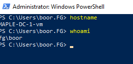

# SQL Server to Arc SQL MI - Migration environment
> `#TODO HEADER WITH SQL SERVERS, SQL MI AND TERRAFORM`
A terraform-built demo environment for migrating various SQL Servers to Arc SQL MI.

We showcase the following entities in this repo:
> `#TODO DIAGRAM | Domain, DNS`

## Table of Contents <!-- omit in toc -->
- [Infrastructure Deployment](#infrastructure-deployment)
  - [Dev Container](#dev-container)
  - [Terraform apply](#terraform-apply)
- [Post Deployment Steps](#post-deployment)
  - [Create Root Domain fg.contoso.com](#create-root-domain-with-dc1)
  - [Join new Domain Controller DC2 to Root Domain](#join-new-dc2-to-root-domain)
  - [Create Child Domain maple.fg.contoso.com](#create-child-domain)
  - [Add DNS Forwarding and Delegation](#add-dns-forwarding-and-delegation)
  - [Domain join SQL Servers & Client](#domain-join-remaining-machines)
  - [Client VM tooling](#client-vm-tooling)
  - [Create Windows Logins in SQL](#create-windows-logins-in-sql)
- [Arc Deployment](#post-deployment)
- [Data Migration Setup](#migration-setup)
- [Arc SQL MI Setup with AD](#arc-sql-mi-setup)
  - [Data Controller deployment](#data-controller-deployment)
  - [Active Directory pre-reqs](#active-directory-pre-reqs)
  - [Keytab creation](#keytab-creation)
  - [SQL MI Deployment](#sql-mi-deployment)
  - [Create Windows Logins](#create-windows-logins)

## Infrastructure Deployment

### Dev Container
The folder `.devcontainer` has necessary tools (terraform, azure-cli, kubectl etc) to get started on this demo with [Remote Containers](https://code.visualstudio.com/docs/remote/containers).

## Terraform apply

The following script deploys the environment with Terraform:
```bash
# ---------------------
# ENVIRONMENT VARIABLES
# For Terraform
# ---------------------
# Secrets
export TF_VAR_SPN_CLIENT_ID=$spnClientId
export TF_VAR_SPN_CLIENT_SECRET=$spnClientSecret
export TF_VAR_SPN_TENANT_ID=$spnTenantId
export TF_VAR_SPN_SUBSCRIPTION_ID=$subscriptionId
export TF_VAR_VM_USER_PASSWORD=$localPassword # RDP password for VMs

# Module specific
export TF_VAR_resource_group_name='raki-sql-to-miaa-migration-test-rg'

# ---------------------
# DEPLOY TERRAFORM
# ---------------------
cd terraform
terraform init
terraform plan 
terraform apply -auto-approve

# ---------------------
# DESTROY ENVIRONMENT
# ---------------------
terraform destory
```
And we see:


## Post Deployment

The following steps weren't automated via Terraform because of return on invetment (and because automating stuff inside Windows is hard) - so we perform them manually:

---

### Create Root Domain with DC1

We run the following on: `FG-DC-1` to create `fg.contoso.com`

```powershell
# Configure the Domain Controller
$domainName = 'fg.contoso.com'
$domainAdminPassword = "P@s5w0rd123!!"
$secureDomainAdminPassword = $domainAdminPassword | ConvertTo-SecureString -AsPlainText -Force

Install-WindowsFeature -Name AD-Domain-Services -IncludeManagementTools

# Create Active Directory Forest
Install-ADDSForest `
    -DomainName "$domainName" `
    -CreateDnsDelegation:$false `
    -DatabasePath "C:\Windows\NTDS" `
    -DomainMode "7" `
    -DomainNetbiosName $domainName.Split('.')[0].ToUpper() ` # FG
    -ForestMode "7" `
    -InstallDns:$true `
    -LogPath "C:\Windows\NTDS" `
    -NoRebootOnCompletion:$false `
    -SysvolPath "C:\Windows\SYSVOL" `
    -Force:$true `
    -SafeModeAdministratorPassword $secureDomainAdminPassword
```

After the reboot, we can login via Bastion as our Domain Admin `boor@fg.contoso.com`.

---

### Join new DC2 to Root Domain

We run the following on: `FG-DC-2` to join `fg.contoso.com`:

```powershell
# Join to Domain
$user = "FG\boor"
$domainAdminPassword = "P@s5w0rd123!!"
$domainName = 'fg.contoso.com'
$pass = $domainAdminPassword | ConvertTo-SecureString -AsPlainText -Force
$Credential = New-Object -TypeName System.Management.Automation.PSCredential -ArgumentList $user, $pass
add-computer –domainname $domainName -Credential $Credential

# Install Windows Features
Install-WindowsFeature -Name AD-Domain-Services -IncludeManagementTools -Verbose

# Import Module
Import-Module ADDSDeployment -Verbose

Install-ADDSDomainController `
    -CreateDnsDelegation:$false `
    -DatabasePath "C:\Windows\NTDS" `
    -DomainName $domainName `
    -InstallDns:$true `
    -LogPath "C:\Windows\NTDS" `
    -NoGlobalCatalog:$false `
    -SiteName "Default-First-Site-Name" `
    -SysvolPath "C:\Windows\SYSVOL" `
    -NoRebootOnCompletion:$false `
    -Force:$true `
    -SafeModeAdministratorPassword $pass `
    -Credential $Credential

# Reboot, and login with Domain Admin

# Test install after reboot
Test-ADDSDomainControllerInstallation -Debug -Credential $Credential -DomainName $domainName -SafeModeAdministratorPassword $pass

# Get DC information
Get-ADDomainController -Discover
Get-ADDomainController -Verbose

# Get PDC
Get-ADDomainController -Discover -Domain $domainName -Service "PrimaryDC","TimeService"

```
And we see:


DNS:


And we can check the domain and Forest information:
``` Powershell
# To find the Domain Functional Level, use this command:
Get-ADDomain | fl Name,DomainMode

# To find the Forest Functional Level, use this command:
Get-ADForest | fl Name,ForestMode
```


---

### Create Child Domain

We run the following on: `MAPLE-DC-1` to create `maple.fg.contoso.com`:

```Powershell
# Install Windows Features
Install-WindowsFeature -Name AD-Domain-Services -IncludeManagementTools -Verbose

# Set Creds
$user = "boor@fg.contoso.com" # Different format than before since machine isn't domain joined
$domainAdminPassword = "P@s5w0rd123!!"
$domainName = 'fg.contoso.com'
$pass = $domainAdminPassword | ConvertTo-SecureString -AsPlainText -Force
$Credential = New-Object -TypeName System.Management.Automation.PSCredential -ArgumentList $user, $pass

# Create Child Domain
Install-ADDSDomain `
    -Credential $Credential `
    -NewDomainName "maple" `
    -ParentDomainName $domainName `
    -InstallDNS `
    -DatabasePath "C:\Windows\NTDS" `
    -SysvolPath "C:\Windows\SYSVOL" `
    -LogPath "C:\Windows\NTDS" `
    -SafeModeAdministratorPassword $pass `
    -NoRebootOnCompletion:$false `
    -Force:$true

# Reboot, and login with Domain Admin for Child Domain boor@maple.fg.contoso.com
whoami

# Test install after reboot
Test-ADDSDomainControllerInstallation -Debug -Credential $Credential -DomainName $domainName -SafeModeAdministratorPassword $pass

# Get DC information
Get-ADDomainController -Discover
Get-ADDomainController -Verbose

# Get PDC
Get-ADDomainController -Discover -Domain $domainName -Service "PrimaryDC","TimeService"
```

We see after logging in with `boor@maple.fg.contoso.com`:


And note we can also login with `boor@fg.contoso.com` into the `maple` machine - which is desirable:

Finally we see the new Child Domain and domain controller get added as well:



The Child Domain is visible in the Root Domain Controller as well:


---

### Add DNS Forwarding and Delegation

On both `FG-DC-1` and `MAPLE-DC-1`, we need to configure DNS Delegation and Conditional Forwarding so any domain queries end up in the correct domain's DNS server:

* Run on `FG-DC-1` for `maple.fg.contoso.com` goes to the `MAPLE-DC-1` DNS Server

  ```PowerShell
  Add-DnsServerZoneDelegation -Name "fg.contoso.com" -ChildZoneName "maple" -NameServer "maple-dc-1-vm.maple.fg.contoso.com" -IPAddress 192.168.1.4 -PassThru -Verbose
  ```
* Run on `MAPLE-DC-1` for `fg.contoso.com` goes to the `FG-DC-1` DNS Server

  ```PowerShell
  Add-DnsServerConditionalForwarderZone -Name "fg.contoso.com" -MasterServers "192.168.0.4" # FG-DC-1-vm
  ```

> Run `ipconfig /flushdns` each machine testing this update.

`ping FG-DC-1-vm.fg.contoso.com`:

We see on `FG-DC-1`:


And we see on `MAPLE-DC-1`:

`ping MAPLE-DC-1-vm.maple.fg.contoso.com`


---

### Domain Join remaining machines

On each of the following `FG` machines, run the following PowerShell script as local admin:
* `FG-CLIENT-vm`
* `FG-SQL-2012-sql-vm`
* `FG-SQL-2014-sql-vm`
* `FG-SQL-2016-sql-vm`

``` Powershell
# Join to FG Domain
$user = "FG\boor"
$domainAdminPassword = "P@s5w0rd123!!"
$domainName = 'fg.contoso.com'
$pass = $domainAdminPassword | ConvertTo-SecureString -AsPlainText -Force
$Credential = New-Object -TypeName System.Management.Automation.PSCredential -ArgumentList $user, $pass
add-computer –domainname $domainName -Credential $Credential -restart –force
```

We see:


And for `MAPLE-SQL-2019-sql-vm`:

``` Powershell
# Join to MAPLE Domain
$user = "MAPLE\boor"
$domainAdminPassword = "P@s5w0rd123!!"
$domainName = 'maple.fg.contoso.com'
$pass = $domainAdminPassword | ConvertTo-SecureString -AsPlainText -Force
$Credential = New-Object -TypeName System.Management.Automation.PSCredential -ArgumentList $user, $pass
add-computer –domainname $domainName -Credential $Credential -restart –force
```


---

### Client VM tooling

We install a few tools on `FG-CLIENT-vm` for demo purposes later by signing in as `boor@fg.contoso.com`:

```Powershell
# Install chocolatey
iex ((New-Object System.Net.WebClient).DownloadString('https://chocolatey.org/install.ps1'))

# Install apps
$chocolateyAppList = 'azure-cli,kubernetes-cli,vscode,kubernetes-helm,grep,ssms'

$appsToInstall = $chocolateyAppList -split "," | foreach { "$($_.Trim())" }

foreach ($app in $appsToInstall)
{
    Write-Host "Installing $app"
    & choco install $app /y -Force| Write-Output
}

# Kubectl alias
New-Item -path alias:kubectl -value 'C:\ProgramData\chocolatey\lib\kubernetes-cli\tools\kubernetes\client\bin\kubectl.exe'
```

---

### Create Windows logins in SQL

Now, we must RDP in as the **local** user `boor` and not the domain user (`FG\boor` or `MAPLE\boor`) - so that we can sign into our 4 SQL Servers and create Windows AD logins.

> This is because the SQL Marketplace images created local user logins by default.

For example:


Launch SSMS and sign in:


Perform on:
* `FG-SQL-2012-sql-vm`
* `FG-SQL-2014-sql-vm`
* `FG-SQL-2016-sql-vm`
* `MAPLE-SQL-2019-sql-vm`

``` SQL
USE [master]
GO
-- Create login for FG
CREATE LOGIN [FG\boor] FROM WINDOWS WITH DEFAULT_DATABASE=[master]
GO
ALTER SERVER ROLE [sysadmin] ADD MEMBER [FG\boor]
GO
-- Create login for MAPLE
CREATE LOGIN [MAPLE\boor] FROM WINDOWS WITH DEFAULT_DATABASE=[master]
GO
ALTER SERVER ROLE [sysadmin] ADD MEMBER [MAPLE\boor]
GO
```

We create the windows logins on all 4 SQL servers:


From `FG-SQL-2014`, and `MAPLE-SQL-2019`, login to all 4 instances as Windows AD login:


---

## Arc SQL MI Setup

### Data Controller deployment

We deploy in _Indirect_ mode since it's a bit faster but this will work identically in _Direct_.

We run this directly in our `.devcontainer` which has the pre-reqs installed:

```bash
cd kubernetes

# Deployment variables
export adminUsername='admin'
export resourceGroup=$TF_VAR_resource_group_name
export AZDATA_USERNAME='admin'
export AZDATA_PASSWORD='P@s5w0rd123!!'
export arcDcName='arc-dc'
export azureLocation='eastus'
export clusterName='aks-cni'
export AZDATA_LOGSUI_USERNAME=$AZDATA_USERNAME
export AZDATA_METRICSUI_USERNAME=$AZDATA_USERNAME
export AZDATA_LOGSUI_PASSWORD=$AZDATA_PASSWORD
export AZDATA_METRICSUI_PASSWORD=$AZDATA_PASSWORD

# Login as service principal
az login --service-principal --username $spnClientId --password $spnClientSecret --tenant $spnTenantId
az account set --subscription $subscriptionId

# Adding Azure Arc CLI extensions
az config set extension.use_dynamic_install=yes_without_prompt

# Getting AKS cluster credentials kubeconfig file
az aks get-credentials --resource-group $resourceGroup --name $clusterName --admin

kubectl get nodes

# Monitor pods in arc namespace in another window
watch kubectl get pods -n arc

#########################################
# Create data controller in indirect mode
#########################################
# Create with the AKS profile
az arcdata dc create --profile-name azure-arc-aks-premium-storage \
                     --k8s-namespace arc \
                     --name $arcDcName \
                     --subscription $subscriptionId \
                     --resource-group $resourceGroup \
                     --location $azureLocation \
                     --connectivity-mode indirect \
                     --use-k8s

# Monitor Data Controller
watch kubectl get datacontroller -n arc

# Spot for ActiveDirectoryConnector CRD
kubectl get ActiveDirectoryConnector -n arc
```

---

### Active Directory pre-reqs

Perform the pre-reqs below in `FG-DC-1` and repeat #3 on `MAPLE-DC-1`:

```PowerShell
Import-Module ActiveDirectory
#######################################
# 1. Create an AD Account for our sqlmi
#######################################
# Create OU - not an Arc requirement but nice to show since everyone uses it
# Arc SQL MI Users can be in any OU
New-ADOrganizationalUnit -Name "ArcSQLMI" -Path "DC=FG,DC=CONTOSO,DC=COM"

$pass = "acntorPRESTO!" | ConvertTo-SecureString -AsPlainText -Force
New-ADUser -Name "sql-ad-yes-1-account" `
           -UserPrincipalName "sql-ad-yes-1-account@fg.contoso.com" `
           -Path "OU=ArcSQLMI,DC=FG,DC=CONTOSO,DC=COM" `
           -AccountPassword $pass `
           -Enabled $true `
           -ChangePasswordAtLogon $false `
           -PasswordNeverExpires $true

# "-PasswordNeverExpires "Since we don't want to deal with Keytab rotations for this demo, in PROD we don't need this

################
# 2. Create SPNs
################
setspn -S MSSQLSvc/sql-ad-yes-1.fg.contoso.com sql-ad-yes-1-account
setspn -S MSSQLSvc/sql-ad-yes-1.fg.contoso.com:31433 sql-ad-yes-1-account

# Verify SPNs got created
$search = New-Object DirectoryServices.DirectorySearcher([ADSI]"")
$search.filter = "(servicePrincipalName=*)"

## You can use this to filter for OU's:
## $results = $search.Findall() | ?{ $_.path -like '*OU=whatever,DC=whatever,DC=whatever*' }
$results = $search.Findall()

foreach( $result in $results ) {
	$userEntry = $result.GetDirectoryEntry()
	Write-host "Object Name	=	"	$userEntry.name -backgroundcolor "yellow" -foregroundcolor "black"
	Write-host "DN	=	"	$userEntry.distinguishedName
	Write-host "Object Cat.	=	" $userEntry.objectCategory
	Write-host "servicePrincipalNames"

	$i=1
	foreach( $SPN in $userEntry.servicePrincipalName ) {
		Write-host "SPN ${i} =$SPN"
		$i+=1
	}
	Write-host ""
}

#############################################
# 3. Reverse Lookup Zone - Pointer - FG-DC-1
#############################################
# Add a reverse lookup zone
Add-DnsServerPrimaryZone -NetworkId "192.168.0.0/24" -ReplicationScope Domain

# Get reverse zone name
$Zones = @(Get-DnsServerZone)
ForEach ($Zone in $Zones) {
    if (-not $($Zone.IsAutoCreated) -and ($Zone.IsReverseLookupZone)) {
       $Reverse = $Zone.ZoneName
    }
}

# Add a PTR record to the Reverse Lookup Zone for the Domain Controller. This is needed for when the SQL MI Pod looks up the DC in reverse.
Add-DNSServerResourceRecordPTR -ZoneName $Reverse -Name 4 -PTRDomainName FG-DC-1-vm.fg.contoso.com # 4 is because of the IP address of the DC
Add-DNSServerResourceRecordPTR -ZoneName $Reverse -Name 5 -PTRDomainName FG-DC-2-vm.fg.contoso.com # 5 is because of the IP address of the DC

################################################
#              RUN ON MAPLE-DC-1
################################################
# 4. Reverse Lookup Zone - Pointer - MAPLE-DC-1
################################################
# Add a reverse lookup zone
Add-DnsServerPrimaryZone -NetworkId "192.168.1.0/24" -ReplicationScope Domain

$Zones = @(Get-DnsServerZone)
ForEach ($Zone in $Zones) {
    if (-not $($Zone.IsAutoCreated) -and ($Zone.IsReverseLookupZone)) {
       $Reverse = $Zone.ZoneName
    }
}

Add-DNSServerResourceRecordPTR -ZoneName $Reverse -Name 4 -PTRDomainName MAPLE-DC-1-vm.maple.fg.contoso.com
```

---

### Keytab Creation

```bash
cd active-directory
##################################
# Keytab generation Job deployment
##################################
# Create secret with AD Password
kubectl create secret generic keytab-password --from-literal=password=acntorPRESTO! -n arc

# Kubernetes Service Account for Job to create secrets
kubectl apply -f service-account.yaml

# Kubernetes Job Deployment
kubectl apply -f deploy-job.yaml

# View keytab secret
kubectl get secret sql-ad-yes-1-keytab-secret -n arc -o go-template='
{{range $k,$v := .data}}{{printf "%s: " $k}}{{if not $v}}{{$v}}{{else}}{{$v | base64decode}}{{end}}{{"\n"}}{{end}}'
```

---

### SQL MI Deployment

```bash
cd ../sql-mi
######################################
# Active Directory + SQL MI deployment
######################################
# Deploy Active Directory Connector
kubectl apply -f ActiveDirectoryConnector.yaml

# Deploy MI
kubectl apply -f sql-ad-yes-1.yaml
```

And we create a DNS record in `FG-DC-1` with the Load Balancer's IP:
```Powershell
Add-DnsServerResourceRecordA -Name sql-ad-yes-1 -ZoneName fg.contoso.com -IPv4Address 20.121.224.105 # AKS LB
```

### Create Windows Logins

Use SSMS from any of our Windows VMs to login to `sql-ad-yes-1.fg.contoso.com,31433`:

```SQL
USE [master]
GO
-- Create login for FG
CREATE LOGIN [FG\boor] FROM WINDOWS WITH DEFAULT_DATABASE=[master]
GO
ALTER SERVER ROLE [sysadmin] ADD MEMBER [FG\boor]
GO
-- Create login for MAPLE
CREATE LOGIN [MAPLE\boor] FROM WINDOWS WITH DEFAULT_DATABASE=[master]
GO
ALTER SERVER ROLE [sysadmin] ADD MEMBER [MAPLE\boor]
GO
```