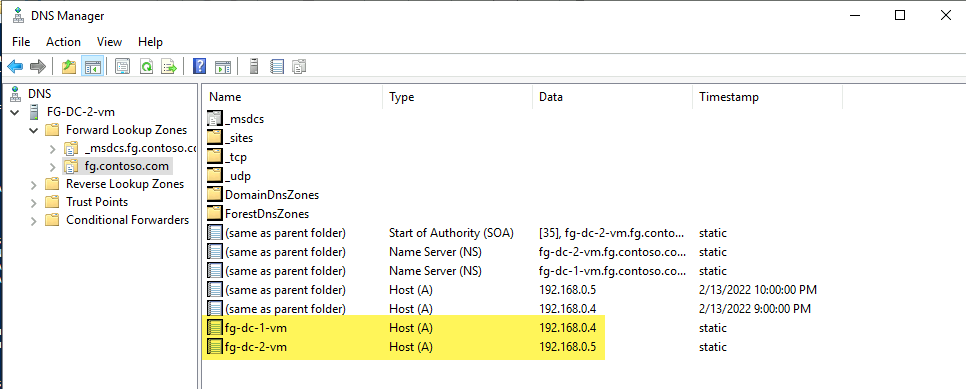

# SQL Server to Arc SQL MI - Migration environment
A terraform-built demo environment for migrating various SQL Servers to Arc SQL MI.

We showcase the following entities in this repo:
> `#TODO DIAGRAM`

## Table of Contents <!-- omit in toc -->
- [Infrastructure Deployment](#infrastructure-deployment)
  - [Dev Container](#dev-container)
  - [Terraform apply](#terraform-apply)
- [Post Deployment Steps](#post-deployment)
  - [Create Root Domain fg.contoso.com](#create-root-domain-with-dc1)
  - [Join new Domain Controller DC2 to Root Domain](#join-new-dc2-to-root-domain)
  - [Create Child Domain maple.fg.contoso.com](#create-child-domain)

## Infrastructure Deployment

### Dev Container
The folder `.devcontainer` has necessary tools (terraform, azure-cli, kubectl etc) to get started on this demo with [Remote Containers](https://code.visualstudio.com/docs/remote/containers).

## Terraform apply

The following script deploys the environment with Terraform:
```bash
# ---------------------
# ENVIRONMENT VARIABLES
# For Terraform
# ---------------------
# Secrets
export TF_VAR_SPN_CLIENT_ID=$spnClientId
export TF_VAR_SPN_CLIENT_SECRET=$spnClientSecret
export TF_VAR_SPN_TENANT_ID=$spnTenantId
export TF_VAR_SPN_SUBSCRIPTION_ID=$subscriptionId
export TF_VAR_VM_USER_PASSWORD=$localPassword # RDP password for VMs

# Module specific
export TF_VAR_resource_group_name='raki-sql-to-miaa-migration-rg'

# ---------------------
# DEPLOY TERRAFORM
# ---------------------
cd terraform
terraform init
terraform plan
terraform apply -auto-approve

# ---------------------
# DESTROY ENVIRONMENT
# ---------------------
terraform destory
```
And we see:


## Post Deployment

The following steps weren't automated via Terraform because of return on invetment (and because automating stuff inside Windows is hard) - so we perform them manually:

---

### Create Root Domain with DC1

We run the following on: `FG-DC-1` to create `fg.contoso.com`

```powershell
# Configure the Domain Controller
$domainName = 'fg.contoso.com'
$domainAdminPassword = "P@s5w0rd123!!"
$secureDomainAdminPassword = $domainAdminPassword | ConvertTo-SecureString -AsPlainText -Force

Install-WindowsFeature -Name AD-Domain-Services -IncludeManagementTools

# Create Active Directory Forest
Install-ADDSForest `
    -DomainName "$domainName" `
    -CreateDnsDelegation:$false `
    -DatabasePath "C:\Windows\NTDS" `
    -DomainMode "7" `
    -DomainNetbiosName $domainName.Split('.')[0].ToUpper() ` # FG
    -ForestMode "7" `
    -InstallDns:$true `
    -LogPath "C:\Windows\NTDS" `
    -NoRebootOnCompletion:$false `
    -SysvolPath "C:\Windows\SYSVOL" `
    -Force:$true `
    -SafeModeAdministratorPassword $secureDomainAdminPassword
```

After the reboot, we can login via Bastion as our Domain Admin `boor@fg.contoso.com`.

---

### Join new DC2 to Root Domain

We run the following on: `FG-DC-2` to join `fg.contoso.com`:

```powershell
# Join to Domain
$user = "FG\boor"
$domainAdminPassword = "P@s5w0rd123!!"
$domainName = 'fg.contoso.com'
$pass = $domainAdminPassword | ConvertTo-SecureString -AsPlainText -Force
$Credential = New-Object -TypeName System.Management.Automation.PSCredential -ArgumentList $user, $pass
add-computer –domainname $domainName -Credential $Credential

# Install Windows Features
Install-WindowsFeature -Name AD-Domain-Services -IncludeManagementTools -Verbose

# Import Module
Import-Module ADDSDeployment -Verbose

Install-ADDSDomainController `
    -CreateDnsDelegation:$false `
    -DatabasePath "C:\Windows\NTDS" `
    -DomainName $domainName `
    -InstallDns:$true `
    -LogPath "C:\Windows\NTDS" `
    -NoGlobalCatalog:$false `
    -SiteName "Default-First-Site-Name" `
    -SysvolPath "C:\Windows\SYSVOL" `
    -NoRebootOnCompletion:$false `
    -Force:$true `
    -SafeModeAdministratorPassword $pass `
    -Credential $Credential

# Reboot, and login with Domain Admin

# Test install after reboot
Test-ADDSDomainControllerInstallation -Debug -Credential $Credential -DomainName $domainName -SafeModeAdministratorPassword $pass

# Get DC information
Get-ADDomainController -Discover
Get-ADDomainController -Verbose

# Get PDC
Get-ADDomainController -Discover -Domain $domainName -Service "PrimaryDC","TimeService"

```
And we see:


DNS:



And we can check the domain and Forest information:
``` Powershell
# To find the Domain Functional Level, use this command:
Get-ADDomain | fl Name,DomainMode

# To find the Forest Functional Level, use this command:
Get-ADForest | fl Name,ForestMode
```


---

### Create Child Domain

We run the following on: `MAPLE-DC-1` to create `maple.fg.contoso.com`:

```Powershell
# Install Windows Features
Install-WindowsFeature -Name AD-Domain-Services -IncludeManagementTools -Verbose

# Set Creds
$user = "boor@fg.contoso.com" # Different format than before since machine isn't domain joined
$domainAdminPassword = "P@s5w0rd123!!"
$domainName = 'fg.contoso.com'
$pass = $domainAdminPassword | ConvertTo-SecureString -AsPlainText -Force
$Credential = New-Object -TypeName System.Management.Automation.PSCredential -ArgumentList $user, $pass

# Create Child Domain
Install-ADDSDomain `
    -Credential $Credential `
    -NewDomainName "maple" `
    -ParentDomainName $domainName `
    -InstallDNS `
    -DatabasePath "C:\Windows\NTDS" `
    -SysvolPath "C:\Windows\SYSVOL" `
    -LogPath "C:\Windows\NTDS" `
    -SafeModeAdministratorPassword $pass `
    -NoRebootOnCompletion:$false `
    -Force:$true

# Reboot, and login with Domain Admin for Child Domain boor@maple.fg.contoso.com
whoami

# Test install after reboot
Test-ADDSDomainControllerInstallation -Debug -Credential $Credential -DomainName $domainName -SafeModeAdministratorPassword $pass

# Get DC information
Get-ADDomainController -Discover
Get-ADDomainController -Verbose

# Get PDC
Get-ADDomainController -Discover -Domain $domainName -Service "PrimaryDC","TimeService"
```

We see after logging in with `boor@maple.fg.contoso.com`:


And note we can also login with `boor@fg.contoso.com` into the `maple` machine - which is desirable:

Finally we see the new Child Domain and domain controller get added as well:


The Child Domain is visible in the Root Domain Controller as well:


---