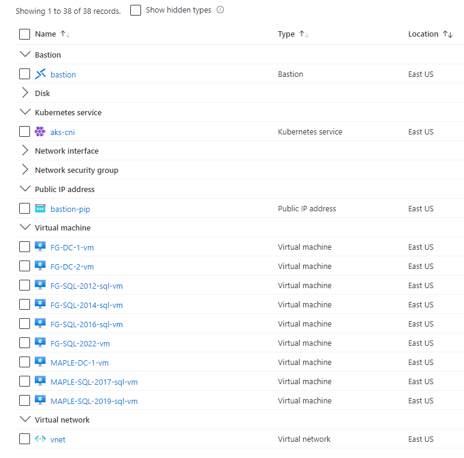
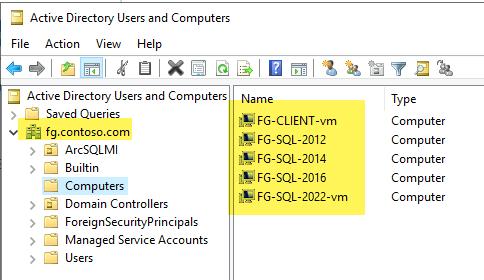
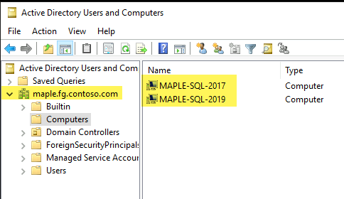

# SQL Server to Arc SQL MI - Migration environment

A terraform-built demo environment for migrating various SQL Servers to Arc SQL MI.

> `#TODO DIAGRAM | Domain, DNS`

## Table of Contents <!-- omit in toc -->
- [Infrastructure Deployment](#infrastructure-deployment)
  - [Dev Container](#dev-container)
  - [Terraform apply](#terraform-apply)
- [Post Deployment Steps](#post-deployment)
  - [Create Root Domain fg.contoso.com](#create-root-domain-with-dc1)
  - [Join new Domain Controller DC2 to Root Domain](#join-new-dc2-to-root-domain)
  - [Create Child Domain maple.fg.contoso.com](#create-child-domain)
  - [Add DNS Forwarding and Delegation](#add-dns-forwarding-and-delegation)
  - [Turn off local Windows Firewalls](#turn-off-local-firewall)
  - [Domain join SQL Servers & Client](#domain-join-remaining-machines)
  - [Create Windows Logins in SQL](#create-windows-logins-in-sql)
- [Arc Deployment](#post-deployment)
- [Data Migration Setup](#migration-setup)
- [Arc SQL MI Setup with AD](#arc-sql-mi-setup)
  - [Data Controller deployment](#data-controller-deployment)
  - [Active Directory pre-reqs](#active-directory-pre-reqs)
  - [Keytab creation](#keytab-creation)
  - [SQL MI Deployment](#sql-mi-deployment)
  - [Create Windows Logins](#create-windows-logins)
  - [Kerberos workaround for MAPLE](#kerberos-workaround-for-maple)
- [MIAA - DAG migration setup](#miaa-dag-migration-setup)
  - [DAG from SQL 2019](#dag-from-SQL-2019-to-MIAA)
  - [DAG from SQL 2017](#dag-from-SQL-2017-to-MIAA)
  - [DAG from SQL 2022](#dag-from-SQL-2022-to-MIAA)
  - [DAG from Azure SQL MI](#dag-from-Azure-SQL-MI-to-MIAA)
- [MIAA - Log shipping migration setup](#miaa-log-shipping-migration-setup)
  - [Why DAG on SQL 2016 won't work](#dag-from-SQL-2016-wont-work)
  - [Log shipping from SQL 2012-2016 to 2019, DAG over](#log-shipping-from-SQL-2012-to-2016-to-MIAA)

## Infrastructure Deployment

### Dev Container
The folder `.devcontainer` has necessary tools (terraform, azure-cli, kubectl etc) to get started on this demo with [Remote Containers](https://code.visualstudio.com/docs/remote/containers).

## Terraform apply

The following script deploys the environment with Terraform:
```bash
# ---------------------
# ENVIRONMENT VARIABLES
# For Terraform
# ---------------------
# Secrets
export TF_VAR_SPN_CLIENT_ID=$spnClientId
export TF_VAR_SPN_CLIENT_SECRET=$spnClientSecret
export TF_VAR_SPN_TENANT_ID=$spnTenantId
export TF_VAR_SPN_SUBSCRIPTION_ID=$subscriptionId
export TF_VAR_VM_USER_PASSWORD=$localPassword # RDP password for VMs

# Module specific
export TF_VAR_resource_group_name='raki-sql-to-miaa-migration-test-rg'

# ---------------------
# DEPLOY TERRAFORM
# ---------------------
cd terraform
terraform init
terraform plan 
terraform apply -auto-approve

# ---------------------
# DESTROY ENVIRONMENT
# ---------------------
terraform destory
```
And we see:



## Post Deployment

The following steps weren't automated via Terraform because of return on invetment (and because automating stuff inside Windows is hard) - so we perform them manually:

---

### Create Root Domain with DC1

We run the following on: `FG-DC-1` to create `fg.contoso.com`

```powershell
# Configure the Domain Controller
$domainName = 'fg.contoso.com'
$domainAdminPassword = "P@s5w0rd123!!"
$secureDomainAdminPassword = $domainAdminPassword | ConvertTo-SecureString -AsPlainText -Force

Install-WindowsFeature -Name AD-Domain-Services -IncludeManagementTools

# Create Active Directory Forest
Install-ADDSForest `
    -DomainName "$domainName" `
    -CreateDnsDelegation:$false `
    -DatabasePath "C:\Windows\NTDS" `
    -DomainMode "7" `
    -DomainNetbiosName $domainName.Split('.')[0].ToUpper() ` # FG
    -ForestMode "7" `
    -InstallDns:$true `
    -LogPath "C:\Windows\NTDS" `
    -NoRebootOnCompletion:$false `
    -SysvolPath "C:\Windows\SYSVOL" `
    -Force:$true `
    -SafeModeAdministratorPassword $secureDomainAdminPassword
```

After the reboot, we can login via Bastion as our Domain Admin `boor@fg.contoso.com`.

---

### Join new DC2 to Root Domain

We run the following on: `FG-DC-2` to join `fg.contoso.com`:

```powershell
# Join to Domain
$user = "FG\boor"
$domainAdminPassword = "P@s5w0rd123!!"
$domainName = 'fg.contoso.com'
$pass = $domainAdminPassword | ConvertTo-SecureString -AsPlainText -Force
$Credential = New-Object -TypeName System.Management.Automation.PSCredential -ArgumentList $user, $pass
add-computer –domainname $domainName -Credential $Credential

# Install Windows Features
Install-WindowsFeature -Name AD-Domain-Services -IncludeManagementTools -Verbose

# Import Module
Import-Module ADDSDeployment -Verbose

Install-ADDSDomainController `
    -CreateDnsDelegation:$false `
    -DatabasePath "C:\Windows\NTDS" `
    -DomainName $domainName `
    -InstallDns:$true `
    -LogPath "C:\Windows\NTDS" `
    -NoGlobalCatalog:$false `
    -SiteName "Default-First-Site-Name" `
    -SysvolPath "C:\Windows\SYSVOL" `
    -NoRebootOnCompletion:$false `
    -Force:$true `
    -SafeModeAdministratorPassword $pass `
    -Credential $Credential

# Reboot, and login with Domain Admin

# Test install after reboot
Test-ADDSDomainControllerInstallation -Debug -Credential $Credential -DomainName $domainName -SafeModeAdministratorPassword $pass

# Get DC information
Get-ADDomainController -Discover
Get-ADDomainController -Verbose

# Get PDC
Get-ADDomainController -Discover -Domain $domainName -Service "PrimaryDC","TimeService"

```
And we see:


DNS:


And we can check the domain and Forest information:
``` Powershell
# To find the Domain Functional Level, use this command:
Get-ADDomain | fl Name,DomainMode

# To find the Forest Functional Level, use this command:
Get-ADForest | fl Name,ForestMode
```


---

### Create Child Domain

We run the following on: `MAPLE-DC-1` to create `maple.fg.contoso.com`:

```Powershell
# Install Windows Features
Install-WindowsFeature -Name AD-Domain-Services -IncludeManagementTools -Verbose

# Set Creds
$user = "boor@fg.contoso.com" # Different format than before since machine isn't domain joined
$domainAdminPassword = "P@s5w0rd123!!"
$domainName = 'fg.contoso.com'
$pass = $domainAdminPassword | ConvertTo-SecureString -AsPlainText -Force
$Credential = New-Object -TypeName System.Management.Automation.PSCredential -ArgumentList $user, $pass

# Create Child Domain
Install-ADDSDomain `
    -Credential $Credential `
    -NewDomainName "maple" `
    -ParentDomainName $domainName `
    -InstallDNS `
    -DatabasePath "C:\Windows\NTDS" `
    -SysvolPath "C:\Windows\SYSVOL" `
    -LogPath "C:\Windows\NTDS" `
    -SafeModeAdministratorPassword $pass `
    -NoRebootOnCompletion:$false `
    -Force:$true

# Reboot, and login with Domain Admin for Child Domain boor@maple.fg.contoso.com
whoami

# Test install after reboot
Test-ADDSDomainControllerInstallation -Debug -Credential $Credential -DomainName $domainName -SafeModeAdministratorPassword $pass

# Get DC information
Get-ADDomainController -Discover
Get-ADDomainController -Verbose

# Get PDC
Get-ADDomainController -Discover -Domain $domainName -Service "PrimaryDC","TimeService"
```

We see after logging in with `boor@maple.fg.contoso.com`:


And note we can also login with `boor@fg.contoso.com` into the `maple` machine - which is desirable:

Finally we see the new Child Domain and domain controller get added as well:


The Child Domain is visible in the Root Domain Controller as well:


---

### Add DNS Forwarding and Delegation

On both `FG-DC-1` and `MAPLE-DC-1`, we need to configure DNS Delegation and Conditional Forwarding so any domain queries end up in the correct domain's DNS server:

* Run on `FG-DC-1` for `maple.fg.contoso.com` goes to the `MAPLE-DC-1` DNS Server

  ```PowerShell
  Add-DnsServerZoneDelegation -Name "fg.contoso.com" -ChildZoneName "maple" -NameServer "maple-dc-1-vm.maple.fg.contoso.com" -IPAddress 192.168.1.4 -PassThru -Verbose
  ```
* Run on `MAPLE-DC-1` for `fg.contoso.com` goes to the `FG-DC-1` DNS Server

  ```PowerShell
  Add-DnsServerConditionalForwarderZone -Name "fg.contoso.com" -MasterServers "192.168.0.4" # FG-DC-1-vm
  ```

> Run `ipconfig /flushdns` each machine testing this update.

`ping FG-DC-1-vm.fg.contoso.com`:

We see on `FG-DC-1`:


And we see on `MAPLE-DC-1`:

`ping MAPLE-DC-1-vm.maple.fg.contoso.com`


---
### Turn off local Firewall

We need to turn off Windows Firewall for later steps where `5022` is required for the AG listener. In PROD environments this can be dealt with seperately but for this use case, I found the following to work in avoiding various network related heartaches:

```PowerShell
Set-NetFirewallProfile -Profile Domain,Public,Private -Enabled False
```

---

### Domain Join remaining machines

On each of the following `FG` machines, run the following PowerShell script as local admin:
* `FG-CLIENT-vm`
* `FG-SQL-2012-sql-vm`
* `FG-SQL-2014-sql-vm`
* `FG-SQL-2016-sql-vm`

``` Powershell
# Join to FG Domain
$user = "FG\boor"
$domainAdminPassword = "P@s5w0rd123!!"
$domainName = 'fg.contoso.com'
$pass = $domainAdminPassword | ConvertTo-SecureString -AsPlainText -Force
$Credential = New-Object -TypeName System.Management.Automation.PSCredential -ArgumentList $user, $pass
add-computer –domainname $domainName -Credential $Credential -restart –force
```

We see:



And for `MAPLE-SQL-2019-sql-vm`:

``` Powershell
# Join to MAPLE Domain
$user = "MAPLE\boor"
$domainAdminPassword = "P@s5w0rd123!!"
$domainName = 'maple.fg.contoso.com'
$pass = $domainAdminPassword | ConvertTo-SecureString -AsPlainText -Force
$Credential = New-Object -TypeName System.Management.Automation.PSCredential -ArgumentList $user, $pass
add-computer –domainname $domainName -Credential $Credential -restart –force
```



---

### Create Windows logins in SQL

Now, we must RDP in as the **local** user `boor` and not the domain user (`FG\boor` or `MAPLE\boor`) - so that we can sign into our 4 SQL Servers and create Windows AD logins.

> This is because the SQL Marketplace images created local user logins by default.

For example:


Launch SSMS and sign in:


Perform on:
* `FG-SQL-2012-sql-vm`
* `FG-SQL-2014-sql-vm`
* `FG-SQL-2016-sql-vm`
* `MAPLE-SQL-2019-sql-vm`

``` SQL
USE [master]
GO
-- Create login for FG
CREATE LOGIN [FG\boor] FROM WINDOWS WITH DEFAULT_DATABASE=[master]
GO
ALTER SERVER ROLE [sysadmin] ADD MEMBER [FG\boor]
GO
-- Create login for MAPLE
CREATE LOGIN [MAPLE\boor] FROM WINDOWS WITH DEFAULT_DATABASE=[master]
GO
ALTER SERVER ROLE [sysadmin] ADD MEMBER [MAPLE\boor]
GO
```

We create the windows logins on all 4 SQL servers:


From `FG-SQL-2014`, and `MAPLE-SQL-2019`, login to all 4 instances as Windows AD login:


---

## Arc SQL MI Setup

### Data Controller deployment

We deploy in _Indirect_ mode since it's a bit faster but this will work identically in _Direct_.

We run this directly in our `.devcontainer` which has the pre-reqs installed:

```bash
cd kubernetes

# Deployment variables
export adminUsername='admin'
export resourceGroup=$TF_VAR_resource_group_name
export AZDATA_USERNAME='admin'
export AZDATA_PASSWORD='P@s5w0rd123!!'
export arcDcName='arc-dc'
export azureLocation='eastus'
export clusterName='aks-cni'
export AZDATA_LOGSUI_USERNAME=$AZDATA_USERNAME
export AZDATA_METRICSUI_USERNAME=$AZDATA_USERNAME
export AZDATA_LOGSUI_PASSWORD=$AZDATA_PASSWORD
export AZDATA_METRICSUI_PASSWORD=$AZDATA_PASSWORD

# Login as service principal
az login --service-principal --username $spnClientId --password $spnClientSecret --tenant $spnTenantId
az account set --subscription $subscriptionId

# Adding Azure Arc CLI extensions
az config set extension.use_dynamic_install=yes_without_prompt

# Getting AKS cluster credentials kubeconfig file
az aks get-credentials --resource-group $resourceGroup --name $clusterName --admin

kubectl get nodes

# Monitor pods in arc namespace in another window
watch kubectl get pods -n arc

#########################################
# Create data controller in indirect mode
#########################################
# Create with the AKS profile
az arcdata dc create --profile-name azure-arc-aks-premium-storage \
                     --k8s-namespace arc \
                     --name $arcDcName \
                     --subscription $subscriptionId \
                     --resource-group $resourceGroup \
                     --location $azureLocation \
                     --connectivity-mode indirect \
                     --use-k8s

# Monitor Data Controller
watch kubectl get datacontroller -n arc

# Spot for ActiveDirectoryConnector CRD
kubectl get ActiveDirectoryConnector -n arc
```

---

### Active Directory pre-reqs

Perform the pre-reqs below in `FG-DC-1` and repeat #3 on `MAPLE-DC-1`:

```PowerShell
Import-Module ActiveDirectory
#######################################
# 1. Create an AD Account for our sqlmi
#######################################
# Create OU - not an Arc requirement but nice to show since everyone uses it
# Arc SQL MI Users can be in any OU
New-ADOrganizationalUnit -Name "ArcSQLMI" -Path "DC=FG,DC=CONTOSO,DC=COM"

$pass = "acntorPRESTO!" | ConvertTo-SecureString -AsPlainText -Force
New-ADUser -Name "sql-ad-yes-1-account" `
           -UserPrincipalName "sql-ad-yes-1-account@fg.contoso.com" `
           -Path "OU=ArcSQLMI,DC=FG,DC=CONTOSO,DC=COM" `
           -AccountPassword $pass `
           -Enabled $true `
           -ChangePasswordAtLogon $false `
           -PasswordNeverExpires $true

# "-PasswordNeverExpires "Since we don't want to deal with Keytab rotations for this demo, in PROD we don't need this

################
# 2. Create SPNs
################
setspn -S MSSQLSvc/sql-ad-yes-1.fg.contoso.com sql-ad-yes-1-account
setspn -S MSSQLSvc/sql-ad-yes-1.fg.contoso.com:31433 sql-ad-yes-1-account

# Verify SPNs got created
$search = New-Object DirectoryServices.DirectorySearcher([ADSI]"")
$search.filter = "(servicePrincipalName=*)"

## You can use this to filter for OU's:
## $results = $search.Findall() | ?{ $_.path -like '*OU=whatever,DC=whatever,DC=whatever*' }
$results = $search.Findall()

foreach( $result in $results ) {
	$userEntry = $result.GetDirectoryEntry()
	Write-host "Object Name	=	"	$userEntry.name -backgroundcolor "yellow" -foregroundcolor "black"
	Write-host "DN	=	"	$userEntry.distinguishedName
	Write-host "Object Cat.	=	" $userEntry.objectCategory
	Write-host "servicePrincipalNames"

	$i=1
	foreach( $SPN in $userEntry.servicePrincipalName ) {
		Write-host "SPN ${i} =$SPN"
		$i+=1
	}
	Write-host ""
}

##########################################################################################
#                                      RUN ON FG-DC-1
##########################################################################################
# 3A. Reverse Lookup Zone - Pointer - FG
#############################################
# Add a reverse lookup zone - FG Subnet
Add-DnsServerPrimaryZone -NetworkId "192.168.0.0/24" -ReplicationScope Domain

# Get reverse zone name
$Zones = @(Get-DnsServerZone)
ForEach ($Zone in $Zones) {
    if ((-not $($Zone.IsAutoCreated)) -and ($Zone.IsReverseLookupZone) -and ($Zone.ZoneName.Split(".")[0] -eq "0")) {
       $Reverse = $Zone.ZoneName
    }
}

# Add a PTR record to the Reverse Lookup Zone for the Domain Controller. This is needed for when the SQL MI Pod looks up the DC in reverse.
Add-DNSServerResourceRecordPTR -ZoneName $Reverse -Name 4 -PTRDomainName FG-DC-1-vm.fg.contoso.com # 4 is because of the IP address of the DC
Add-DNSServerResourceRecordPTR -ZoneName $Reverse -Name 5 -PTRDomainName FG-DC-2-vm.fg.contoso.com # 5 is because of the IP address of the DC

#############################################
# 3B. Reverse Lookup Zone - Pointer - MAPLE
#############################################
# Add a reverse lookup zone - MAPLE Subnet
Add-DnsServerPrimaryZone -NetworkId "192.168.1.0/24" -ReplicationScope Domain

# Get reverse zone name
$Zones = @(Get-DnsServerZone)
ForEach ($Zone in $Zones) {
    if ((-not $($Zone.IsAutoCreated)) -and ($Zone.IsReverseLookupZone) -and ($Zone.ZoneName.Split(".")[0] -eq "1")) {
       $Reverse = $Zone.ZoneName
    }
}

# Add a PTR record to the Reverse Lookup Zone for the Domain Controller. 
Add-DNSServerResourceRecordPTR -ZoneName $Reverse -Name 4 -PTRDomainName MAPLE-DC-1-vm.maple.fg.contoso.com

##########################################################################################
#                          RUN 3 AND 4 ABOVE ON MAPLE-DC-1 AS WELL
##########################################################################################

```

---

### Keytab Creation

```bash
cd active-directory
##################################
# Keytab generation Job deployment
##################################
# Create secret with AD Password
kubectl create secret generic keytab-password --from-literal=password=acntorPRESTO! -n arc

# Kubernetes Service Account for Job to create secrets
kubectl apply -f service-account.yaml

# Kubernetes Job Deployment
kubectl apply -f deploy-job.yaml

# View keytab secret
kubectl get secret sql-ad-yes-1-keytab-secret -n arc -o go-template='
{{range $k,$v := .data}}{{printf "%s: " $k}}{{if not $v}}{{$v}}{{else}}{{$v | base64decode}}{{end}}{{"\n"}}{{end}}'
```

---

### SQL MI Deployment

```bash
cd ../sql-mi
######################################
# Active Directory + SQL MI deployment
######################################
# Deploy Active Directory Connector
kubectl apply -f ActiveDirectoryConnector.yaml

# Deploy MI
kubectl apply -f sql-ad-yes-1.yaml
```

And we create a DNS record in `FG-DC-1` with the Load Balancer's IP:
```Powershell
Add-DnsServerResourceRecordA -Name sql-ad-yes-1 -ZoneName fg.contoso.com -IPv4Address 20.121.224.105 # AKS LB
```

### Create Windows Logins

Use SSMS from any of our Windows VMs to login to `sql-ad-yes-1.fg.contoso.com,31433`:

```SQL
USE [master]
GO
-- Create login for FG
CREATE LOGIN [FG\boor] FROM WINDOWS WITH DEFAULT_DATABASE=[master]
GO
ALTER SERVER ROLE [sysadmin] ADD MEMBER [FG\boor]
GO
-- ####################################################################################
--            THIS WILL NOT WORK TILL UPCOMING KRB5.CONF FIX FOR CHILD DOMAINS
-- ####################################################################################
-- Create login for MAPLE
-- CREATE LOGIN [MAPLE\boor] FROM WINDOWS WITH DEFAULT_DATABASE=[master]
-- GO
-- ALTER SERVER ROLE [sysadmin] ADD MEMBER [MAPLE\boor]
-- GO
```

And we see the windows login get created:


And we note that Windows login works:


And note if we try to create the `MAPLE` user from the child domain, we see:


This is a bugfix for supporting child domains that will come in soon. Here's a workaround.

---

### Kerberos workaround for MAPLE

Let's take a look at the [`krb5.conf`](https://web.mit.edu/kerberos/krb5-1.12/doc/admin/conf_files/krb5_conf.html) file that was created in the SQL MI Pod:

```bash
kubectl exec sql-ad-yes-1-0 -n arc -c arc-sqlmi -- cat /var/run/etc/krb5.conf
```

We see:
```
[libdefaults]
    default_realm = FG.CONTOSO.COM
    dns_lookup_realm = false
    dns_lookup_kdc = false
    dns_canonicalize_hostname = false

[realms]
    FG.CONTOSO.COM={
        kdc = FG-DC-1-vm.fg.contoso.com
        kdc = FG-DC-2-vm.fg.contoso.com
        kdc = MAPLE-DC-1-vm.maple.fg.contoso.com

        admin_server = FG-DC-1-vm.fg.contoso.com
        default_domain = fg.contoso.com
    }

[domain_realm]
    fg.contoso.com = FG.CONTOSO.COM
    .fg.contoso.com = FG.CONTOSO.COM
```

We are going to replace with a smaller file that uses lookups as documented [here](https://web.mit.edu/kerberos/krb5-1.12/doc/admin/conf_files/krb5_conf.html#libdefaults):

```
[libdefaults]
    default_realm = FG.CONTOSO.COM
    dns_lookup_realm = true
    dns_lookup_kdc = true

[realms]
    FG.CONTOSO.COM={
        admin_server = FG-DC-1-vm.fg.contoso.com
        default_domain = fg.contoso.com
    }
    MAPLE.FG.CONTOSO.COM={
        admin_server = MAPLE-DC-1-vm.maple.fg.contoso.com
        default_domain = maple.fg.contoso.com
    }

[domain_realm]
    fg.contoso.com = FG.CONTOSO.COM
    .fg.contoso.com = FG.CONTOSO.COM
    maple.fg.contoso.com = MAPLE.FG.CONTOSO.COM
    .maple.fg.contoso.com = MAPLE.FG.CONTOSO.COM
```

We copy the `krb5.conf` file into the container:

```bash
cd kubernetes/active-directory

# Move old one to backup
kubectl exec sql-ad-yes-1-0 -n arc -c arc-sqlmi -- mv /var/run/etc/krb5.conf /var/run/etc/krb5.conf.bak 

# Copy local krb5.conf over to pod
kubectl cp krb5.conf arc/sql-ad-yes-1-0:/var/run/etc/krb5.conf -c arc-sqlmi

# Verify
kubectl exec sql-ad-yes-1-0 -n arc -c arc-sqlmi -- cat /var/run/etc/krb5.conf

# Tail the Kerberos logs to see what happens when you create the users
# security.log
kubectl exec sql-ad-yes-1-0 -n arc -c arc-sqlmi -- tail /var/opt/mssql/log/security.log --follow
```

Now we run the following for `MAPLE`:

```sql
USE [master]
GO
-- Create login for MAPLE
CREATE LOGIN [MAPLE\boor] FROM WINDOWS WITH DEFAULT_DATABASE=[master]
GO
ALTER SERVER ROLE [sysadmin] ADD MEMBER [MAPLE\boor]
GO
```

In `security.log`:
```bash
# Successful for FG\boor
02/16/2022 13:51:16.571453412 Debug [security.kerberos] <0000001361/0x00000330> Processing SSPI operation 0x0000000D
02/16/2022 13:51:16.673826368 Debug [security.kerberos] <0000001361/0x00000330> SSPI operation 0x0000000D returned status: [Status: 0x0 Success errno = 0x0(0) Success]
02/16/2022 13:51:16.674009670 Debug [security.kerberos.libos] <0000000872/0x00000214> LookupAccountName() return value: 0x00000001

# Successful for MAPLE\boor
02/16/2022 14:41:38.820451426 Debug [security.kerberos] <0000001361/0x00000330> Processing SSPI operation 0x0000000D
02/16/2022 14:41:38.834570701 Debug [security.kerberos] <0000001361/0x00000330> SSPI operation 0x0000000D returned status: [Status: 0x0 Success errno = 0x0(0) Success]
02/16/2022 14:41:38.834778403 Debug [security.kerberos.libos] <0000000981/0x000002cc> LookupAccountName() return value: 0x00000001
```

And we see the user get created:


We can now sign in with `MAPLE\boor`:


> ‼ Every reboot of the container will mean this new krb5.conf file needs to be copied again in order to login from `MAPLE` - until the fix is in.

---

# MIAA Migration Setup

Here we will showcase the various migration scenarios that are possible with Arc SQL MI.

First, let's download and restore AdventureWorks in all of our SQL Server Instances:

**Download**
```PowerShell
# Run on all if PowerShell complains about SSL
[Net.ServicePointManager]::SecurityProtocol = "tls12, tls11, tls"

# FG-SQL-2012
wget "https://github.com/Microsoft/sql-server-samples/releases/download/adventureworks/AdventureWorksLT2012.bak" -outfile "C:\Program Files\Microsoft SQL Server\MSSQL11.MSSQLSERVER\MSSQL\Backup\AdventureWorksLT2012.bak"

# FG-SQL-2014
wget "https://github.com/Microsoft/sql-server-samples/releases/download/adventureworks/AdventureWorksLT2014.bak" -outfile "C:\Program Files\Microsoft SQL Server\MSSQL12.MSSQLSERVER\MSSQL\Backup\AdventureWorksLT2014.bak"

# FG-SQL-2016
wget "https://github.com/Microsoft/sql-server-samples/releases/download/adventureworks/AdventureWorksLT2016.bak" -outfile "C:\Program Files\Microsoft SQL Server\MSSQL13.MSSQLSERVER\MSSQL\Backup\AdventureWorksLT2016.bak"

# MAPLE-SQL-2019
wget "https://github.com/Microsoft/sql-server-samples/releases/download/adventureworks/AdventureWorksLT2019.bak" -outfile "C:\Program Files\Microsoft SQL Server\MSSQL15.MSSQLSERVER\MSSQL\Backup\AdventureWorksLT2019.bak"
```

**Restore**
```SQL

-- FG-SQL-2012
USE [master]
RESTORE DATABASE [AdventureWorks2012] 
FROM  DISK = N'C:\Program Files\Microsoft SQL Server\MSSQL11.MSSQLSERVER\MSSQL\Backup\AdventureWorksLT2012.bak' 
WITH MOVE 'AdventureWorksLT2008_Data' TO 'C:\Program Files\Microsoft SQL Server\MSSQL11.MSSQLSERVER\MSSQL\DATA\AdventureWorksLT2012_Data.mdf',
MOVE 'AdventureWorksLT2008_Log' TO 'C:\Program Files\Microsoft SQL Server\MSSQL11.MSSQLSERVER\MSSQL\DATA\AdventureWorksLT2012_log.ldf',
FILE = 1,  NOUNLOAD,  STATS = 5
GO

-- FG-SQL-2014
USE [master]
RESTORE DATABASE [AdventureWorks2014] 
FROM  DISK = N'C:\Program Files\Microsoft SQL Server\MSSQL12.MSSQLSERVER\MSSQL\Backup\AdventureWorksLT2014.bak' 
WITH MOVE 'AdventureWorksLT2008_Data' TO 'C:\Program Files\Microsoft SQL Server\MSSQL12.MSSQLSERVER\MSSQL\DATA\AdventureWorksLT2014_Data.mdf',
MOVE 'AdventureWorksLT2008_Log' TO 'C:\Program Files\Microsoft SQL Server\MSSQL12.MSSQLSERVER\MSSQL\DATA\AdventureWorksLT2014_log.ldf',
FILE = 1,  NOUNLOAD,  STATS = 5
GO

-- FG-SQL-2016
USE [master]
RESTORE DATABASE [AdventureWorks2016] 
FROM  DISK = N'C:\Program Files\Microsoft SQL Server\MSSQL13.MSSQLSERVER\MSSQL\Backup\AdventureWorksLT2016.bak' 
WITH MOVE 'AdventureWorksLT2012_Data' TO 'C:\Program Files\Microsoft SQL Server\MSSQL13.MSSQLSERVER\MSSQL\DATA\AdventureWorksLT2016_Data.mdf',
MOVE 'AdventureWorksLT2012_Log' TO 'C:\Program Files\Microsoft SQL Server\MSSQL13.MSSQLSERVER\MSSQL\DATA\AdventureWorksLT2016_log.ldf',
FILE = 1,  NOUNLOAD,  STATS = 5
GO

-- MAPLE-SQL-2019
USE [master]
RESTORE DATABASE [AdventureWorks2019] 
FROM  DISK = N'C:\Program Files\Microsoft SQL Server\MSSQL15.MSSQLSERVER\MSSQL\Backup\AdventureWorksLT2019.bak' 
WITH MOVE 'AdventureWorksLT2012_Data' TO 'C:\Program Files\Microsoft SQL Server\MSSQL15.MSSQLSERVER\MSSQL\DATA\AdventureWorksLT2016_Data.mdf',
MOVE 'AdventureWorksLT2012_Log' TO 'C:\Program Files\Microsoft SQL Server\MSSQL15.MSSQLSERVER\MSSQL\DATA\AdventureWorksLT2016_log.ldf',
FILE = 1,  NOUNLOAD,  STATS = 5
GO

```

We see:


## DAG from SQL 2019 to MIAA

1. Get the Mirroring endpoint cert out of our MIAA Pod:

```bash
cd distributed-ag

# Pull out .PEM from Pod
instance='sql-ad-yes-1'
az sql mi-arc get-mirroring-cert \
             --cert-file "$instance.pem" \
             --name $instance \
             --k8s-namespace arc \
             --use-k8s
# result write to file sql-ad-yes-1.pem: -----BEGIN CERTIFICATE-----
# MIIDTTCCAjWgAwIBAgIIAvXErfDIUg4wDQYJKoZIhvcNAQELBQAwKDEmMCQGA1UEAxMdQ2x1c3Rl
# ...
# ELusPb3xiiGRKs7ufrf1YusZXRK4xfHrNcN5ctNAskQB5Z7RG+bphXBG1qeIrKX0fE9j
# -----END CERTIFICATE-----

# Convert to .CER for SQL Server 2019
openssl x509 -inform PEM -in $instance.pem -outform DER -out $instance.cer
```

> Now we can use any creative method to get the .cer file into our MAPLE-SQL-2019 Azure VM from this dev container 😊 (I used a SAS URL.)

We also note the mirroring endpoint for MIAA is `sql-ad-yes-1.fg.contoso.com:5022` - since we added a DNS entry in Windows earlier and this listens on Port 5022.

---

2. On `MAPLE-SQL-2019`, first we enable AlwaysOn AGs:

```PowerShell
Enable-SqlAlwaysOn -ServerInstance "MAPLE-SQL-2019" -Force
```

Then, create Master Key and locally signed certificate for the AG Mirroring Endpoint:

```sql
-- Create Master Key for cert based operations
CREATE MASTER KEY ENCRYPTION BY PASSWORD = 'acntorPRESTO!'

-- Create certificte for this AG mirroring endpoint
-- Backup public key to local C:\ Drive
CREATE CERTIFICATE server_ag_cert WITH SUBJECT = 'Local AG Certificate';
BACKUP CERTIFICATE server_ag_cert to file = N'C:\Program Files\Microsoft SQL Server\MSSQL15.MSSQLSERVER\MSSQL\Backup\MAPLE-SQL-2019.cer';

```
> Copy the file into this container using some creative method

We see:


Then, we create the AG mirroring endpoint on Port `5022` and onboard the DB:

```sql
-- Create AG mirroring endpoint with this cert as the authentication mechanism
CREATE ENDPOINT [Hadr_endpoint]
    STATE = STARTED 
	AS TCP (LISTENER_IP = ALL, LISTENER_PORT = 5022)
    FOR DATA_MIRRORING (
        ROLE = ALL,
        AUTHENTICATION = CERTIFICATE server_ag_cert,
        ENCRYPTION = REQUIRED ALGORITHM AES
	);

-- View database mirroring endpoints on SQL Server
SELECT
 name, type_desc, state_desc, role_desc,
 connection_auth_desc, is_encryption_enabled, encryption_algorithm_desc
FROM 
 sys.database_mirroring_endpoints

-- Create AG with static IP address - can also use DNS
CREATE AVAILABILITY GROUP [SQL2019-AG1]
WITH (DB_FAILOVER = ON, CLUSTER_TYPE = NONE)
FOR 
REPLICA ON N'MAPLE-SQL-2019' WITH (ENDPOINT_URL = 'TCP://192.168.3.4:5022',
    FAILOVER_MODE = MANUAL,  
    AVAILABILITY_MODE = SYNCHRONOUS_COMMIT,   
	PRIMARY_ROLE(ALLOW_CONNECTIONS = ALL),SECONDARY_ROLE(ALLOW_CONNECTIONS = ALL),
    BACKUP_PRIORITY = 50,   
    SEEDING_MODE = AUTOMATIC);

-- Change Database in Full Recovery mode to add to AG
ALTER DATABASE AdventureWorks2019 SET RECOVERY FULL
GO
BACKUP DATABASE AdventureWorks2019 TO DISK = N'NUL'
GO

-- Add Database into created AG
ALTER AVAILABILITY GROUP [SQL2019-AG1] ADD DATABASE AdventureWorks2019;  
GO  

-- Create login
CREATE LOGIN miaa_login WITH PASSWORD = 'acntorPRESTO!';

-- Create user for login
CREATE USER miaa_user FOR LOGIN miaa_login;

-- Allow authorization via the cert we pulled from MIAA
CREATE CERTIFICATE miaa_certificate   
    AUTHORIZATION miaa_user
    FROM FILE = N'C:\Program Files\Microsoft SQL Server\MSSQL15.MSSQLSERVER\MSSQL\Backup\sql-ad-yes-1.cer';

-- Allow MIAA to connect to the Mirroring endpoint 
GRANT CONNECT ON ENDPOINT::[Hadr_endpoint] TO [miaa_login]

-- Create DAG
CREATE AVAILABILITY GROUP [DAG2019]  
   WITH (DISTRIBUTED)   
   AVAILABILITY GROUP ON  
      'SQL2019-AG1' WITH    
      (   
		LISTENER_URL = 'TCP://192.168.3.4:5022',    
        AVAILABILITY_MODE = ASYNCHRONOUS_COMMIT,   
        FAILOVER_MODE = MANUAL,   
        SEEDING_MODE = AUTOMATIC
	  ), 
      'sql-ad-yes-1' WITH    
      (   
         LISTENER_URL = 'TCP://sql-ad-yes-1.fg.contoso.com:5022',   
         AVAILABILITY_MODE = ASYNCHRONOUS_COMMIT,   
         FAILOVER_MODE = MANUAL,   
         SEEDING_MODE = AUTOMATIC   
      );    
GO
```

We see:


Now, we create the DAG on the MIAA side.

---

3. On MIAA, create the DAG:

```bash
# Convert SQL 2019 cert to PEM
openssl x509 -inform der -in MAPLE-SQL-2019.cer -outform pem -out MAPLE-SQL-2019.pem

# Tail logs in Controller to see DAG getting created
watch kubectl logs control-sfrlt -n arc -c controller

# Tail error logs in SQL MI pod to see what happens when DAG is created
watch kubectl exec sql-ad-yes-1-0 -n arc -c arc-sqlmi -- tail /var/opt/mssql/log/errorlog

# Variables
dag_cr_name='dag2019' # CRD name
dag_sql_name='DAG2019' # Same name as T-SQL DAG above
local_instance='sql-ad-yes-1' # MIAA instance
remote_instance='SQL2019-AG1' # SQL 2019 AG name
sql_ag_endpoint='TCP://192.168.3.4:5022' # Endpoint for SQL 2019 AG listener

# Check MAPLE 2019 AG endpoint is reachable
kubectl exec sql-ad-yes-1-0 -n arc -c arc-sqlmi -- curl -v telnet://192.168.3.4:5022
# * TCP_NODELAY set
# * Connected to MAPLE-SQL-2019.maple.fg.contoso.com (192.168.3.4) port 5022 (#0)

# Create DAG on MIAA
az sql mi-arc dag create \
              --name=$dag_cr_name \
              --dag-name=$dag_sql_name \
              --local-instance-name=$local_instance \
              --remote-instance-name=$remote_instance \
              --role secondary \
              --remote-mirroring-url=$sql_ag_endpoint \
              --remote-mirroring-cert-file="MAPLE-SQL-2019.pem" \
              --k8s-namespace=arc \
              --use-k8s

# In the Controller logs
# GRANT CONNECT ON ENDPOINT::hadr_endpoint TO [DAG_SQL2019-AG1_Login]
# ; 
# 2022-02-19 01:14:24.7450 | INFO  | DistributedAgStateMachine:sql-ad-yes-1::CreatingDagTransition : Done with add certificate to mirroring endpoint 
# 2022-02-19 01:14:24.7546 | INFO  | DistributedAgStateMachine:sql-ad-yes-1::AddDistributedAgForRemote : connection : sql-ad-yes-1,sql-ad-yes-1-p-svc  query = 
# ALTER AVAILABILITY GROUP [DAG2019]
#    JOIN
#    AVAILABILITY GROUP ON 
#       'sql-ad-yes-1' WITH 
#       (
#          LISTENER_URL = 'tcp://localhost:5022',
#          AVAILABILITY_MODE = ASYNCHRONOUS_COMMIT,
#          FAILOVER_MODE = MANUAL,
#          SEEDING_MODE = AUTOMATIC 
#       ),
#       'SQL2019-AG1' WITH 
#       (   
#          LISTENER_URL = 'TCP://192.168.3.4:5022', 
#          AVAILABILITY_MODE = ASYNCHRONOUS_COMMIT,   
#          FAILOVER_MODE = MANUAL,
#          SEEDING_MODE = AUTOMATIC
#       );
  
# 2022-02-19 01:14:24.8282 | INFO  | Succeeded: 
# ALTER AVAILABILITY GROUP [DAG2019]
#    JOIN
#    AVAILABILITY GROUP ON 
#       'sql-ad-yes-1' WITH 
#       (
#          LISTENER_URL = 'tcp://localhost:5022',
#          AVAILABILITY_MODE = ASYNCHRONOUS_COMMIT,
#          FAILOVER_MODE = MANUAL,
#          SEEDING_MODE = AUTOMATIC 
#       ),
#       'SQL2019-AG1' WITH 
#       (   
#          LISTENER_URL = 'TCP://192.168.3.4:5022', 
#          AVAILABILITY_MODE = ASYNCHRONOUS_COMMIT,   
#          FAILOVER_MODE = MANUAL,
#          SEEDING_MODE = AUTOMATIC
#       );

# And we see
kubectl get dag -n arc

# NAME      STATUS      RESULTS   AGE
# dag2019   Succeeded             13s

# Let's check if the database files are present for AdventureWorks
# MDF
kubectl exec sql-ad-yes-1-0 -n arc -c arc-sqlmi -- ls -lA /var/opt/mssql/data
# total 152516
# -rw-rw---- 1 1000700001 1000700001 23003136 Feb 19 01:14 AdventureWorksLT2016_Data.mdf
# ...

# LDF
kubectl exec sql-ad-yes-1-0 -n arc -c arc-sqlmi -- ls -lA /var/opt/mssql/data-log
# total 2064
# -rw-rw---- 1 1000700001 1000700001 2097152 Feb 19 01:14 AdventureWorksLT2016_log.ldf
```

And we can get the health of the DAG on the SQL MI side via:

```sql
-- Shows sync status of distributed AG
SELECT 
 ag.[name] AS [DAG Name], 
 ag.is_distributed, 
 ar.replica_server_name AS [Underlying AG],
 ars.role_desc AS [Role], 
 ars.synchronization_health_desc AS [Sync Status],
 ar.endpoint_url as [Endpoint URL],
 ar.availability_mode_desc AS [Sync mode],
 ar.failover_mode_desc AS [Failover mode],
 ar.seeding_mode_desc AS [Seeding mode],
 ar.primary_role_allow_connections_desc AS [Primary allow connections],
 ar.secondary_role_allow_connections_desc AS [Secondary allow connections]
FROM
 sys.availability_groups AS ag
 INNER JOIN sys.availability_replicas AS ar
 ON ag.group_id = ar.group_id
 INNER JOIN sys.dm_hadr_availability_replica_states AS ars
 ON ar.replica_id = ars.replica_id
WHERE
 ag.is_distributed = 1
```

And this is the finished state:


To clean up the DAG on SQL 2019:
```sql
-- Run on SQL 2019
-- DAG
DROP AVAILABILITY GROUP [DAG2019]
DROP CERTIFICATE [miaa_certificate]
DROP USER [miaa_user]
DROP LOGIN [miaa_login]

-- AG
DROP AVAILABILITY GROUP [SQL2019-AG1]
DROP ENDPOINT [Hadr_endpoint]
DROP CERTIFICATE [server_ag_cert]
```
To clean up the DAG on SQL MIAA:

```bash
az sql mi-arc dag delete \
            --name=dag2019 \
            --k8s-namespace=arc \
            --use-k8s
```

---

## DAG from SQL 2017 to MIAA

> The steps for a SQL 2017 are identical to 2019 above, since starting with SQL Server 2017 and Windows Server 2016, it's possible to enable the availability group feature even if the SQL Server instance does not reside on a Windows Server Failover Cluster - [see here](https://docs.microsoft.com/en-us/sql/database-engine/availability-groups/windows/enable-and-disable-always-on-availability-groups-sql-server?view=sql-server-ver15#Prerequisites).

---

## DAG from SQL 2022 to MIAA

> TBD on access

---

# DAG from Azure SQL MI to MIAA

> TBD on feature support

---

# [MIAA - Log shipping migration setup

## DAG from SQL 2016 wont work

There are 2 reasons why setting up DAGs from SQL 2016 to MIAA is hard - even though DAG support was introduced in SQL 2016.

### 1. Windows Filepath
Currently, there is a blocking feature in setting up Distributed AGs in SQL 2016, basically, the DAG with a seed expects MIAA on Linux to have the same MDF, LDF filepath as the Windows in SQL 2016 machine `C:\` drive, which is impossible - this limitation is documented [here](https://docs.microsoft.com/en-us/sql/database-engine/availability-groups/windows/automatic-seeding-secondary-replicas?view=sql-server-ver15#-disk-layout) and is fixed from 2017:

> In SQL Server 2016 and before, the folder where the database is created by automatic seeding **must already exist and be the same as the path on the primary replica**.

> SQL Server 2017 supports availability group replicas on instances of SQL Server with different default paths.

So if we were to follow the above 2019 steps in an Always-On enabled 2016 cluster - we'd see this blocking error which doesn't have any workarounds:
```text
2022-02-10 19:30:52.91 spid41s Error: 5133, Severity: 16, State: 1.
2022-02-10 19:30:52.91 spid41s Directory lookup for the file "C:\Program Files\Microsoft SQL Server\MSSQL13.MSSQLSERVER\MSSQL\DATA\test_db1.mdf" failed with the operating system error 2(The system cannot find the file specified.).
2022-02-10 19:30:52.92 spid41s Error: 3156, Severity: 16, State: 3.
2022-02-10 19:30:52.92 spid41s File 'test_db1' cannot be restored to 'C:\Program Files\Microsoft SQL Server\MSSQL13.MSSQLSERVER\MSSQL\DATA\test_db1.mdf'. Use WITH MOVE to identify a valid location for the file.
2022-02-10 19:30:52.98 spid41s Error: 5133, Severity: 16, State: 1.
2022-02-10 19:30:52.98 spid41s Directory lookup for the file "C:\Program Files\Microsoft SQL Server\MSSQL13.MSSQLSERVER\MSSQL\DATA\test_db1_log.ldf" failed with the operating system error 2(The system cannot find the file specified.).
2022-02-10 19:30:52.99 spid41s Error: 3156, Severity: 16, State: 3.
2022-02-10 19:30:52.99 spid41s File 'test_db1_log' cannot be restored to 'C:\Program Files\Microsoft SQL Server\MSSQL13.MSSQLSERVER\MSSQL\DATA\test_db1_log.ldf'. Use WITH MOVE to identify a valid location for the file.
```

### 2. WSFC requirement

> Prior to SQL Server 2017, and Windows Server 2016, the instance had to reside on a Windows Server Failover Cluster (WSFC) node to enable the Always On availability group feature - from [here](https://docs.microsoft.com/en-us/sql/database-engine/availability-groups/windows/enable-and-disable-always-on-availability-groups-sql-server?view=sql-server-ver15#Prerequisites)

So because of the fact that DAGs won't work with 2016 anyway, and the fact that it's notoriously hard to setup WSFC in Azure with Terraform, we bucket SQL 2016 with the remainder of the migration patterns for 2012 and 2014 via log-shipping.

---

## Log shipping from SQL 2012 to 2016 to MIAA

> If we go through the log shipping setup for SQL 2012-2016 to a 2019 on a new SQL MIAA `sql-ad-no-1`, we can then setup DAGs to MIAA

`#TODO Log shipping setup`